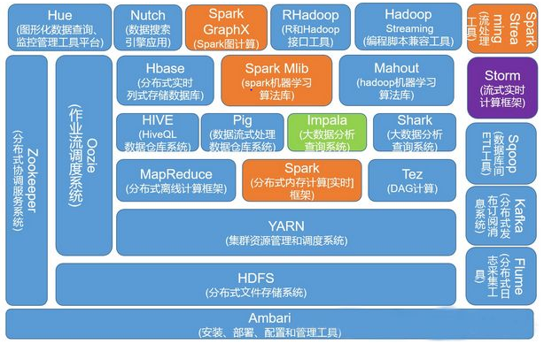
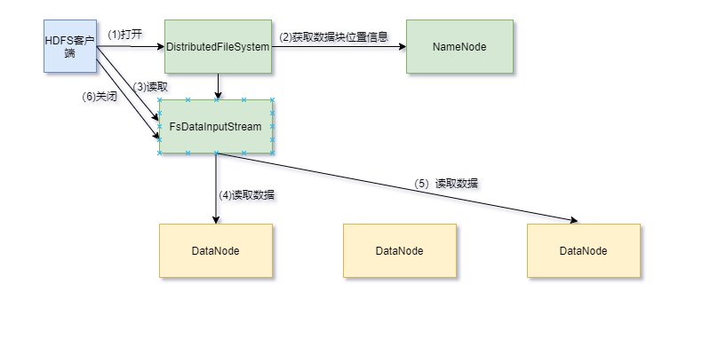
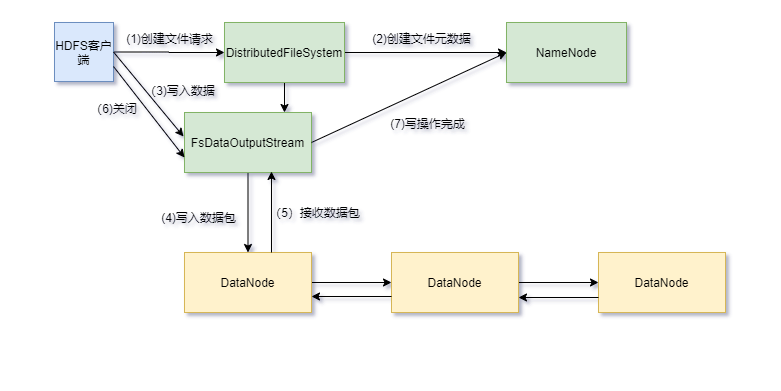
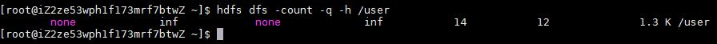
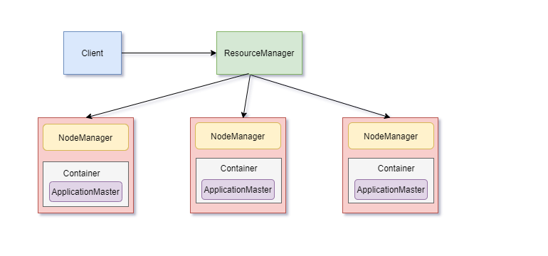
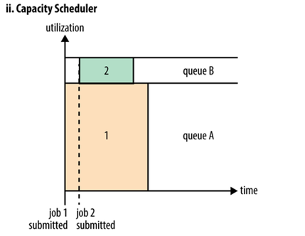
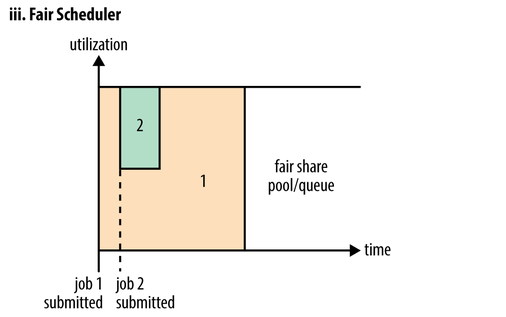
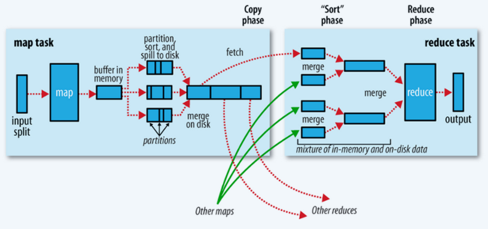

# Hadoop 理论基础

## 初识Hadoop大数据技术

### GFS思想

论文”The Google File System“ 描述了一个分布式文件系统的设计思路。GFS架构中提到以下几点：

1. GFS Master节点管理所有的文件系统元数据，包括命名空间、访问控制信息、文件和块的映射信息以及当前块的位置信息。
2. GFS Master管理系统范围内的活动，比如块服务器之间的数据迁移等。
3. GFS Master与每个块服务器通信（发送心跳包），发送指令，获取状态。
4. GFS存储的文件都被分割成固定大小的块，每个块都会被复制到多个服务器上。块的冗余度默认为3。

### Hadoop版本的演变

Hadoop2.x：与Hadoop1.x相比，Hadoop2.x采用全新的架构，增加了YARN（通用资源调度框架），支持HDFS的Federation（联邦）、HA（High Availability）等。

Hadoop3.x：与Hadoop2.x相比

1. JDK最低依赖从1.7变成1.8.

2. 支持多个Standby状态的Namenode。

3. 改变了多个端口

   **Namenode 端口**

   | 2.x端口 | 3.x端口 | name                       | desc                                                         |
   | ------- | ------- | -------------------------- | ------------------------------------------------------------ |
   | 50470   | 9871    | dfs.namenode.https-address | The namenode secure http server address and port.            |
   | 50070   | 9870    | dfs.namenode.http-address  | The address and the base port where the dfs namenode web ui will listen on. |
   | 8020    | 9820    | fs.defaultFS               | 指定HDFS运行时nameNode地址                                   |

   * * *

   **Secondary NN 端口**

   | 2.x端口 | 3.x端口 | name                                 | desc                                                 |
   | ------- | ------- | ------------------------------------ | ---------------------------------------------------- |
   | 50091   | 9869    | dfs.namenode.secondary.https-address | The secondary namenode HTTPS server address and port |
   | 50090   | 9868    | dfs.namenode.secondary.http-address  | The secondary namenode HTTPS server address and port |

   * * *

   **Datanode 端口**

   | 2.x端口 | 3.x端口 | name                       | desc                                                    |
   | ------- | ------- | -------------------------- | ------------------------------------------------------- |
   | 50020   | 9867    | dfs.datanode.ipc.address   | The datanode ipc server address and port.               |
   | 50010   | 9866    | dfs.datanode.address       | The datanode server address and port for data transfer. |
   | 50475   | 9865    | dfs.datanode.https.address | The datanode secure http server address and port        |
   | 50075   | 9864    | dfs.datanode.http.address  | The datanode http server address and port               |

   **Yarn 端口**

   | 2.x端口 | 3.x端口 | name                                | desc         |
   | ------- | ------- | ----------------------------------- | ------------ |
   |         | 8088    | yarn.resourcemanager.webapp.address | http服务端口 |

   * * *

4. DataNode内部添加了负载均衡。

5. HDFS支持可擦除编码（Erasure Encoding）。

### Hadoop的特点

1. 高容错性
   数据保存多个副本，副本丢失后自动恢复。

2. 高效性

   Hadoop能够在节点之间动态地移动数据，并保证各个节点的动态平衡，所以处理速度非常快。

3. 高可靠性

   Hadoop按位存储和处理数据的能力强，可靠性高。

4. 高扩展性

   可构建在廉价机上，实现横向扩展，当集群增加新节点之后，namenode也可以感知，将数据分发和备份到相应的节点上。


### 机架感知

定义：机架感知是一种计算不同计算节点的距离的技术，运行任务的时候尽量减少网络带宽的资源消耗。副本存储策略为：数据文件默认在 HDFS 上存放三份, 本地一份，同机架内其它某一节点上一份, 不同机架的某一节点上一份。

- 高可靠性，高可用性(一个机架或节点不能用了，其他机架中的节点仍然保存着数据)
- 提高IO利用率(机架内的机器之间的网络速度通常都会高于跨机架机器之间的网络速度，并且机架之间机器的网络通信通常受到上层交换机间网络带宽的限制。所以数据块只存放在两个不同的机架上，此策略减少了读取数据时需要的网络传输总带宽(两条车道和三条车道的区别)。

### Hadoop生态圈组件及其功能



## Hadoop安装

### 单机模式安装

Hadoop单机模式没有HDFS，只能测试MapReduce程序。MapReduce处理的是本地Linux的文件数据。

配置文件:

| 文件名        | 属性名称  | 属性值          | 含义      |
| :------------ | --------- | :-------------- | :-------- |
| hadoop-env.sh | JAVA_HOME | <Your Path>/jdk | JAVA_HOME |

### 伪分布式安装

配置文件:

| 文件名          | 属性名称                      | 属性值                 | 含义                                                 |
| :-------------- | ----------------------------- | :--------------------- | :--------------------------------------------------- |
| hadoop-env.sh   | JAVA_HOME                     | <Your Path>/jdk        | JAVA_HOME                                            |
| core-site.xml   | fs.defaultFS                  | hdfs://<ip>:8020       | 配置NameNode地址，8020是RPC通信端口                  |
|                 | hadoop.tmp.dir                | <Your Path>/hadoop/tmp | HDFS数据保存在Linux的哪个目录，默认是Linux的/tmp目录 |
| hdfs-site.xml   | dfs.replication               | 1                      | 副本数                                               |
| mapred-site.xml | mapreduce.framework.name      | yarn                   | 配置为yarn是集群模式，配置为local表示为本地模式      |
| yarn-site.xml   | yarn.resourcemanager.hostname | <ip>                   | ResourceManager的IP地址或主机名                      |
|                 | yarn.nodemanager.aux-services | mapreduce_shuffle      | NodeManager上运行的附属服务                          |


### 完全分布式安装

配置文件:

| 文件名          | 属性名称                      | 属性值                       | 含义                                                         |
| :-------------- | ----------------------------- | :--------------------------- | :----------------------------------------------------------- |
| hadoop-env.sh   | JAVA_HOME                     | <Your Path>/jdk              | JAVA_HOME                                                    |
| core-site.xml   | fs.defaultFS                  | hdfs://<ip>:8020             | 配置NameNode地址，8020是RPC通信端口                          |
|                 | hadoop.tmp.dir                | <Your Path>/hadoop/tmp       | HDFS数据保存在Linux的哪个目录，默认是Linux的/tmp目录，如果不修改路径的话，系统重启会清空 /tmp 目录下的东西，导致NameNode元数据丢失，是个非常严重的问题 |
| hdfs-site.xml   | dfs.replication               | 2                            | 副本数默认为3                                                |
| mapred-site.xml | mapreduce.framework.name      | yarn                         | 配置为yarn是集群模式，配置为local表示为本地模式              |
| yarn-site.xml   | yarn.resourcemanager.hostname | <ip>                         | ResourceManager的IP地址或主机名                              |
|                 | yarn.nodemanager.aux-services | mapreduce_shuffle            | NodeManager上运行的附属服务                                  |
| slaves          | DataNode的地址                | 从节点1主机名，从节点2主机名 |                                                              |

安装完成后各个节点进程如下：

主节点进程：NameNode、SecondaryNameNode、ResourceManager

从节点一：DataNode、NodeManager

从节点二：DataNode、NodeManager

### SSH

SSH是一种网络协议，用于计算机之间的加密登录。

node1免密登录node2设置：

- 进入node1命令行，生成密钥对：ssh-keygen -t  rsa 
- 为了连接node2，向node2追加公钥：ssh-copy-id -i ~/.ssh/id_rsa.pub node2
- 登录验证：ssh node2

## HDFS

### HDFS优缺点

**优点：**

1. 支持超大文件
   一般来说，HDFS存储的文件可以支持TB和PB级别的数据。

2. 检测和快速应对硬件故障
   假设某一个Datanode节点挂掉之后，因为数据备份，还可以从其他节点里找到。Namenode通过心跳机制来检测Datanode是否还存在。

3. 流式数据访问
   HDFS的数据处理规模比较大，应用一次需要大量的数据，同时这些应用一般都是批量处理，而不是用户交互式处理，应用程序能以流的形式访问数据库。HDFS主要是大数据的吞吐量，而不是访问速度。访问速度最终是要受制于网络和磁盘的速度，机器节点再多，也不能突破物理的局限，HDFS不适合于低延迟的数据访问，HDFS是高吞吐量。

4. 简化的一致性模型

   HDFS应用需要一个“一次写入多次读取”的文件访问模型。一个文件经过创建、写入和关闭之后就不需要改变。这简化了数据一致性问题，并且使高吞吐量的数据访问成为可能。

5. 低成本运行

   HDFS可运行在廉价的商用硬件集群上。

**缺点：**

  1. 不能做到低延迟
     由于Hadoop针对高数据吞吐量做了优化，牺牲了获取数据的延迟，所以对于低延迟数据访问，不适合Hadoop，对于低延迟的访问需求，HBase是更好的选择，
  2. 不适合大量的小文件存储
     由于Namenode将文件系统的元数据存储在内存中，因此该文件系统所能存储的文件总数受限于namenode的内存容量，根据经验，每个文件、目录和数据块的存储信息大约占150字节。因此，如果大量的小文件存储，每个小文件会占一个数据块，会使用大量的内存，有可能超过当前硬件的能力。
  3. 不适合多用户写入文件，修改文件
     Hadoop2.0虽然支持文件的追加功能，但是还是不建议对HDFS上的文件进行修改，因为效率低。对于上传到HDFS上的文件，不支持修改文件，HDFS适合一次写入，多次读取的场景。HDFS不支持多用户同时执行写操作，即同一时间，只能有一个用户执行写操作。

### HDFS的组成和架构

#### NameNode

NameNode是HDFS的管理者，职责如下：

- 管理和维护HDFS的NameSpace（维护文件系统树及文件树下的所有文件或文件夹的元数据），维护NameSpace中的edits（保存客户端执行的所有写操作）和fsimage(包含HDFS的所有目录和文件的序列化信息)。
- 管理DataNode上的数据块，维持副本数量。
- 接受客户端请求，如文件上传、下载、创建目录等。

#### DataNode

##### 为什么数据块大小默认为128M

较大可以减少寻址开销，减少磁盘一次读取时间。较小会导致大量时间花在磁盘数据块定位上。

##### DataNode职责

1. 保存数据块。每个数据块对应一个元数据信息文件，描述这个数据块属于哪个文件，是第几个数据块等。
2. 启动DataNode线程，向NameNode定期汇报数据块信息。
3. 定期向NameNode发送心跳信息保持联系。如果NameNode10分钟没有收到DataNode 的心跳信息，则认为失去联系，并将其上的数据块复制到其他的DataNode。

### SecondaryNameNode

SecondaryNameNode职责：定期把NameNode的fsimage和edits下载到本地并且加载到内存进行合并，将合并后的fsimage上传回NameNode,这个过程叫检查点。

工作流程：

1. SecondaryNameNode定期与NameNode进行通信，要求停止使用edits文件，暂时将新的更新操作写到一个新的文件edits.new上，这个操作是瞬间完成的。
2. 把NameNode的fsimage和edits下载到本地并且加载到内存，一条条执行edits文件中的更新操作，使得内存中的fsimage保持最新，然后将合并后的fsimage上传回NameNode。
3. NameNode将接收新的fsimage文件替换旧的，并将edits.new文件更名为edits。

### HDFS读流程



1. HDFS客户端通过DistributedFileSystem对象的open()方法打开要读取的文件。
2. DistributedFileSystem负责向远程的NameNode发起RPC调用，得到文件数据块信息，返回数据块列表。对于每个数据块，NameNode返回该数据块的DataNode地址。这些返回的DN 地址，会按照集群拓扑结构得出 DataNode 与客户端的距离，然后进行排序，排序两个规则：网络拓扑结构中距离 Client 近的排靠前；心跳
   机制中超时汇报的 DN 状态为 STALE，这样的排靠后；据Client 选取排序靠前的 DataNode 来读取 block，如果客户端本身就是DataNode，那么将从本地直接获取数据(短路读取特性)。
3. DistributedFileSystem返回一个FSDataInputStream对象给客户端，客户端调用FsDataInputStream对象的read()方法开始读取数据。
4. 通过对数据流反复调用read()方法，把数据从数据节点传输到客户端。
5. 当一个节点数据读取完毕时，若文件读取还没有结束，客户端再次请求NameNode获取下一批DataNode地址，连接此文件下一个数据块的最近数据节点。读取完一个 block 都会进行 checksum 验证，把客户端读取到本地的块与 HDFS 上的原始块进行校验，如果发现校验结果不一致，说明读取 DataNode 时出现错误，客户端会通知 NameNode，然后再从下一个拥有该 block 副本的 DataNode 继续读。
6. 当客户端读取完数据时，调用FsDataInputStream对象的close()方法关闭输入流。最终读取来所有的 block 会合并成一个完整的最终文件。

### HDFS写流程



1. 客户端调用DistributedFileSystem对象的create()方法创建一个文件输出流对象。
2. DistributedFileSystem对象向远程的NameNode节点发起RPC调用，NameNode会检查文件是否存在，用户是否有权限新建文件。如果满足条件，则返回给客户端一个可以上传的信息。
3. 客户端根据文件的大小进行切分，默认 128M 一块，切分完成之后给NameNode 发送请求第一个 block 块上传到哪些服务器上；NameNode 收到请求之后，根据网络拓扑和机架感知以及副本机制进行文件分配，返回可用的一组数据节点；
4. 客户端调用FsDataOutputStream对象的write()方法写数据，数据先被写入缓冲区，再被切分成一个一个数据包。
5. 每个数据包被发送到由NameNode节点分配的一组数据节点的一个节点上，在这组数据节点组成的管道上依次传输数据包。
6. 管道上的数据节点反向返回确认信息，最终由管道的第一个数据节点将整条管道的确认信息发送给客户端。
7. 当一个block传输完成之后, 客户端再次请求NameNode上传第二个block，NameNode 重新选择可用的一组数据节点给 客户端。最后客户端完成写入，调用close()方法关闭文件输出流。

### 数据容错

#### DataNode出错

##### HDFS 在上传文件的时候，如果其中一个 DataNode 突然挂掉了怎么办

当 DataNode 突然挂掉了，客户端接收不到这个 DataNode 发送的 ack 确认，客户
端会通知 NameNode，NameNode 检查该块的副本与规定的不符，NameNode 会通知
DataNode 去复制副本，并将挂掉的 DataNode 作下线处理，不再让它参与文件上传与下载。

##### 正常情况下DataNode出错怎么办

每个DataNode都会定期向NameNode发送心跳信号，由于网络割裂等原因导致NameNode无法联系到DataNode，NameNode通过心跳信号的缺失来检测这一情况，并将其标志为宕机，不会再将新的I/O请求发送给它们。NameNode不断检测数据块的状态，一旦发现数据块数量小于设定值，就启动复制操作。

#### NameNode出错

HDFS中的所有元数据都保存在NameNode上，如果NameNode的edits和fsimage文件损坏，整个HDFS将失效。解决办法：

1. 使用HA(High Available)采用共享存储来存储edits。当NameNode出现故障时，HDFS会自动切换到备用的NameNode上，元数据从共享存储获取。
2. 运行一个SecondaryNameNode，当NameNode出现故障时，可以用SecondaryNameNode中的元数据信息进行系统恢复，但仍会有部分数据丢失。通常会把这两种方法结合使用。

### HDFS操作

#### 基础命令

##### 操作命令

**help**
格式: hdfs dfs -help 操作命令
作用: 查看某一个操作命令的参数信息

**ls**
格式：hdfs dfs -ls URI
作用：类似于 Linux 的 ls 命令，显示文件列表

**lsr**
格式 : hdfs dfs -lsr URI
作用 : 在整个目录下递归执行 ls, 与 UNIX 中的 ls-R 类似

**mkdir**
格式 ： hdfs dfs -mkdir [-p] <paths>
作用 : 以<paths>中的 URI 作为参数，创建目录。使用-p 参数可以递归创建目录

**put**
格式 ： hdfs dfs -put <localsrc > ... <dst>
作用 ： 将单个的源文件 src 或者多个源文件 srcs 从本地文件系统拷贝到目标文件系统中（<dst>对应
的路径）。也可以从标准输入中读取输入，写入目标文件系统中
hdfs dfs -put /rooot/bigdata.txt /dir1

**moveFromLocal**
格式： hdfs dfs -moveFromLocal <localsrc> <dst>
作用: 和 put 命令类似，但是源文件 localsrc 拷贝之后自身被删除
hdfs dfs -moveFromLocal /root/bigdata.txt /

**copyFromLocal**
格式: hdfs dfs -copyFromLocal <localsrc> ... <dst>
作用: 从本地文件系统中拷贝文件到 hdfs 路径去

**appendToFile**
格式: hdfs dfs -appendToFile <localsrc> ... <dst>
作用: 追加一个或者多个文件到 hdfs 指定文件中.也可以从命令行读取输入.
hdfs dfs -appendToFile a.xml b.xml /big.xml

**moveToLocal**
在 hadoop 2.6.4 版本测试还未未实现此方法
格式：hadoop dfs -moveToLocal [-crc] <src> <dst>
作用：将本地文件剪切到 HDFS

**get**
格式 hdfs dfs -get [-ignorecrc ] [-crc] <src> <localdst>
作用：将文件拷贝到本地文件系统。 CRC 校验失败的文件通过-ignorecrc 选项拷贝。 文件和 CRC 校验
可以通过-CRC 选项拷贝
hdfs dfs -get /bigdata.txt /export/servers

**getmerge**
格式: hdfs dfs -getmerge <src> <localdst>
作用: 合并下载多个文件，比如 hdfs 的目录 /aaa/下有多个文件:log.1, log.2,log.3,... 

**copyToLocal**
格式: hdfs dfs -copyToLocal <src> ... <localdst>
作用: 从 hdfs 拷贝到本地

**mv**
格式 ： hdfs dfs -mv URI <dest>
作用： 将 hdfs 上的文件从原路径移动到目标路径（移动之后文件删除），该命令不能跨文件系统
hdfs dfs -mv /dir1/bigdata.txt /dir2

**rm**
格式： hdfs dfs -rm [-r] 【-skipTrash】 URI 【URI 。。。】
作用： 删除参数指定的文件，参数可以有多个。 此命令只删除文件和非空目录。
如果指定-skipTrash 选项，那么在回收站可用的情况下，该选项将跳过回收站而直接删除文件；
否则，在回收站可用时，在 HDFS Shell 中执行此命令，会将文件暂时放到回收站中。
hdfs dfs -rm -r /dir1

**cp**
格式: hdfs dfs -cp URI [URI ...] <dest>
作用： 将文件拷贝到目标路径中。如果<dest> 为目录的话，可以将多个文件拷贝到该目录下。
-f
选项将覆盖目标，如果它已经存在。
-p
选项将保留文件属性（时间戳、所有权、许可、ACL、XAttr）。
hdfs dfs -cp /dir1/a.txt /dir2/bigdata.txt

**cat**
hdfs dfs -cat URI [uri ...]
作用：将参数所指示的文件内容输出到 stdout
hdfs dfs -cat /bigdata.txt

**tail**
格式: hdfs dfs -tail path
作用: 显示一个文件的末尾

**text**
格式:hdfs dfs -text path
作用: 以字符形式打印一个文件的内容

**chmod**
格式:hdfs dfs -chmod [-R] URI[URI ...]
作用：改变文件权限。如果使用 -R 选项，则对整个目录有效递归执行。使用这一命令的用户必须是文
件的所属用户，或者超级用户。
hdfs dfs -chmod -R 777 /bigdata.txt

**chown**
格式: hdfs dfs -chmod [-R] URI[URI ...]
作用： 改变文件的所属用户和用户组。如果使用 -R 选项，则对整个目录有效递归执行。使用这一命
令的用户必须是文件的所属用户，或者超级用户。
hdfs dfs -chown -R hadoop:hadoop /bigdata.txt

**df**
格式: hdfs dfs -df -h path
作用: 统计文件系统的可用空间信息

**du**
格式: hdfs dfs -du -s -h path
作用: 统计文件夹的大小信息

**count**
格式: hdfs dfs -count path
作用: 统计一个指定目录下的文件节点数量

**setrep**
格式: hdfs dfs -setrep num filePath
作用: 设置 hdfs 中文件的副本数量
注意: 即使设置的超过了 datanode 的数量,副本的数量也最多只能和 datanode 的数量是一致的

**expunge (慎用)**
格式: hdfs dfs -expunge
作用: 清空 hdfs 垃圾桶

##### 管理命令

**hdfs dfsadmin -report**

作用：报告文件系统的基本信息和统计信息

**hdfs dfsadmin -printTopology**

作用：查看拓扑

##### 其他命令

**hdfs namenode -format**

作用：格式化HDFS

#### 高级功能

##### HDFS 文件限额配置

在多人共用 HDFS 的环境下，配置设置非常重要。特别是在 Hadoop 处理大量资
料的环境，如果没有配额管理，很容易把所有的空间用完造成别人无法存取。HDFS
的配额设定是针对目录而不是针对账号，可以让每个账号仅操作某一个目录，然后
对目录设置配置。
HDFS 文件的限额配置允许我们以文件个数，或者文件大小来限制我们在某个目
录下上传的文件数量或者文件内容总量，以便达到我们类似百度网盘网盘等限制
每个用户允许上传的最大的文件的量。

```bash
hdfs dfs -count -q -h /user/root/dir1 #查看配额信息
```

结果：

###### 数量限额

```bash
hdfs dfs -mkdir -p /user/root/dir #创建 hdfs 文件夹
hdfs dfsadmin -setQuota 2 dir # 给该文件夹下面设置最多上传两个文件，发现只能上传一个文件
hdfs dfsadmin -clrQuota /user/root/dir # 清除文件数量限制
```

###### 空间大小限额

在设置空间配额时，设置的空间至少是 block_size * 3 大小

```bash
hdfs dfsadmin -setSpaceQuota 4k /user/root/dir # 限制空间大小 4KB
hdfs dfs -put /root/a.txt /user/root/dir
```

生成任意大小文件的命令:

```bash
dd if=/dev/zero of=1.txt bs=1M count=2 #生成 2M 的文件
```

清除空间配额限制

```bash
hdfs dfsadmin -clrSpaceQuota /user/root/dir
```


##### HDFS 的安全模式

安全模式是 hadoop 的一种保护机制，用于保证集群中的数据块的安全性。当集群启动的时候，会首先进入安全模式。当系统处于安全模式时会检查数据块的完整性。假设我们设置的副本数（即参数 dfs.replication)是 3，那么在 datanode 上就应该有 3 个副本存在，假设只存在 2 个副本，那么比例就是 2/3=0.666。hdfs默认的副本率 0.999。我们的副本率 0.666 明显小于 0.999，因此系统会自动的复制副本到其他 dataNode，使得副本率不小于 0.999。如果系统中有 5 个副本，超过我们设定的 3 个副本，那么系统也会删除多于的 2 个副本。在安全模式状态下，文件系统只接受读数据请求，而不接受删除、修改等变更请求。当整个系统达到安全标准时，HDFS 自动离开安全模式。

安全模式操作命令：

```bash
hdfs dfsadmin -safemode get #查看安全模式状态
hdfs dfsadmin -safemode enter #进入安全模式
hdfs dfsadmin -safemode leave #离开安全模式
hdfs dfsadmin -safemode wait #一直等待直到安全模式结束
```

##### 回收站

任何一个文件系统，基本上都会有垃圾桶机制，也就是删除的文件，不会直接彻底清掉，我们一把都是将文件放置到垃圾桶当中去，过一段时间之后，自动清空垃圾桶当中的文件，这样对于文件的安全删除比较有保证，避免我们一些误操作，导致误删除文件或者数据

1. 回收站配置两个参数
    默认值 fs.trash.interval=0，0 表示禁用回收站，可以设置删除文件的存活时
    间。
    默认值 fs.trash.checkpoint.interval=0，检查回收站的间隔时间。
    要求 fs.trash.checkpoint.interval<=fs.trash.interval。

2. 启用回收站
    修改所有服务器的 core-site.xml 配置文件

  ```xml
  <!-- 开启 hdfs 的垃圾桶机制，删除掉的数据可以从垃圾桶中回收，单位分钟 -->
  <property>
  <name>fs.trash.interval</name>
  <value>10080</value>
  </property>
  ```

3. 查看回收站
    回收站在集群的 /user/root/.Trash/ 这个路径下

4. 通过 javaAPI 删除的数据，不会进入回收站，需要调用 moveToTrash()才会进入回收
    站

  ```java
  //使用回收站的方式: 删除数据
  @Test
  public void deleteFile() throws Exception{
      //1. 获取 FileSystem 对象
      Configuration configuration = new Configuration();
      FileSystem fileSystem = FileSystem.get(new URI("hdfs://node01:8020"), confi
      guration, "root");
      //2. 执行删除操作
      // fileSystem.delete(); 这种操作会直接将数据删除, 不会进入垃圾桶
      Trash trash = new Trash(fileSystem,configuration);
      boolean flag = trash.isEnabled(); // 是否已经开启了垃圾桶机制
      System.out.println(flag);
      trash.moveToTrash(new Path("/quota"));
      //3. 释放资源
      fileSystem.close();
  }
  ```

5. 恢复回收站数据
    hdfs dfs -mv trashFileDir hdfsdir
    trashFileDir ：回收站的文件路径
    hdfsdir ：将文件移动到 hdfs 的哪个路径下

6. 清空回收站
    hdfs dfs -expunge

##### 快照

快照顾名思义，就是相当于对我们的 hdfs 文件系统做一个备份，我们可以通过快照对我们指定的文件夹设置备份，但是添加快照之后，并不会立即复制所有文件，而是指向同一个文件。当写入发生时，才会产生新文件

1. 快照使用基本语法
1、 开启指定目录的快照功能
hdfs dfsadmin -allowSnapshot 路径
2、禁用指定目录的快照功能（默认就是禁用状态）
hdfs dfsadmin -disallowSnapshot 路径
3、给某个路径创建快照 snapshot
hdfs dfs -createSnapshot 路径
4、指定快照名称进行创建快照 snapshot
hdfs dfs -createSanpshot 路径 名称
5、给快照重新命名
hdfs dfs -renameSnapshot 路径 旧名称 新名称
6、列出当前用户所有可快照目录
hdfs lsSnapshottableDir
7、比较两个快照的目录不同之处
hdfs snapshotDiff 路径 1 路径 2
8、删除快照 snapshot
hdfs dfs -deleteSnapshot <path> <snapshotName>
2. 快照操作实际案例
1、开启与禁用指定目录的快照
[root@node01 hadoop-2.6.0-cdh5.14.0]# hdfs dfsadmin -allowSnapshot /user
Allowing snaphot on /user succeeded
[root@node01 hadoop-2.6.0-cdh5.14.0]# hdfs dfsadmin -disallowSnapshot /user
Disallowing snaphot on /user succeeded
2、对指定目录创建快照
注意：创建快照之前，先要允许该目录创建快照
[root@node01 hadoop-2.6.0-cdh5.14.0]# hdfs dfsadmin -allowSnapshot /user
Allowing snaphot on /user succeeded
[root@node01 hadoop-2.6.0-cdh5.14.0]# hdfs dfs -createSnapshot /user
Created snapshot /user/.snapshot/s20190317-210906.549
通过 web 浏览器访问快照
http://node01:50070/explorer.html#/user/.snapshot/s20190317-210906.549
3、指定名称创建快照
[root@node01 hadoop-2.6.0-cdh5.14.0]# hdfs dfs -createSnapshot /user mysnap1
Created snapshot /user/.snapshot/mysnap1
4、重命名快照
hdfs dfs -renameSnapshot /user mysnap1 mysnap2
5、列出当前用户所有可以快照的目录
hdfs lsSnapshottableDir
6、比较两个快照不同之处
hdfs dfs -createSnapshot /user snap1
hdfs dfs -createSnapshot /user snap2
hdfs snapshotDiff snap1 snap2
7、删除快照
hdfs dfs -deleteSnapshot /user snap1

快照和镜像的区别：快照仅针对某个特定时刻的数据进行拷贝，无法记录在此之后的数据变化，快照的目标是将系统数据恢复至错误发生以前的某个时间。镜像则需时刻保证目标数据和拷贝数据的一致，目的是保证数据冗余，在数据源发生故障时能够迅速恢复。当用户目标数据源损坏，快照回滚将丢失最新修改的数据，而镜像则可以将其完整复原，以保证业务的连续。

##### HA和Federation的区别

HDFS 高可用性和 HDFS Federation之间的主要区别在于Federation中的NameNode彼此不相关。

Federation：HDFS有多个不相关的NameNode，这些NameNode是联合的，共享一个元数据池，但不需相互协调，各自分工。每个NameNode都有自己的池，能够容错（如果一个NameNode挂掉，不会影响其他的NameNode）。

HDFS HA ：有两个NameNode （主 NN 和备用 NN）。主 NN 将元数据写入共享存储系统，备用 NN 监听该共享存储系统并从共享存储更新元数据。当主 NN 出故障时，备用 NN可快速切换到主NN。对于 HA 架构，需要将两台单独的机器配置为 Namenode，其中只有一台应该在Active状态下运行，另一台Standby（备用）状态。

## YARN

设计YARN的最初目的是为了改善MapReduce的实现，后来YARN演变成了一种资源调度框架，具有通用性。

YARN的主要进程：ResourceManager、NodeManager。

### YARN的架构



1. **ResourceManager**
    RM 是一个全局的资源管理器，负责整个系统的资源管理和分配，它主要由两个部分组成：调度器（Scheduler）和应用程序管理器（ApplicationManager）。Scheduler根据容量、队列等限制条件，将系统中的资源分配给正在运行的应用程序，在保证容量、公平性和服务等级的前提下，优化集群资源利用率，让所有的资源都被充分利用 。
    ApplicationManager负责管理整个系统中的所有的应用程序，包括应用程序的提交、与Scheduler协商资源以启动 ApplicationMaster、监控 ApplicationMaster 运行状态并在失败时重启它。
2. **ApplicationMaster**
    用户提交的一个应用程序会对应于一个 ApplicationMaster，它的主要功能有：
  - 与 RM 调度器协商以获得资源，资源以 Container 表示。
  - 与 NameNode通信以启动/停止任务。
  - 与NodeManager协同工作完成任务的执行和监控；负责应用监控，重启失败任务。
3. **NodeManager**
NodeManager 是每个节点上的资源和任务管理器，一方面，它会定期地向 RM 汇报本节点上的资源使用情况和各个 Container 的运行状态；另一方面，他接收并处理来自 AM 的 Container 启动和停止请求。
4. **Container**
Container 是 YARN 中的资源抽象，封装了各种资源。一个应用程序会分配一个Container，这个应用程序只能使用这个 Container 中描述的资源。不同于 MapReduceV1 中槽位 slot 的资源封装，Container 是一个动态资源的划分单位，更能充分利用资源。

### YARN调度器

在 Yarn 中有三种调度器可以选择：FIFO Scheduler ，Capacity Scheduler，Fair
Scheduler。
Apache 版本的 hadoop 默认使用的是 Capacity Scheduler 调度方式。CDH 版本的
默认使用的是 Fair Scheduler 调度方式。

1. **FIFO Scheduler（先进先出调度器）：**

   

   FIFO Scheduler 把应用按提交的顺序排成一个队列，这是一个先进先出队列，在进行资源分配的时候，先给队列中最头上的应用进行分配资源，待最头上的应用需求满足后再给下一个分配，以此类推。但是大的应用可能会占用所有集群资源，这就导致其它应用被阻塞。

2. **Capacity Scheduler（容器调度器）：**

   

   Capacity Scheduler容量调度是多用户调度器，它以队列为单位划分资源。每个队列可设定一定比例的资源最低保证和使用上限。每个用户也可设置一定的资源使用上限，以防资源滥用。并支持资源共享，将队列剩余资源共享给其他队列使用。

   在FIFO的基础上，增加多用户支持，最大化集群吞吐量和利用率。它基于一个很朴素的思想：每个用户都可以使用特定量的资源，但集群空闲时，也可以使用整个集群的资源。也就是说，单用户的情况下，和FIFO差不多。

3. **Fair Scheduler（公平调度器）：**

   

   Fair 调度器是一个队列资源分配方式，会为所有运行的 job 动态的调整系统资源。当集群只有一个任务时，此任务会占用集群的全部资源，当其他的任务提交后，那些释放的资源会被分配给新的任务，所以每个任务最终都能获得几乎一样多的资源。

## MapReduce

### MapReduce概述

MapReduce是一种简化的并行计算模型，MapReduce也就是“分而治之，汇总结果”。

#### MapReduce特点

1. 易于编程。用一些简单的接口即可实现一个分布式程序。
2. 良好的扩展性。可增加计算机扩展计算能力。
3. 高容错性。一台主机出现问题了，它可以把上面的计算任务转移到另外一个节点上运行，而且这个过程不需人工干预，完全由MapReduce在内部完成。
4. 能对PB级以上海量数据进行离线处理。MapReduce适合离线处理而不适合实时处理。

#### MapReduce不擅长的场景

1. 实时计算：MR无法像MySOL一样，在毫秒或秒级内返回结果。
2. 流式计算：流式计算的输入数据是动态的，而MapReduce的输入数据是静态的，不能动态变化。如Web Server产生的日志，这是MR不擅长的。
3. DAG（有向图）计算：多个应用程序存在依赖关系，后一个应用程序的输入为前一个输出。在这种情况下，MR也能做，但是MR做完后，每个MR的输出结果都会写入磁盘，会制造大量的磁盘I/O，降低性能。

### MapReduce编程模型

#### Hadoop的数据类型

| 类              | 描述                    |
| --------------- | ----------------------- |
| BooleanWritable | 标准布尔变量的封装      |
| ByteWritable    | 单字节数的封装          |
| DoubleWritable  | 双字节数的封装          |
| FloatWritable   | 浮点数的封装            |
| IntWritable     | 整数的封装              |
| LongWritable    | 长整型的封装            |
| Text            | 使用UTF-8格式的文本封装 |
| NullWritable    | 无键值时的占位符        |

#### 序列化

**序列化：**将内存中的对象转换为文件或可实际传输的数据流。

**反序列化：**将磁盘中的文件或者传输的数据流转换为内存中的对象。

Hadoop的序列化是实现了org.apache.hadoop.io.Writable接口，该接口包含了readFields()和write()方法。

#### 分区

Mapreduce默认的分区是HashPartitioner，优点是可以把数据打散，且效率高。

#### 合并

在MR中，Mapper先输出<K2,V2>键值对，然后再网络节点间Shuffle，并传入Reducer处理，获得最终的输出。如果Mapper输出的过多，不断进行Shuffle，会产生较大的网络压力；所以我们在Shuffle前先进行一次Reduce，减少Mapper输出的数量，这样就可以减轻网络压力，大幅度提高程序效率。但有些场景不适用，如求平均值的场景。

### Shuffle

shuffle 是 Mapreduce 的核心，它分布在 Mapreduce 的 map 阶段和 reduce阶段。一般把从 Map 产生输出开始到 Reduce 取得数据作为输入之前的过程称作 shuffle。



**Map端**

1. Collect 阶段：将 MapTask 的结果输出到默认大小为 100M 的环形缓冲区，保存的是 key/value，Partition 分区信息等。
2. Spill 阶段：当内存中的数据量达到一定的阀值（默认为0.8）的时候，就会将数据写入本地磁盘，在将数据写入磁盘之前需要对数据进行一次排序的操作，如果配置了 combiner，还会将有相同分区号和 key 的数据进行排序。
3. Merge 阶段：把所有溢出的临时文件进行一次合并操作，以确保一个 MapTask 最终只产生一个中间数据文件。

**Reduce端**

1. Copy 阶段：ReduceTask 启动 Fetcher 线程到已经完成 MapTask 的节点上复制一份属于自己的数据，这些数据默认会保存在内存的缓冲区中，当内存的缓冲区达到一定的阀值的时候，就会将数据写到磁盘之上。
2. Merge 阶段：在 ReduceTask 远程复制数据的同时，会在后台开启两个线程对内存到本地的数据文件进行合并操作。
3. Sort 阶段：在对数据进行合并的同时，会进行排序操作，由于 MapTask 阶段已经对数据进行了局部的排序，ReduceTask 只需保证 Copy 的数据的最终整体有效性即可。Shuffle 中的缓冲区大小会影响到 mapreduce 程序的执行效率，原则上说，缓冲区越大，磁盘 io 的次数越少，执行速度就越快。缓冲区的大小可以通过参数调整, 参数：mapreduce.task.io.sort.mb 默认为 100M。

## Hive

Hive是一个基于Hadoop的数据仓库工具，可以用于对Hadoop文件中的数据集进行整理、查询、分析。Hive提供了类似于SQL的HiveQL，HiveQL可以转化为MapReduce任务进行运行，而不必开发专门的MapReduce应用。

### 安装Hive

1. 嵌入模式的安装特点：不需要MySQL数据库的支持，使用Hive自带的数据块Derby。但只支持一个数据库连接。
2. 本地模式的安装特点：采用MySQL数据库存储数据。
3. 远程模式的安装特点：如果有其他主机已经启动了Metastore服务（hive --service metastore），参考本地模式的安装步骤并修改配置文件hive-site.xml即可。

### Hive的数据类型和存储格式

Hive 的基本数据类型有：TINYINT，SAMLLINT，INT，BIGINT，BOOLEAN，FLOAT，DOUBLE，
STRING，TIMESTAMP(V0.8.0+)和 BINARY(V0.8.0+)。
Hive 的集合类型有：STRUCT，MAP 和 ARRAY。

Hive支持的存储数据的格式主要有： TEXTFILE 文本格式文件（行式存储）、 SEQUENCEFILE 二进制序列化文件(行式存储)、ORC（列式存储）、PARQUET（列式存储）、Avro（不是列存储，是一个数据序列化系统）等。

### Hive的数据模型

Hive 主要有四种数据模型(即表)：内部表、外部表、分区表和桶表。

表的元数据保存传统的数据库的表中，当前 hive 只支持 Derby 和 MySQL 数据库。

`HiveQL提示: ROW FORMAT DELIMITED FIELDS TERMINATED BY  以结束的行格式分隔字段`

#### Hive 内部表

Hive 中的内部表和传统数据库中的表在概念上是类似的，Hive 的每个表都有自己的存储目录，除了外部表外，所有的表数据都存放在配置在 hive-site.xml 文件的${hive.metastore.warehouse.dir}/table_name 目录下。

**创建内部表：**

```sql
CREATE TABLE IF NOT EXISTS students(user_no INT,name STRING,sex STRING,
grade STRING COMMOT '班级'）COMMONT '学生表'
ROW FORMAT DELIMITED
FIELDS TERMINATED BY ','
STORE AS TEXTFILE;
```

#### Hive 外部表

被 external 修饰的为外部表（external table），外部表指向已经存在在 HadoopHDFS 上的数据，除了在删除外部表时只删除元数据而不会删除表数据外，其他和内部表很像。

**创建外部表：**

```sql
CREATE EXTERNAL TABLE IF NOT EXISTS students(user_no INT,name STRING,sex STRING,
class STRING COMMOT '班级'）COMMONT '学生表'
ROW FORMAT DELIMITED
FIELDS TERMINATED BY ','
STORE AS SEQUENCEFILE
LOCATION '/usr/test/data/students.txt';
```

#### Hive 分区表
分区表的每一个分区都对应数据库中相应分区列的一个索引，但是其组织方式和传统的关系型数据库不同。

在 Hive 中，分区表的每一个分区都对应表下的一个目录，所有的分区的数据都存储在对应的目录中。
比如说，分区表 partitinTable 有包含 nation(国家)、ds(日期)和 city(城市)3个分区，其中 nation = china，ds = 20130506，city = Shanghai 则对应 HDFS上的目录为：
/datawarehouse/partitinTable/nation=china/city=Shanghai/ds=20130506/。

分区中定义的变量名不能和表中的列相同。

**创建分区表：**

```sql
CREATE TABLE IF NOT EXISTS students(user_no INT,name STRING,sex STRING,
class STRING COMMOT '班级'）COMMONT '学生表'
PARTITIONED BY (ds STRING,country STRING)
ROW FORMAT DELIMITED
FIELDS TERMINATED BY ','
STORE AS SEQUENCEFILE;
```

#### Hive 分桶表
桶表就是对指定列进行哈希(hash)计算，然后会根据 hash 值进行切分数据，将
具有不同 hash 值的数据写到每个桶对应的文件中。
将数据按照指定的字段进行分成多个桶中去，说白了就是将数据按照字段进行划
分，可以将数据按照字段划分到多个文件当中去。

**创建分桶表：**

```sql
CREATE TABLE IF NOT EXISTS students(user_no INT,name STRING,sex STRING,
class STRING COMMOT '班级',score SMALLINT COMMOT '总分'）COMMONT '学生表'
PARTITIONED BY (ds STRING,country STRING)
CLUSTERED BY(user_no) SORTED BY(score) INTO 32 BUCKETS
ROW FORMAT DELIMITED
FIELDS TERMINATED BY ','
STORE AS SEQUENCEFILE;
```

#### Hive 视图
在 Hive 中，视图是逻辑数据结构，可以通过隐藏复杂数据操作（Joins, 子查
询, 过滤,数据扁平化）来于简化查询操作。
与关系数据库不同的是，Hive 视图并不存储数据或者实例化。一旦创建 HIve 视
图，它的 schema 也会立刻确定下来。对底层表后续的更改(如 增加新列)并不
会影响视图的 schema。如果底层表被删除或者改变，之后对视图的查询将会
failed。基于以上 Hive view 的特性，我们在 ETL 和数据仓库中对于经常变化
的表应慎重使用视图。

**创建视图：**

```sql
CREATE VIEW employee_skills
AS
SELECT name, skills_score['DB'] AS DB,
skills_score['Perl'] AS Perl,
skills_score['Python'] AS Python,
skills_score['Sales'] as Sales,
skills_score['HR'] as HR
FROM employee;
```

创建视图的时候是不会触发 MapReduce 的 Job，因为只存在元数据的改变。
但是，当对视图进行查询的时候依然会触发一个 MapReduce Job 进程：SHOW
CREATE TABLE 或者 DESC FORMATTED TABLE 语句来显示通过 CREATE
VIEW 语句创建的视图。以下是对 Hive 视图的 DDL 操作：

**更改视图的属性：**

```sql
ALTER VIEW employee_skills
SET TBLPROPERTIES ('comment' = 'This is a view');
```

**重新定义视图：**

```sql
ALTER VIEW employee_skills AS
SELECT * from employee ;
```

**删除视图：**

```sql
DROP VIEW 
```


