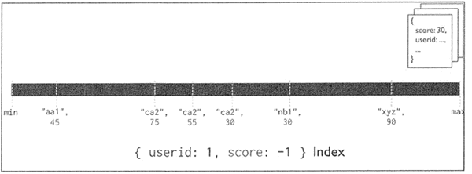

# NoSQL基础

## 数据库系统的基本概念

数据库系统由用户、数据库应用程序、数据库管理系统（DataBase Management System，DBMS）（如MySQL，SQL Server）和数据库（Database，DB）组成。

数据库根据不同的逻辑模型分为3种：层次型、网状型和关系型。

### NoSQL数据库的特点

NoSQL主要存储的是非结构化和半结构化的数据。其主要特点为：

1. 灵活的数据模型：可以存储各种各样的数据类型。
2. 可伸缩性强：NoSQL数据库是分布式的、横向扩展的，当数据库服务器无法满足数据存储和数据访问的需求时，可增加多台服务器，将用户请求分散到多台服务器上，减少单台服务器的性能瓶颈出现的可能性。
3. 自动分片。NoSQL数据库支持自动分片，自动在多台服务器上分发数据，不需要应用程序增加额外的操作。
4. 自动复制。NoSQL数据库支持自动复制。在NoSQL数据库分布式集群中，服务器会自动对数据进行备份，将一份数据复制到多台服务器上。因此，当用户访问同一数据时，可以将用户请求分散到多台服务器上。同时，若某台服务器出现故障，其他服务器的数据可以提供备份，即NoSQL数据库的分布式集群具有高可用性与灾备恢复能力。

## 分布式数据库的数据管理

### CAP理论

CAP定理（CAP theorem）,它指出对于一个 分布式计算系统 来说，不可能同时满足以下三点：

- Consistency(一致性)： 所有节点在同一时间具有相同的数据。
- Availability(可用性)：保证每个请求不管成功或者失败都有响应（也就是只要收到用户的请求，服务器都要在合理的时间内给出合理的响应）。
- Partition tolerance(分区容错)：系统中任意信息的丢失或失败不会影响系统的继续运作（也就是分布式系统遇到任何网络分区故障时，仍然可以对外提供一致性、可用性的服务）。

因此，根据CAP原理将NoSQL数据库分成了满足CA原则、满足CP原则和满足AP原则三大类：

- CA - 单点集群，满足一致性，可用性的系统，通常在可扩展性上不太强大。比如传统的Oracle数据库。
- CP - 满足一致性，分区容错性的系统，通常性能不是特别高。比如**Redis**、MongoDB。
- AP - 满足可用性，分区容错性的系统，通常可能对一致性的要求低一些，满足最终一致性即可。大多数网站架构的选择。

#### Consistency 和 Availability 的矛盾
一致性和可用性，为什么不可能同时成立？答案很简单，因为可能通信失败（即出现分区容错）。

假设数据库一和数据库二同时为客户端服务，这两个库的数据是一致的。

如果保证 数据库二 的一致性，那么数据库一必须在写操作时，锁定 数据库二 的读操作和写操作。只有数据同步后，才能重新开放读写。锁定期间，数据库二 不能读写，没有可用性不。如果保证 数据库二 的可用性，那么势必不能锁定 数据库二，所以一致性不成立。综上所述，数据库二 无法同时做到一致性和可用性。系统设计时只能选择一个目标。如果追求一致性，那么无法保证所有节点的可用性；如果追求所有节点的可用性，那就没法做到一致性。

综上所述，由于网络的原因，肯定会出现延迟和丢包等问题，所以：**分区容错性（Partition tolerance）是我们必须要实现的。**所以只能在一致性和可用性之间进行权衡，没有NoSQL系统能同时保证这三点。

### ACID

事务在英文中是 transaction，和现实世界中的交易很类似，它有如下四个特性：

1. **A（Atomicity）原子性**
   原子性很容易理解，也就是说事务里的所有操作要么全部做完，要么都不做，事务成功的条件是事务里的所有操作都成功，只要有一个操作失败，整个事务就失败，需要回滚。比如银行转账，从A账户转100元至B账户，分为两个步骤：1）从A账户取100元：2）存入100元至B账户。这两步要么一起完成，要么一起不完成，如果只完成第一步，第二步失败，钱会莫名其妙少了100元。
2. **C（Consistency）一致性**
   一致性也比较容易理解，也就是说数据库要一直处于一致的状态，事务的运行不会改变数据库原本的一致性约束。
3. **I（Isolation）独立性**
   所谓的独立性是指并发的事务之间不会互相影响。如果一个事务要访问的数据正在被另外一个事务修改，只要另外一个事务未提交，它所访问的数据就不受未提交事务的影响。比如现有有个交易是从A账户转100元至B账户，在这个交易还未完成的情况下，如果此时B查询自己的账户，是看不到新增加的100元的。
4. **D（Durability）持久性**
   持久性是指一旦事务提交后，它所做的修改将会永久的保存在数据库上，即使出现岩机也不会丢失。

### BASE理论

BASE是Basically Available(基本可用）、Soft state(软状态）和Eventually consistent(最终一致性）三个短语的简写。BASE是对CAP中一致性和可用性权衡的结果，是基于CAP定理逐步演化而来的，其核心思想是即使无法做到强一致性，但每个应用都可以根据自身的业务特点，采用适当的方法来使系统达到最终一致性。BASE中的三要素如下：

**基本可用**
基本可用是指分布式系统在出现不可预知故障的时候，允许损失部分可用性但仍然基本可用。例如：

1. 响应时间上的损失：正常情况下，一个在线搜索引擎需要在0.5秒之内返回给用户相应的查询结果，但由于出现故障（比如系统部分机房发生断电或断网故障），查询结果的响应时间增加到了1-2秒。

2. 功能上的损失：正常情况下，在电商平台上购物，消费者完全能够顺利地完成每一笔订单。但在双十一期间，由于消费者的购物行为激增，为了保护系统核心功能的可用性，通常会采取服务降级的策略，比如关闭评论等非核心功能。

**软状态**
软状态是指允许系统中的数据存在中间状态，但不会影响系统的整体可用性，即允许不同节点副本之间存在暂时的不一致的情况。

**最终一致性**
强调系统保证最终数据能够达到一致，而不需要实时保证系统数据的强一致性。

最终一致性是一种特殊的弱一致性：系统能够保证在没有其他新的更新操作的情况下，数据最终一定能够达到一致的状态，因此所有客户端对系统的数据访问都能够获取到最新的值。同时，在没有发生故障的前提下，数据到达一致状态的时间延迟，取决于网络延迟、系统负载和数据复制方案设计等因素。

### ACID和BASE的联系与区别

BASE理论面向的是大型高可用可扩展的分布式系统，和传统事务的ACID特性使相反的，它完全不同于ACID的强一致性模型，而是提出通过牺牲强一致性来获得可用性，并允许数据在一段时间内是不一致的，但最终达到一致状态。但同时，在实际的分布式场景中，不同业务单元和组件对数据一致性的要求是不同的，因此在具体的分布式系统架构设计过程中，ACID特性与BASE理论往往又会结合在一起使用。

## NoSQL数据库分类

| 分类            | 相关产品               | 应用场景                                                     | 数据模型                                   |                   优点                    | 缺点                                                         |
| :-------------- | ---------------------- | ------------------------------------------------------------ | ------------------------------------------ | :---------------------------------------: | ------------------------------------------------------------ |
| 键值数     据库 | Redis、Memcached、Riak | 内容缓存，如会话、配     置文件、参数等；频繁读写、拥有简单数据模型的应用 | <key,value>键值对，通过散列表来实现        | 扩展性好，灵活性好，大量操作     时性能高 | 数据无结构化，通常     只被当作字符串或者二进制数据，只能通过键来查询值 |
| 列族数     据库 | Bigtable、     HBase   | 分布式数据存储与管理                                         | 以列族式存储，将同一列数据存在一起         |   可扩展性强，查找速度快，复杂     性低   | 功能局限，不支持事     务的强一致性                          |
| 文档数     据库 | MongoDB、CouchDB       | Web应用，存储面向文     档或类似半结构化的数     据          | <key,value>     value是JSON结构     的文档 |    数据结构灵活，可以根据value构建索引    | 缺乏统一查询语法                                             |
| 图数据库        | Neo4j、InfoGrid        | 社交网络、推荐系统，     专注构建关系图谱                    | 图结构                                     |            支持复杂的图形算法             | 复杂性高，只能支持     一定的数据规模                        |

## HBASE

HBase是一个开源的、分布式的、可扩展的、列存储的、版本化的非关系型数据库，利用HDFS提供分布式数据存储。

### Hbase的组件和功能

HBase系统架构图如下：


#### 客户端

客户端包含访问 HBase 的接口，是整个 HBase 系统的入口，使用者直接通过客户端操作 HBase。客户端使用 HBase 的 RPC 机制与 HMaster 和 RegionServer 进行通信。

在一般情况下，客户端与 HMaster 进行管理类操作的通信，在获取 RegionServer 的信息后，直接与RegionServer 进行数据读写类操作。而且客户端获取 Region 的位置信息后会缓存下来，用来加速后续数据的访问过程。

#### ZooKeeper

ZooKeepeer是一个高性能、集中化、分布式应用程序协调服务，主要解决分布式应用中遇到的数据管理问题，如Master选举、数据发布/订阅、集群管理等。在Hadoop中，ZooKeeper主要用于实现HA，包括HDFS的NameNode和YARN的ResourceManager的HA。

ZooKeeper在HBase负责任务如下：

1. Master选举。HBase集群有多个HMaster并存，通过竞争选举保证同一时刻只有一个HMaster处于活跃状态，一旦这个HMaster挂掉，则备用HMaster替换并继续提供服务，保证集群的高可靠性。

2. 系统容错

   在 HBase 启动时，每个 RegionServer 在加入集群时都需要到 ZooKeeper 中进行注册，创建一个状态节点，ZooKeeper 会实时监控每个 RegionServer 的状态，同时 HMaster 会监听这些注册的 RegionServer。

   当某个 RegionServer 挂断的时候，ZooKeeper 会因为一段时间内接收不到它的心跳信息而删除该RegionServer 对应的状态节点，并且给 HMaster 发送节点删除的通知。这时，HMaster 获知集群中某节点断开，会立即调度其他节点开启容错机制。

3. Region 元数据管理

   在 HBase 集群中，Region 元数据被存储在 Meta 表中。每次客户端发起新的请求时，需要查询 Meta 表来获取 Region 的位置，而 Meta 表是存在 ZooKeeper 中的。

   当 Region 发生变化时，例如，Region 的手工移动、进行负载均衡的移动或 Region 所在的 RegionServer 出现故障等，就能够通过 ZooKeeper 来感知到这一变化，保证客户端能够获得正确的 Region 元数据信息。

4. Region 状态管理

   HBase 集群中 Region 会经常发生变更，其原因可能是系统故障，配置修改，或者是 Region 的分裂和合并。只要 Region 发生变化，就需要让集群的所有节点知晓，否则就会出现某些事务性的异常。

   而对于 HBase 集群，Region 的数量会达到 10 万，甚至更多。如此规模的 Region 状态管理如果直接由 HMaster 来实现，则 HMaster 的负担会很重，因此只有依靠 ZooKeeper 系统来完成。

5.  提供 Meta 表存储位置

   在 HBase 集群中，数据库表信息、列族信息及列族存储位置信息都属于元数据。这些元数据存储在 Meta 表中，而 Meta 表的位置入口由 ZooKeeper 来提供。

#### HMaster

HMaster 是 HBase集群中的主服务器，负责监控集群中的所有 RegionServer，并且是所有元数据更改的接口。

在分布式集群中，HMaster 服务器通常运行在 HDFS 的 NameNode上，HMaster 通过 ZooKeeper 来避免单点故障，在集群中可以启动多个 HMaster，但 ZooKeeper 的选举机制能够保证同时只有一个 HMaster 处于 Active 状态，其他的 HMaster 处于Standby状态。

HMaster 主要负责表和 Region 的管理工作。

1. 管理用户对表的增、删、改、查操作。

HMaster 提供了下表中的一些基于元数据方法的接口，便于用户与 HBase 进行交互。

| 相关接口        | 功能                                |
| --------------- | ----------------------------------- |
| HBase 表        | 创建表、删除表、启用/失效表、修改表 |
| HBase 列表      | 添加列、修改列、移除列              |
| HBase 表 Region | 移动 Region、分配和合并 Region      |

2. 管理 RegionServer 的负载均衡，调整 Region 的分布。

3. Region 的分配和移除。

4. 处理 RegionServer 的故障转移。

当某台 RegionServer 出现故障时，总有一部分新写入的数据还没有持久化地存储到磁盘中，因此在迁移该 RegionServer 的服务时，需要从修改记录中恢复这部分还在内存中的数据，HMaster 需要遍历该 RegionServer 的修改记录，并按 Region 拆分成小块移动到新的地址下。

另外，当 HMaster 节点发生故障时，由于客户端是直接与 RegionServer 交互的，且 Meta 表也是存在于 ZooKeeper 当中，整个集群的工作会继续正常运行，所以当 HMaster 发生故障时，集群仍然可以稳定运行。

但是 HMaster 还会执行一些重要的工作，例如，Region 的切片、RegionServer 的故障转移等，如果 HMaster 发生故障而没有及时处理，这些功能都会受到影响，因此 HMaster 还是要尽快恢复工作。 ZooKeeper 组件提供了这种多 HMaster 的机制，提高了 HBase 的可用性和稳健性。

#### RegionServer

在 HDFS 中，DataNode 负责存储实际数据。RegionServer 主要负责响应用户的请求，向 HDFS 读写数据。一般在分布式集群中，RegionServer 运行在 DataNode 服务器上，实现数据的本地性。

每个 RegionServer 包含多个 Region，它负责的功能如下：

- 处理分批给它的 Region。
- 处理客户端读写请求。
- 刷新缓存到 HDFS 中。
- 处理 Region 分片。
- 执行压缩。


RegionServer 是 HBase中最核心的模块，其内部管理了一系列 Region 对象，每个 Region 由多个 HStore 组成，每个 HStore 对应表中一个列族的存储。

HBase 是按列进行存储的，将列族作为一个集中的存储单元，并且 HBase 将具备相同 I/O 特性的列存储到一个列族中，这样可以保证读写的高效性。

在HBase架构图中，RegionServer 最终将 Region 数据存储在 HDFS 中，采用 HDFS 作为底层存储。

HBase 自身并不具备数据复制和维护数据副本的功能，而依赖 HDFS 为 HBase 提供可靠和稳定的存储。

### HBase数据模型及使用

一个单元格可以用行键、列族、列、时间戳来确定。

HBase的逻辑数据模型，是有空值的，但真实的物理存储是无空值的。

### Shell

#### 添加操作

1. 进入 HBase 客户端命令操作界面
    $ bin/hbase shell
2. 查看帮助命令
    hbase(main):001:0> help
3. 查看当前数据库中有哪些表
    hbase(main):002:0> list
4. 创建一张表
    创建 user 表，包含 info、data 两个列族
    hbase(main):010:0> create 'user', 'info', 'data' 或者
    hbase(main):010:0> create 'user', {NAME => 'info', VERSIONS => '3'}，{NAME => 'data'}
5. 添加数据操作
    向 user 表中插入信息，row key 为 rk0001，列族 info 中添加 name 列标示
    符，值为 zhangsan
    hbase(main):011:0> put 'user', 'rk0001', 'info:name', 'zhangsan' 向 user 表中插入信息，row key 为 rk0001，列族 info 中添加 gender 列标
    示符，值为 female
    hbase(main):012:0> put 'user', 'rk0001', 'info:gender', 'female' 向 user 表中插入信息，row key 为 rk0001，列族 info 中添加 age 列标示符，
    值为 20
    hbase(main):013:0> put 'user', 'rk0001', 'info:age', 20
    向 user 表中插入信息，row key 为 rk0001，列族 data 中添加 pic 列标示符，
    值为 picture
    hbase(main):014:0> put 'user', 'rk0001', 'data:pic', 'picture' 
#### 查询操作
1. 通过 rowkey 进行查询
    获取 user 表中 row key 为 rk0001 的所有信息
    hbase(main):015:0> get 'user', 'rk0001' 2. 查看 rowkey 下面的某个列族的信息
    获取 user 表中 row key 为 rk0001，info 列族的所有信息
    hbase(main):016:0> get 'user', 'rk0001', 'info' 3. 查看 rowkey 指定列族指定字段的值
    获取 user 表中 row key 为 rk0001，info 列族的 name、age 列标示符的信息
    hbase(main):017:0> get 'user', 'rk0001', 'info:name', 'info:age' 4. 查看 rowkey 指定多个列族的信息
    获取 user 表中 row key 为 rk0001，info、data 列族的信息
    hbase(main):018:0> get 'user', 'rk0001', 'info', 'data' 或者这样写
    hbase(main):019:0> get 'user', 'rk0001', {COLUMN => ['info', 'data']}
    或者这样写
    hbase(main):020:0> get 'user', 'rk0001', {COLUMN => ['info:name', 'data:pic']}
7. 指定 rowkey 与列值查询
    获取 user 表中 row key 为 rk0001，cell 的值为 zhangsan 的信息
    hbase(main):030:0> get 'user', 'rk0001', {FILTER => "ValueFilter(=, 'binary:zhangsa
    n')"}
8. 指定 rowkey 与列值模糊查询
    获取 user 表中 row key 为 rk0001，列标示符中含有 a 的信息
    hbase(main):031:0> get 'user', 'rk0001', {FILTER => "(QualifierFilter(=,'substring:
    a'))"}
    继续插入一批数据
    hbase(main):032:0> put 'user', 'rk0002', 'info:name', 'fanbingbing'
    hbase(main):033:0> put 'user', 'rk0002', 'info:gender', 'female'
    hbase(main):034:0> put 'user', 'rk0002', 'info:nationality', '中国'
    hbase(main):035:0> get 'user', 'rk0002', {FILTER => "ValueFilter(=, 'binary:中国')"}
9. 查询所有数据
    查询 user 表中的所有信息
    scan 'user' 8. 列族查询
    查询 user 表中列族为 info 的信息
    scan 'user', {COLUMNS => 'info'}
    scan 'user', {COLUMNS => 'info', RAW => true, VERSIONS => 5}
    scan 'user', {COLUMNS => 'info', RAW => true, VERSIONS => 3}
5. 多列族查询
    查询 user 表中列族为 info 和 data 的信息
    scan 'user', {COLUMNS => ['info', 'data']}
    scan 'user', {COLUMNS => ['info:name', 'data:pic']}
    10.指定列族与某个列名查询
    查询 user 表中列族为 info、列标示符为 name 的信息
    scan 'user', {COLUMNS => 'info:name'}
    11.指定列族与列名以及限定版本查询
    查询 user 表中列族为 info、列标示符为 name 的信息,并且版本最新的 5 个
    scan 'user', {COLUMNS => 'info:name', VERSIONS => 5}
    12.指定多个列族与按照数据值模糊查询
    查询 user 表中列族为 info 和 data 且列标示符中含有 a 字符的信息
    scan 'user', {COLUMNS => ['info', 'data'], FILTER => "(QualifierFilter(=,'substring:
    a'))"}
    13.rowkey 的范围值查询
    查询 user 表中列族为 info，rk 范围是(rk0001, rk0003)的数据
    scan 'user', {COLUMNS => 'info', STARTROW => 'rk0001', ENDROW => 'rk0003'}
    14.指定 rowkey 模糊查询
    查询 user 表中 row key 以 rk 字符开头的
    scan 'user',{FILTER=>"PrefixFilter('rk')"}
    15.指定数据范围值查询
    查询 user 表中指定范围的数据
    scan 'user', {TIMERANGE => [1392368783980, 1392380169184]}
    16.统计一张表有多少行数据
    count 'user' 
#### 更新操作
1. 更新数据值
     更新操作同插入操作一模一样，只不过有数据就更新，没数据就添加。

2. 更新版本号
     将 user 表的 f1 列族版本号改为 5
     hbase(main):050:0> alter 'user', NAME => 'info', VERSIONS => 5

#### 删除操作

1. 指定 rowkey 以及列名进行删除
   删除 user 表 row key 为 rk0001，列标示符为 info:name 的数据
   hbase(main):045:0> delete 'user', 'rk0001', 'info:name' 2. 指定 rowkey，列名以及字段值进行删除
   删除 user 表 row key 为 rk0001，列标示符为 info:name，timestamp 为
   1392383705316 的数据
   delete 'user', 'rk0001', 'info:name', 1392383705316

2. 删除一个列族
   alter 'user', NAME => 'info', METHOD => 'delete' 或者
   alter 'user', NAME => 'info', METHOD => 'delete' 4. 清空表数据
   hbase(main):017:0> truncate 'user' 5. 删除表
   首先需要先让该表为 disable 状态，使用命令：
   hbase(main):049:0> disable 'user
   然后才能 drop 这个表，使用命令：
   hbase(main):050:0> drop 'user' 注意：如果直接 drop 表，会报错：Drop the named table. Table must first be
   disabled

### HBase 的高级 shell 管理命令

1. status
例如：显示服务器状态
hbase(main):058:0> status 'node01' 
1. whoami
显示 HBase 当前用户，例如：
hbase> whoami
3. list
显示当前所有的表
hbase> list
4. count
统计指定表的记录数，例如：
hbase> count 'user'
5. describe
展示表结构信息
hbase> describe 'user' 
5. exists
检查表是否存在，适用于表量特别多的情况
hbase> exists 'user' 
5.  is_enabled、is_disabled
检查表是否启用或禁用
hbase> is_enabled 'user' 
5. alter
该命令可以改变表和列族的模式，例如：
为当前表增加列族：
hbase> alter 'user', NAME => 'CF2', VERSIONS => 2
为当前表删除列族：
hbase(main):002:0> alter 'user', 'delete' => 'CF2' 
5. disable/enable
禁用一张表/启用一张表
5. drop
删除一张表，记得在删除表之前必须先禁用
5. truncate
清空表

#### 过滤器

 在 HBase中，get 和 scan 操作都可以使用过滤器来设置输出的范围，类似 SQL 里的 Where 查询条件。

使用 show_filter 命令可以查看当前 HBase 支持的过滤器类型，如下图所示。


使用上述过滤器时，一般需要配合比较运算符或比较器使用，如下面两个表所示。

##### 比较运算符

| 比较运算符 | 描述 |
| -- |-- |
| = | 等于 |
| > | 大于 |
| >= | 大于等于 |
| < | 小于 |
| <= | 小于等于 |
| != | 不等于 |

##### 比较器

| 比较器 | 描述 |
| -- |-- |
| BinaryComparator | 匹配完整字节数组 |
| BinaryPrefixComparator | 匹配字节数组前缀 |
| BitComparator | 匹配比特位 |
| NullComparator | 匹配空值 |
| RegexStringComparator | 匹配正则表达式 |
| SubstringComparator | 匹配子字符串 |

使用过滤器的语法格式如下所示：

scan '表名', { Filter => "过滤器(比较运算符, '比较器')“ }

在上述语法中，Filter=> 指明过滤的方法，整体可用大括号引用，也可以不用大括号。过滤的方法用双引号引用，而比较方式用小括号引用。

下面介绍常见的过滤器使用方法。

##### 行键过滤器

RowFilter 可以配合比较器和运算符，实现行键字符串的比较和过滤。例如，匹配行键中大于 0001 的数据，可使用 binary 比较器；匹配以 0001 开头的行键，可使用 substring 比较器，注意 substring 不支持大于或小于运算符。

实现上述匹配条件的过滤命令以及显示结果如下图所示。

 

针对行键进行匹配的过滤器还有 PrefixFilter、KeyOnlyFilter、FirstKeyOnlyFilter 和 InclusiveStopFilter，其具体含义和使用示例如下表所示。

其中，FirstKeyOnlyFilter 过滤器可以用来实现对逻辑行进行计数的功能，并且比其他计数方式效率高。
| 行键过滤器          | 描述                                               | 示例                                                         |
| ------------------- | -------------------------------------------------- | ------------------------------------------------------------ |
| PrefixFilter        | 行键前缀比较器，比较行键前缀                       | scan 'Student', FILTER => "PrefixFilter('0001')"                         同 scan 'Student', FILTER => "RowFilter(=,'substring:0001')" |
| KeyOnlyFilter       | 只对单元格的键进行过滤和显示，不显示值             | scan 'Student', FILTER => "KeyOnlyFilter()"                  |
| FirstKeyOnlyFilter  | 只扫描显示相同键的第一个单元格，其键值对会显示出来 | scan 'Student', FILTER => "FirstKeyOnlyFilter()"             |
| InclusiveStopFilter | 替代 ENDROW 返回终止条件行                         | scan 'Student', { STARTROW => '0001', FIILTER => "InclusiveStopFilter('binary:0002')" }                                              同  scan 'Student', { STARTROW => '0001', ENDROW => '0003' } |

上表中的命令示例操作结果如下图所示。

 

##### 列族与列过滤器

针对列族进行过滤的过滤器为 FamilyFilter，其语法结构与 RowFilter 类似，不同之处在于 FamilyFilter 是对列族名称进行过滤的。

例如，以下命令扫描Student表显示列族为 Grades 的行。

scan 'Student', FILTER=>" FamilyFilter(= , 'substring:Grades')"

针对列的过滤器如下表所示，这些过滤器也需要结合比较运算符和比较器进行列族或列的扫描过滤。

| 列过滤器                   | 描述                               | 示例                                                         |
| -------------------------- | ---------------------------------- | ------------------------------------------------------------ |
| QualifierFilter            | 列标识过滤器，只显示对应列名的数据 | scan 'Student', FILTER => "QualifierFilter(=,'substring:Math')" |
| ColumnPrefixFilter         | 对列名称的前缀进行过滤             | scan 'Student', FILTER => "ColumnPrefixFilter('Ma')"         |
| MultipleColumnPrefixFilter | 可以指定多个前缀对列名称过滤       | scan 'Student', FILTER => "MultipleColumnPrefixFilter('Ma','Ag')" |
| ColumnRangeFilter          | 过滤列名称的范围                   | scan 'Student', FILTER => "ColumnRangeFilter('Big',true,'Math',false')" |

上表中 QualifierFilter 和 ColumnPrefixFilter 过滤效果类似，只是 ColumnPrefixFilter 无须结合运算符和比较器即可完成字符串前缀的过滤。

MultipleColumnPrefixFilter 过滤器是对 ColumnPrefixFilter 的延伸，可以一次过滤多个列前缀。

ColumnRangeFilter过滤器则可以扫描出符合过滤条件的列范围，起始和终止列名用单引号引用，true 和 false 参数可指明结果中包含的起始或终止列。

上表中的过滤器示例在 HBase Shell 中扫描结果如下图所示。
 

##### 值过滤器

在 HBase 的过滤器中也有针对单元格进行扫描的过滤器，即值过滤器，如下表所示。

| 值过滤器                       | 描述                                 | 示例                                                         |
| ------------------------------ | ------------------------------------ | ------------------------------------------------------------ |
| ValueFilter                    | 值过滤器，找到符合值条件的键值对     | scan 'Student', FILTER => "ValueFilter(=,'substring:curry')"                                  同  get 'Student', '0001', FILTER => "ValueFilter(=,'substring:curry')" |
| SingleColumnValueFilter        | 在指定的列族和列中进行比较的值过滤器 | scan 'Student', Filter => "SingleColumnValueFilter('StuInfo', 'Name', =, 'binary:curry')" |
| SingleColumnValueExcludeFilter | 排除匹配成功的值                     | scan 'Student', Filter => "SingleColumnValueExcludeFilter('StuInfo', 'Name', =, 'binary:curry')" |

ValueFilter 过滤器可以利用 get 和 scan 方法对单元格进行过滤，但是使用 get 方法时，需要指定行键。

SingleColumnValueFilter 和 SingleColumnValueExcludeFilter 过滤器扫描的结果是相反的， 都需要在过滤条件中指定列族和列的名称。

上表中的值过滤器示例在 HBase Shell 中扫描结果如下图所示。

 

##### 其他过滤器

还有一些其他的过滤器，其过滤方式和示例如下表所示。

| 值过滤器               | 描述                                                        | 示例                                                         |
| ---------------------- | ----------------------------------------------------------- | ------------------------------------------------------------ |
| ColumnCountGetFilter   | 限制每个逻辑行返回键值对的个数，在 get 方法中使用           | get 'Student', '0001', FILTER => "ColumnCountGetFilter(3)"   |
| TimestampsFilter       | 时间戳过滤，支持等值，可以设置多个时间戳                    | scan 'Student', Filter => "TimestampsFilter(1,4)"            |
| InclusiveStopFilter    | 设置停止行                                                  | scan 'Student', { STARTROW => '0001', ENDROW => '0005', FILTER => "InclusiveStopFilter('0003')" } |
| PageFilter             | 对显示结果按行进行分页显示                                  | scan 'Student', { STARTROW => '0001', ENDROW => '0005', FILTER => "PageFilter(3)" } |
| ColumnPaginationFilter | 对一行的所有列分页，只返回 [offset,offset+limit] 范围内的列 | scan 'Student', { STARTROW => '0001', ENDROW => '0005', FILTER => "ColumnPaginationFilter(2,1)" } |

ColumnCountGetFilter 过滤器限制每个逻辑行返回多少列，一般不用在 scan 方法中，Timestamps Filter 匹配相同时间戳的数据。

InclusiveStopFilter过滤器设置停止行，且包含停止的行，上表中示例最终展示数据为行键 0001〜0003 范围内的数据。PageFilter 设置每页最多显示多少逻辑行, 示例中显示三个逻辑行。

ColumnPaginationFilter过滤器对一个逻辑行的所有列进行分页显示。

### HBase原理


## MongoDB

### MongoDB概述

MongoDB是一个开源文档数据库，提供高性能、高可用性和自动扩展的功能。

### 基本概念

NoSQL的文档数据库：文档是处理信息的基本单位。文档数据库的设计思路是尽可能提升数据的读写性能，为此选择性保留了部分关系型数据库的约束，通过减少读写过程的规则约束，提升了读写性能。

### 文档存储结构

文档数据库的存储结构从小到大依次是：键值对、文档、集合、数据库。

1. 键值对：文档数据库存储结构的基本单位。
2. 文档：类似于关系型数据库的行。
3. 集合：类似于关系型数据库的表。
4. 数据库：存储集合。

### 数据类型

MongoDB采用存储的数据格式为BSON，是一种基于JSON的二进制序列化格式，MongoDB用其存储文档。

BSON主要特性：
BSON 改进的主要特性有下面三点。

1. 更快的遍历速度

​	BSON 对 JSON 的一个主要的改进是，在 BSON 元素的头部有一个区域用来存储元素的长度， 当遍历时，如果想跳过某个文档进行读取，就可以先读取存储在 BSON 元素头部的元素的长度， 直接找到到指定的点上就完成了文档的跳过。

​	在 JSON 中，要跳过一个文档进行数据读取，需要在对此文档进行扫描的同时匹配数据结构才可以完成跳过操作。

2. 操作更简易

​	如果要修改 JSON 中的一个值，如将 9 修改为 10，这实际是将一个字符变成了两个，会导致其后面的所有内容都向后移一位。

​	在 BSON 中，可以指定这个列为整型，那么，当将 9 修正为 10 时，只是在整型范围内将数字进行修改，数据总长不会变化。

​	需要注意的是：如果数字从整型增大到长整型，还是会导致数据总长增加。

3. 支持更多的数据类型

​	BSON 在 JSON 的基础上增加了很多额外的类型，BSON 增加了“byte array”数据类型。这使得二进制的存储不再需要先进行 base64 转换再存为 JSON，减少了计算开销。

​	BSON 支持的数据类型如表所示。

| 类型               | 描述示例                                                     |
| ------------------ | ------------------------------------------------------------ |
| NULL               | 表示空值或者不存在的字段，{"x" : null}                       |
| Boolean            | 布尔型有 true 和 false，{"x" : true}                         |
| Number             | 数值：客户端默认使用 64 位浮点型数值。{"x" : 3.14} 或 {"x" : 3}。对于整型值，包括 NumberInt（4 字节符号整数）或 NumberLong（8 字节符号整数），用户可以指定数值类型，{"x" : NumberInt("3")} |
| String             | 字符串：BSON 字符串是 UTF-8，{"x" : "中文"}                  |
| Regular Expression | 正则表达式：语法与 JavaScript 的正则表达式相同，{"x" : /[cba]/} |
| Array              | 数组：使用“[]”表示，{"x" : ["a", "b", "c"]}                  |
| Object             | 内嵌文档：文档的值是嵌套文档，{"a" : {"b" : 3}}              |
| ObjectId           | 对象 id：对象 id 是一个 12 字节的字符串，是文档的唯一标识，{"x" : objectId()} |
| BinaryData         | 二进制数据：二进制数据是一个任意字节的字符串。它不能直接在 Shell 中使用。如果要将非 UTF-8 字符保存到数据库中，二进制数据是唯一的方式 |
| JavaScript         | 代码：查询和文档中可以包括任何 JavaScript 代码，{"x" : function(){/*...*/}} |
| Data               | 日期：{"x" : new Date()}                                     |
| Timestamp          | 时间戳：var a = new Timestamp()                              |

### 基本操作命令

#### 创建数据库

MongoDB 使用 use 命令创建数据库，如果数据库不存在，MongoDB 会在第一次使用该数据库时创建数据库。如果数据库已经存在则连接数据库，然后可以在该数据库进行各种操作。

use myDB

#### 查看数据库

MongoDB 使用 show 命令查看当前数据库列表，代码如下:

```sql
>show dbs        //可以在任意当前数据库上执行该命令
admin 0.000GB    //保留数据库，admin
myDB 0.000GB     //自定义数据库，myDB,该数据库里已经插入记录，没有记录的自定义数据库不会显示 
local 0.000GB    //保留数据库，local
test 0.000GB     //保留数据库，test
```

MongoDB 默认的数据库为 test，如果没有创建新的数据库，集合将存储在 test 数据库中。如果自定义数据库没有插入记录，则用户在查看数据库时是不会显示的，只有插入数据的数据库才会显示相应的信息。

#### 统计数据库信息

MongoDB 使用 stats() 方法查看某个数据库的具体统计信息，注意对某个数据库进行操作之前，一定要用 use 切换至数据库，否则会出错，代码如下：

```sql
>use test              //选择执行的test数据库
switched to db test    //use执行后返回的结果
> db. stats ()         //统计数据信息
{ 
    "db" : "test",     //数据库名
    "collections" : 0, //集合数量
    "views" : 0,
    "objects" : 0,     //文档数量
    "avgObjSize" : 0,  //平均每个文档的大小
    "dataSize" : 0,    //数据占用空间大小，不包括索引，单位为字节
    "storageSize" : 0, //分配的存储空间
    "nuinExtents" : 0, //连续分配的数据块
    "indexes" : 0,     //索引个数
    "indexsize" : 0,   //索引占用空间大小
    "fileSize" : 0,    //物理存储文件的大小
    "ok" : 1 
}
```

#### 删除数据库

MongoDB 使用 dropDatabase() 方法删除数据库，代码如下：

```sql
>db.dropDatabase ()    //删除当前数据库
{ ndropped" : "myDBn Jok" : 1}    //显示结果删除成功
```

#### 查看集合

MongoDB 使用 getCollectionNames() 方法查询当前数据库下的所有集合，代码如下：

```sql
>use test
>db.getCollectionNames ()    //查询当前数据下所有的集合名称
```

#### 创建集合

MongoDB 集合的创建有显式和隐式两种方法。

显式创建集合可通过使用`db.createCollection(name, options)`方法来实现，参数 name 指要创建的集合名称，options 是可选项，指定内存大小和索引等，下表描述 了 options 可使用的选项。


| 参数   | 类型    | 描述                                                         |
| ------ | ------- | ------------------------------------------------------------ |
| capped | Boolean | （可选）如果为 true，则启用封闭的集合。上限集合是固定大小的集合，它在达到其最大时自动覆盖其最旧的条目。如果指定 true，则还需要指定 size 参数 |
| size   | 数字    | （可选）指定上限集合的最大大小（以字节为单位）。如果 capped 为 true，那么还需要指定此字段的值 |
| max    | 数字    | （可选）指定上限集合中允许的最大文档数                       |


注意：在插入文档时，MongoDB 首先检查上限集合 capped 字段的大小，然后检查 max 字段。

显式创建集合的一个例子：

```sql
db.createCollection("mySet", {capped:true,size:6142800, max :10000 })
```

在 MongoDB 中，当插入文档时，如果集合不存在，则 MongoDB 会隐式地自动创建集合，方法如下：

```sql
db.myDB.insert( {"name": "tom"} )
```

#### 其他集合操作

创建集合后可以通过 show collections 命令查看集合的详细信息，使用 renamecollection() 方法可对集合进行重新命名。

删除集合使用 drop() 方法，具体代码如下：

```sql
Show collections;
db.mySet.renameCollection( "orders2014");
db.orders2014.drop()
```

要将数据插入 MongoDB 集合中，可以使用 MongoDB 的 insert() 方法，同时 MongoDB 针对插入一条还是多条数据，提供了更可靠的 insertOne() 和 insertMany() 方法。

MongoDB 向集合里插入记录时，无须事先对数据存储结构进行定义。如果待插入的集合不存在，则插入操作会默认创建集合。

在 MongoDB 中，插入操作以单个集合为目标，MongoDB 中的所有写入操作都是单个文档级别的原子操作。

向集合中插入数据的语法如下：

```sql
db.collection.insert(
<document or array of documents>,
{
    writeConcern: <document>,    //可选字段
    ordered: <boolean>    //可选字段
    }
)
```

db 为数据库名，如当前数据库名为“test”，则用 test 代替 db，collection 为集合名，insert() 为插入文档命令，三者之间用连接。

参数说明：

- <document or array of documents> 参数表示可设置插入一条或多条文档。
- writeConcern:<document> 参数表示自定义写出错的级别，是一种出错捕捉机制。
- ordered:<boolean> 是可选的，默认为 true。
  - 如果为 true，在数组中执行文档的有序插入，并且如果其中一个文档发生错误，MongoDB 将返回而不处理数组中的其余文档；
  - 如果为 false，则执行无序插入，若其中一个文档发生错误，则忽略错误，继续处理数组中的其余文档。


插入不指定 _id 字段的文档的代码如下：

```sql
> db.test.insert( { item : "card", qty : 15 })
```

在插入期间，mongod 将创建 _id 字段并为其分配唯一的 Objectld 值，这里的 mongod 是一个 MongoDB 服务器的实例，也就是 MongoDB 服务驻扎在计算机上的进程。

查看集合文档的代码如下：

```sql
> db.test.find()
{"_id":Objectlid("5bacac84bb5e8c5dff78dc21"), "item":"cardn, "qty":15 }
```

这些 Objectld 值与执行操作时的机器和时间有关，因此，用户执行这段命令后的返回值与示例中的值是不同的。

插入指定 _id 字段的文档，值 _id 必须在集合中唯一，以避免重复键错误，代码如下：

```sql
> db.test.insert(
    { _id: 10, item: "box", qty: 20 }
)
> db.test.find()
{ "_id" : 10, "item" : "box" , "qty": 20 }
```

可以看到新插入文档的 id 值为设置的 id 值。

插入的多个文档无须具有相同的字段。例如，下面代码中的第一个文档包含一个 _id 字段和一个 type 字段，第二个和第三个文档不包含 _id 字段。因此，在插入过程中，MongoDB 将会为第二个和第三个文档创建默认 _id 字段，代码如下：

```sql
db.test.insert(
    [
        { _id: 11, item: "pencil", qty: 50, type: "no.2" },
        { item: "pen", qty: 20 },
        { item: "eraser", qty: 25 }
    ]
)
```

查询验证，可以看到在 _id 插入期间，系统自动为第二、第三个文档创建了字段，代码如下：

```sql
> db.test.find()
{ "_id" : 11, "item" : "pencil", "qty" : 50, "type" : "no.2" }
{ "_id" : Objectld("5bacf31728b746e917e06b27"), "item" : "pen"， "qty" : 20 }
{ "_id" : Objectld("5bacf31728b746e917e06b28"), "item" : "eraser", "qty" : 25 }
```


用变量方式插入文档，代码如下：

```sql
> document= ({ name: "c语言", price: 40 })    //document 为变量名.
> db.test.insert(document)
```


有序地插入多条文档的代码如下：

```sql
> db.test.insert([
        {_id:10, item:"pen", price:"20" },
        {_id:12, item:"redpen", price: "30" },
        {_id:11, item:"bluepen", price: "40" }
    ],
    {ordered:true}
)
```

在设置 ordered:true 时，插入的数据是有序的，如果存在某条待插入文档和集合的某文档 \_id 相同的情况，_id 相同的文档与后续文档都将不再插入。在设置 ordered:false 时，除了出错记录（包括 _id 重复）外其他的记录继续插入。

MongoDB 3.2 更新后新增以下两种新的文档插入命令如下：

db.collection.insertone ()
db.collection.insertMany()

使用 insertOne() 插入一条文档的代码如下：

```sql
db.test.iusertone( { item: "card", qty: 15 } );
```

使用 insertMany() 插入多条文档的代码如下：

```sql
db.test.insertMany([
    { item: "card", qty: 15 },
    { item: "envelope", qty: 20 },
    { item: "stamps", qty:30 }
]);
```

**MongoDB使用 update() 和 save() 方法来更新（修改）集合中的文档。**

#### update() 方法

MongoDB update() 更新文档的基本语法如下:

```sql
db.collection.update(
  <query>,
  <update>,
  {
    upsert,
    multi,
    writeConcern,
    collation
  }
)
```

参数说明：

- <query＞：参数设置查询条件。
- <update＞：为更新操作符。
- upsert：为布尔型可选项，表示如果不存在 update 的记录，是否插入这个新的文档。true 为插入；默认为 false，不插入。
- multi：也是布尔型可选项，默认是 false，只更新找到的第一条记录。如果为 true，则把按条件查询出来的记录全部更新。
- writeConcem：表示出错级别。
- collation：指定语言。


例如，插入多条数据后，使用 update 进行更改，代码如下：

```sql
db.test.insertMany ([
    { item : "card"，qty : 15 },
    { item : "envelope", qty: 20 },
    { item : "stamps", qty: 30 }
]);
```

将 item 为 card 的数量 qty 更正为 35，代码如下：

```sql
db.test.update(
{
    item : "card"
},
{
    $set: {qty: 35}
}
```

collation 特性允许 MongoDB 的用户根据不同的语言定制排序规则，在 MongoDB 中字符串默认当作一个普通的二进制字符串来对比。而对于中文名称，通常有按拼音顺序排序的需求，这时就可以通过collation来实现。

创建集合时，指定 collation 为 zh，按 name 字段排序时，则会按照 collation 指定的中文规则来排序，代码如下：

```sql
db.createCollection ("person", {collation: {locale: "zh" }})    //创建集合并指定语言
db.person.insert ({name: "张三"})
db.person.insert ({name:"李四"})
db.person.insert ({name: ”王五"})
db.person.insert ({name: "马六"})
db.person.insert ({name:"张七"})
db.person.find().sort({name: 1}) //查询并排序
//查询返回结果
{ "_id" : Objectld ("586b995d0cec8d86881cffae") , "name": "李四" }
{ "_id" : Objectld ("586b995d0cec8d86881cffb0") , "name" : "马六" }.
{ "_id" : Objectld ("586b995d0cec8d86881cffaf"), "name": "王五" }
{ "_id" : Objectld ("586b995d0cec8d86881cffb1"), "name": "张七" }
{ "_id" : Objectld ("586b995d0cec8d86881cffad"), "name" : "张三" }
```

#### save() 方法

MongoDB 另一个更新（修改）文档的方法是 save()，语法格式如下：

db.collection.save ( obj )

如下代码会先保存一个 _id 为 100 的记录，然后再执行 save，并对当前已经存在的数据进行修改：

```sql
db.products.save( { _id: 100, item: "watern", qty: 30 })
db.products.save( { _id : 100, item : "juice" })
```

由于`_id`字段包含集合中存在的 value，因此操作会执行更新以替换文档并生成以下文档：

```sql
{ "_id" : 100, "item" : "juice" }
```

如果使用 insert 插入记录，若新增数据的主键已经存在，则会抛出 DuplicateKeyException 异常提示主键重复，不保存当前数据。

MongoDB使用 remove() 和 delete() 方法来删除集合中的文档。

#### remove() 方法

如果不再需要 MongoDB 中存储的文档，可以通过删除命令将其永久删除。删除 MongoDB 集合中的数据可以使用 remove() 函数。

remove() 函数可以接受一个查询文档作为可选参数来有选择性地删除符合条件的文档。删除文档是永久性的，不能撤销，也不能恢复。因此，在执行 remove() 函数前最好先用 find()命令来查看是否正确。

remove() 方法的基本语法格式如下所示：

```sql
db.collection.remove(
  <query>,
  {
    justOne: <boolean>, writeConcern: <document>
  }
)
```

参数说明：

- query：必选项，是设置删除的文档的条件。
- justOne：布尔型的可选项，默认为false，删除符合条件的所有文档，如果设为 true，则只删除一个文档。
- writeConcem：可选项，设置抛出异常的级别。


下面举例说明删除集合中的文档，先进行两次插入操作，代码如下：

```sql
>db.test.insert(
    {
        title : 'MongoDB',
        description : 'MongoDB 是一个 NoSQL 数据库',
        by : 'C语言中文网',
        tags : ['mongodb', 'database', 'NoSQL'],
        likes : 100
    }
)
```

使用 find() 函数查询的代码如下：

```sql
> db.test.find()
{ "_id" : Objectld ("5ba9d8b：L24857a5fefclfde6"), "title" : "MongoDB", "description" : "MongoDB 是一个 NoSQL 数据库", "by" : "C语言中文网", "tags" : [ "mongodb", "database", "NoSQL" ], "likes" : 100 }
{ "_id" : ObjectId("5ba9d90924857a5fefclfde7"), "title" : "MongoDB ", "description" : "MongoDB 是一个 NoSQL 数据库", "by" : "C语言中文网", "tags" : [ "mongodb", "database", "NoSQL"], "likes" : 100 }
```

接下来移除 title 为“MongoDB”的文档，执行以下操作后，查询会发现两个文档记录均被删除：

```sql
>db.test.remove({'title': 'MongoDB'})
WriteResult({ 'nRemoved' : 2 })    #删除了两条数据
```

另外，可以设置比较条件，如下操作为删除 likes大于 3 的文档记录：

```sql
>db.test.remove(
    {
        likes:{$gt:3}
    }
)
```

#### delete() 方法

官方推荐使用 deleteOne() 和 deleteMany() 方法删除文档，语法格式如下：

```sql
db.collection.deleteMany ({})
db.collection.deleteMany ({ status : "A" })
db.collection.delete.One ({ status : "D" })
```

第一条语句删除集合下所有的文档，第二条语句删除 status 等于 A 的全部文档，第三条语句删除 status 等于 D 的一个文档。

在关系型数据库中，可以实现基于表的各种各样的查询，以及通过投影来返回指定的列，相应的查询功能也可以在 MongoDB中实现。同时由于 MongoDB 支持嵌套文档和数组，MongoDB 也可以实现基于嵌套文档和数组的查询。

#### find() 简介

MongoDB 中查询文档使用 find() 方法。find() 方法以非结构化的方式来显示所要查询的文档， 查询数据的语法格式如下：

```sql
>db.collection.find(query, projection)
```

query 为可选项，设置查询操作符指定查询条件；projection （投影）也为可选项，表示使用投影操作符指定返回的字段，如果忽略此选项则返回所有字段。

查询 test 集合中的所有文档时，为了使显示的结果更为直观，可使用 pretty() 方法以格式化的方式来显示所有文档，方法如下：

```sql
> db.test.find().pretty()
```

除了 find() 方法，还可使用 findOne() 方法，它只返回一个文档。

#### 查询条件

MongoDB 支持条件操作符，下表为 MongoDB 与 RDBMS 的条件操作符的对比，读者可以通过对比来理解 MongoDB 中条件操作符的使用方法。


| 操作符         | 格式                                                | 实例                                                         | 与 RDBMS where 语句比较                            |
| -------------- | --------------------------------------------------- | ------------------------------------------------------------ | -------------------------------------------------- |
| 等于（=）      | {<key> : {<value>}}                                 | db.test.find( {price : 24} )                                 | where price = 24                                   |
| 大于（>）      | {<key> : {$gt : <value>}}                           | db.test.find( {price : {$gt : 24}} )                         | where price > 24                                   |
| 小于（<）      | {<key> : {$lt : <value>}}                           | db.test.find( {price : {$lt : 24}} )                         | where price < 24                                   |
| 大于等于（>=） | {<key> : {$gte : <value>}}                          | db.test.find( {price : {$gte : 24}} )                        | where price >= 24                                  |
| 小于等于（<=） | {<key> : {$lte : <value>}}                          | db.test.find( {price : {$lte : 24}} )                        | where price <= 24                                  |
| 不等于（!=）   | {<key> : {$ne : <value>}}                           | db.test.find( {price : {$ne : 24}} )                         | where price != 24                                  |
| 与（and）      | {key01 : value01, key02 : value02, ...}             | db.test.find( {name : "《MongoDB 入门教程》", price : 24} )  | where name = "《MongoDB 入门教程》" and price = 24 |
| 或（or）       | {$or : [{key01 : value01}, {key02 : value02}, ...]} | db.test.find( {$or:[{name : "《MongoDB 入门教程》"},{price : 24}]} ) | where name = "《MongoDB 入门教程》" or price = 24  |

#### 特定类型查询

特定类型查询结果在 test 集合中有以下文档为基础：

```sql
> db.test.find()
    {"_id" : Objectld("5ba7342c7f9318ea62161351"), "name" : "《MongoDB教程》", "price" : 24, "tags" : [ "MongoDB", "NoSQL", "database" ], "by": "C语言中文网"}
    {"_id" : Objectld("5ba747bd7f9318ea62161352"), "name" ： "ava 教程", "price" : 36, "tags" : ["编程语言", "Java语言", "面向对象程序设计语言"], "by" : "C语言中文网"}
    {"_id" : Objectld("5ba75a057f9318ea62161356"), "name" : "王二", "age" : null }
```

查询 age 为 null 的字段的语法格式如下：

\> db.test.find({age:null})

此语句不仅匹配出 age 为 null 的文档，其他不同类型的文档也会被查出。这是因为 null 不仅会匹配某个键值为 null 的文档，而且还会匹配不包含这个键的文档。

查询数组可使用以下语法格式：

```sql
> db.test.find(
{
    tags:['MongoDB', 'NoSQL', 'database']
}
)
{"_id" : ObjectId("5ba7342c7f9318ea62161351"), "name": "《MongoDB教程》", "price" : 24, "tags" : [ "MongoDB", "NoSQL", "database"], "by" : "C语言中文网"}
```


查询有 3 个元素的数组的代码如下：

```sql
> db.test.find(
{
    tags:{$size:3}
}
)
{"_id" : Objectld("5baf9b6663ba0fb3ccccle77"), "name" : "《MongoDB 教程》", ''price" : 24, "tags" : ["MongoDB"，"NoSQL", "database"], "by" : "C语言中文网"}
{"_id" : Objectld ("5baf 9bc763ba0fk>3ccccle78"), "name" : "《Java 教程》", "price" : 36, "tags" : ["编程语言", "Java语言", "面向对象程序设计语言"], "by" : "C语言中文网"}
```


查询数组里的某一个值的代码如下：

```sql
> db.test.find(
{
    tags: "MongoDB"
}
)
{"_id" : Objectld("5baf9b6663ba0fb3ccccle77"), "name" : "《MongoDB 教程》", ''price" : 24, "tags" : ["MongoDB"，"NoSQL", "database"], "by" : "C语言中文网"}
```


limit() 函数与 SQL 中的作用相同，用于限制查询结果的个数，如下语句只返回 3 个匹配的结果。若匹配的结果不到 3 个，则返回匹配数量的结果：

```sql
>db.test.find().limit(3)
```


Skip() 函数用于略过指定个数的文档，如下语句略过第一个文档，返回后两个：

```sql
>db.test.find().skip(1)
```


sort() 函数用于对查询结果进行排序，1 是升序，-1 是降序，如下语句可将查询结果升序显示：

```sql
>db.test.find().sort({"price" : 1})
```


使用 $regex 操作符来设置匹配字符串的正则表达式，不同于全文检索，使用正则表达式无须进行任何配置。如下所示为使用正则表达式查询含有 MongoDB 的文档：

```sql
> db.test.find({tags:{$regex:"MongoDB"}})
{"_id" : Objectld("5baf9b6663ba0fb3ccccle77"), "name" : "《MongoDB 教程》", ''price" : 24, "tags" : ["MongoDB"，"NoSQL", "database"], "by" : "C语言中文网"}
```

### 游标

游标是指对数据一行一行地进行操作，在 MongoDB 数据库中对游标的控制非常简单，只需使用 firid() 函数就可以返回游标。有关游标的方法参见下表。

| 方法名          | 作用                                   |
| --------------- | -------------------------------------- |
| hasNext         | 判断是否有更多的文档                   |
| next            | 用来获取下一条文档                     |
| toArray         | 将查询结构放到数组中                   |
| count           | 查询的结果为文档的总数量               |
| limit           | 限制查询结果返回数量                   |
| skip            | 跳过指定数目的文档                     |
| sort            | 对查询结果进行排序                     |
| objsLeftlnBatch | 查看当前批次剩余的未被迭代的文档数量   |
| addOption       | 为游标设置辅助选项，修改游标的默认行为 |
| hint            | 为查询强制使用指定索引                 |
| explain         | 用于获取查询执行过程报告               |
| snapshot        | 对查询结果使用快照                     |

使用游标时，需要注意下面 4 个问题。

1.  当调用 find() 函数时，Shell 并不立即查询数据库，而是等真正开始获取结果时才发送查询请求。

2. 游标对象的每个方法几乎都会返回游标对象本身，这样可以方便进行链式函数的调用。

3. 在 MongoDB Shell 中使用游标输出文档包含两种情况，如果不将 find() 函数返回的游标赋值给一个局部变量进行保存，在默认情况下游标会自动迭代 20 次。如果将 find() 函数返回的游标赋值给一个局部变量，则可以使用游标对象提供的函数进行手动迭代。

4. 使用清空后的游标，进行迭代输出时，显示的内容为空。游标从创建到被销毁的整个过程存在的时间，被称为游标的生命周期，包括游标的创建、使用及销毁三个阶段。当客户端使用 find() 函数向服务器端发起一次查询请求时，会在服务器端创建一个游标，然后就可以使用游标函数来操作查询结果。

以下三种情况会让游标被销毁。

- 客户端保存的游标变量不在作用域内。
- 游标遍历完成后，或者客户端主动发送终止消息。
- 在服务器端 10 分钟内未对游标进行操作。


以下语句显示使用游标查找所有文档：

```sql
>var cursor = db.test.find()
>while (cursor.hasNext()){
    var doc = cursor.next();
    print(doc.name);  //把每一条数据都单独拿出来进行逐行的控制
    print(doc);  //将游标数据取出来后，其实每行数据返回的都是一个［object BSON］型的内容
    printjson(doc);  //将游标获取的集合以JSON的形式显示
}
```

### 索引

#### 索引简介

索引可以提升文档的查询速度，但建立索引的过程需要使用计算与存储资源，在已经建立索引的前提下，插入新的文档会引起索引顺序的重排。

MongoDB 的索引是基于 B-tree 数据结构及对应算法形成的。树索引存储特定字段或字段集的值，按字段值排序。索引条目的排序支持有效的等式匹配和基于范围的查询操作。

下图所示的过程说明了使用索引选择和排序匹配文档的查询过程。


从根本上说，MongoDB 中的索引与其他数据库系统中的索引类似。MongoDB 在集合级别定义索引，并支持 MongoDB 集合中文档的任何字段或子字段的索引。

MongoDB 在创建集合时，会默认在 \_id 字段上创建唯一索引。该索引可防止客户端插入具有相同字段的两个文档，_id 字段上的索引不能被删除。

在分片集群中，如果不将该 _id 字段用作分片键，则应用需要自定义逻辑来确保 _id 字段中值的唯一性，通常通过使用标准的自生成的 Objectld 作为 _id。

#### 索引类型+创建索引

MongoDB 中索引的类型大致包含单键索引、复合索引、多键值索引、地理索引、全文索引、 散列索引等，下面简单介绍各类索引的用法。

##### 单键索引

MongoDB 支持文档集合中任何字段的索引，在默认情况下，所有集合在 _id 字段上都有一个索引，应用程序和用户可以添加额外的索引来支持重要的查询操作，单键索引可参考下图。


对于单字段索引和排序操作，索引键的排序顺序（即升序或降序）无关紧要，因为 MongoDB 可以在任意方向上遍历索引。

创建单键索引的语法结构如下：

\>db.collection.createlndex ( { key: 1 } ) //1 为升序，-1 为降序

以下示例为插入一个文档，并在 score 键上创建索引，具体步骤如下：

```sql
>db.records.insert(
    {
        "score" : 1034,
        "location" : { state: "NY", city: "New York"}
    }
)
db.records.createTndex( { score: 1 } )
```

使用 score 字段进行查询，再使用 explain() 函数，可以查看查询过程：

```sql
db.records.find({score:1034}).explain()
```

##### 复合索引

MongoDB 支持复合索引，其中复合索引结构包含多个字段，下图说明了两个字段的复合索引示例。





复合索引可以支持在多个字段上进行的匹配查询，语法结构如下：

db.collection.createIndex ({ <key1> : <type>, <key2> : <type2>, ...})

需要注意的是，在建立复合索引的时候一定要注意顺序的问题，顺序不同将导致查询的结果也不相同。

如下语句创建复合索引：

```sql
>db.records.createIndex ({ "score": 1, "location.state": 1 })
```


查看复合索引的查询计划的语法如下：

```sql
>db.records.find({score:1034, "location.state" : "NY"}).explain()
```

##### 多键值索引

若要为包含数组的字段建立索引，MongoDB 会为数组中的每个元素创建索引键。这些多键值索引支持对数组字段的高效查询，如图所示。


创建多键值索引的语法如下：

\>db.collecttion.createlndex( { <key>: < 1 or -1 > })

需要注意的是，如果集合中包含多个待索引字段是数组，则无法创建复合多键索引。

以下示例代码展示插入文档，并创建多键值索引：

```sql
>db.survey.insert({item : "ABC", ratings: [ 2, 5, 9 ]})
>db.survey.createIndex({ratings:1})
>db.survey.find({ratings:2}).explain()
```

##### 全文索引

MongoDB 的全文检索提供三个版本，用户在使用时可以指定相应的版本，如果不指定则默认选择当前版本对应的全文索引。

MongoDB 提供的文本索引支持对字符串内容的文本搜索查询，但是这种索引因为需要检索的文件比较多，因此在使用的时候检索时间较长。

全文索引的语法结构如下：

db.collection.createIndex ({ key: "text" })

#### 查看现有索引

若要返回集合上所有索引的列表，则需使用驱动程序的 db.collection.getlndexes() 方法或类似方法。

例如，可使用如下方法查看 records 集合上的所有索引：

db.records.getIndexes()

#### 列出数据库的所有索引

若要列出数据库中所有集合的所有索引，则需在 MongoDB 的 Shell 客户端中进行以下操作：

```sql
db.getCollectionNames().forEach(function(collection){
    indexes = db[collection].getIndexes();
    print("Indexes for " + collection + ":" );
    printjson(indexes);
});
```

#### 删除索引

MongoDB 提供的两种从集合中删除索引的方法如下：

db.collection.dropIndex()

db.collection.dropIndexes()

若要删除特定索引，则可使用该 db.collection.droplndex() 方法。

例如，以下操作将删除集合中 score 字段的升序索引：

```sql
db.records.dropIndex ({ "score" : 1 })  //升序降序不能错，如果为-1，则提示无索引
```

还可以使用 db.collection.droplndexes() 删除除 _id 索引之外的所有索引。

例如，以下命令将从 records 集合中删除所有索引：

```sql
db.records.dropIndexes()
```

#### 修改索引

若要修改现有索引，则需要删除现有索引并重新创建索引。

### 聚合查询

聚合操作主要用于处理数据并返回计算结果。聚合操作将来自多个文档的值组合在一起，按条件分组后，再进行一系列操作（如求和、平均值、最大值、最小值）以返回单个结果。

MongoDB提供了三种执行聚合的方法：聚合管道、map-reduce 和单一目标聚合方法，聚合管道方法如下。

#### 聚合管道方法

MongoDB 的聚合框架就是将文档输入处理管道，在管道内完成对文档的操作，最终将文档转换为聚合结果。

最基本的管道阶段提供过滤器，其操作类似查询和文档转换，可以修改输出文档的形式。其他管道操作提供了按特定字段对文档进行分组和排序的工具，以及用于聚合数组内容（包括文档数组）的工具。

此外，在管道阶段还可以使用运算符来执行诸如计算平均值或连接字符串之类的任务。聚合管道可以在分片集合上运行。

聚合管道方法的流程参见下图。


上图的聚合操作相当于 MySQL中的以下语句：

```sql
select cust_id as _id, sum(amount) as total from orders where status like "%A%" group by cust_id;
```

MongoDB 中的聚合操作语法如下：

```sql
db.collection.aggregate([
{
    $match : {< query >},
}
{
    $group: {< fieldl >: < field2 >}
}
])
```

Query 设置统计查询条件，类似于 SQL 的 where，field1 为分类字段，要求使用 _id 名表示分类字段，field2 为包含各种统计操作符的数字型字段，如 $sum、$avg、$min 等。

这个语法看起来比较难以理解，下面给出一个示例进行对照：

```sql
db.mycol.aggregate([
{
    $group : {_id : "$by_user", num_tutorial : {$sum : 1}}
}
])
```

相当于MySQL中的：

```sql
select by_user as _id, count(*) as num_tutorial from mycol group by by_user;
```


再举一个复杂的例子，按照指定条件对文档进行过滤，然后对满足条件的文档进行统计，并将统计结果输出到临时文件中。

首先插入多条文档，代码如下：

```sql
db.articles.insert([    
    { "_id" : 10, "author" : "dave", "score" : 80, "views" :100 },
    { "_id" : 11, "author" : "dave", "score" : 85, "views" : 521 },
    { "_id" : 12, "author" : "ahn", "score" : 60, "views" : 1000 },
    { "_id" : 13, "author" : "li", "score" : 55, "views" : 5000 },
    { "_id" : 14, "author" : "annT", "score" : 60, "views" : 50 },
    { "_id" : 15, "author" : "1i", "score": 94, "views": 999 },
    { "_id" : 16, "author" : "ty", "score" : 95, "views": 1000 }
]);
```

再进行聚合分类统计，代码如下:

```sql
db.articles.aggregate([
{
    $match: { $or: [{ score: { $gt: 70, $1t: 90 }}, { views: { $gte: 1000 }}]}
    }, 
{ $group: { _id: null, count: { $sum: 1 }}
    }
]);
```

最终统计结果为：

{ "_id" : null, "count" : 5 }

管道阶段的 RAM 限制为 100MB。若要允许处理大型数据集，则可使用 allowDiskUse 选项启用聚合管道阶段，将数据写入临时文件。

### MongoDB架构

MongoDB有三种集群部署模式，分别是主从复制、副本集和分片模式。

#### 主从复制

此模式只有一个主节点，有多个从节点。每个从节点需要知道主节点的位置以定期轮询主节点获取并执行主节点更新操作。当主节点故障时，只能人工介入，指定新的主节点。

#### 副本集

副本集与主从复制的区别为：主节点故障时，副本集可以自动投票选举新的主节点，并引导其余的从节点连接新的主节点。

#### 分片

MongoDB支持自动分片。可以将数据分散到不同的机器上。

> 《NoSQL数据库原理与应用》王爱国 许桂秋主编
>
> 《MongoDB中文手册》https://docs.mongoing.com/
>
> 《MongoDB》http://m.biancheng.net/mongodb/
