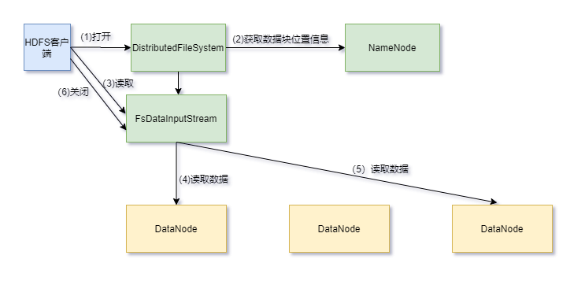
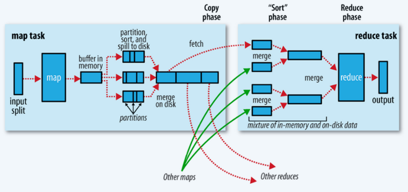
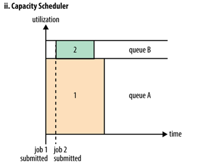
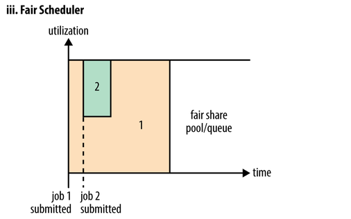

# 第一章 HDFS

## 1.1 请说下 HDFS 读写流程

### HDFS读流程

1. HDFS客户端通过`DistributedFileSystem`对象的open()方法打开要读取的文件。
2. 该对象负责向远程的NameNode发起RPC调用，得到文件数据块信息，返回数据块列表。对于每个数据块，NameNode返回该数据块的DataNode地址。这些返回的DN 地址，会按照集群拓扑结构得出 DataNode 与客户端的距离，然后进行排序，排序两个规则：网络拓扑结构中距离 Client 近的排靠前；心跳机制中超时汇报的 DN 状态为 STALE，这样的排靠后；据Client 选取排序靠前的 DataNode 来读取 block，如果客户端本身就是DataNode，那么将从本地直接获取数据(短路读取特性)。
3. 一旦收到 DataNode 的地址，该对象就会返回给客户端`FSDataInputStream`类型的对象`FSDataInputStream`包含`DFSInputStream`，`DFSInputStream`对象负责与 DataNode 和 NameNode 的交互。客户端调用`FSDataInputStream`对象的`read()`方法，该方法使`DFSInputStream`与文件的第一个块的第一个 DataNode 建立连接。
4. 通过对数据流反复调用read()方法，把数据从数据节点传输到客户端。
5. 当一个block数据读取完毕时，`DFSInputStream `关闭连接并继续定位下一个块的下一个 DataNode。读取完一个 block 都会进行 checksum 验证，把客户端读取到本地的块与 HDFS 上的原始块进行校验，如果发现校验结果不一致，说明读取 DataNode 时出现错误，客户端会通知 NameNode，然后再从下一个拥有该 block 副本的 DataNode 继续读。
6. 一旦客户端完成读取，调用`FSDataInputStream`对象的`close()`方法关闭输入流。最终读取来所有的 block 会合并成一个完整的最终文件。

### HDFS写流程

1. 客户端调用`DistributedFileSystem`对象的`create()`方法创建一个文件输出流对象。
2. `DistributedFileSystem`对象向远程的NameNode节点发起RPC调用，NameNode会检查文件是否存在，用户是否有权限新建文件。如果满足条件，则返回给客户端一个可以上传的信息。
3. 客户端根据文件的大小进行切分，默认 128M 一块，切分完成之后给NameNode 发送请求第一个 block 块上传到哪些服务器上；NameNode 收到请求之后，根据网络拓扑和机架感知以及副本机制进行文件分配，返回可用的一组数据节点；
4. 一旦收到 DataNode 的地址，该对象就会返回给客户端`FSDataOutputStream`类型的对象，客户端调用`FsDataOutputStream`对象的`write()`方法写数据，该方法使`DFSOutputStream`与文件的第一个块的第一个 DataNode 建立连接。数据先被写入缓冲区，再被切分成一个一个数据包。
5. 每个数据包被发送到由NameNode节点分配的一组数据节点的一个节点上，在这组数据节点组成的管道上依次传输数据包。
6. 管道上的数据节点反向返回确认信息，最终由管道的第一个数据节点将整条管道的确认信息发送给客户端。
7. 当一个block传输完成之后, `DFSOutputStream `关闭连接。客户端再次请求NameNode上传第二个block，NameNode 重新选择可用的一组数据节点给 客户端。最后客户端完成写入，调用`FsDataOutputStream`对象的close()方法关闭文件输出流。

## 1.2 HDFS 在读取文件的时候，如果其中一个块突然损坏了怎么办

客户端读取完 DataNode 上的块之后会进行 checksum 验证，也就是把客户端读取到本地的块与 HDFS 上的原始块进行校验，如果发现校验结果不一致，客户端会通知 NameNode，然后再从下一个拥有该 block 副本的 DataNode 继续读。

## 1.3 HDFS 在上传文件的时候，如果其中一个 DataNode 突然挂掉了怎么办

**HDFS 在上传文件的时候，如果其中一个 DataNode 突然挂掉了怎么办**

当 DataNode 突然挂掉了，客户端接收不到这个 DataNode 发送的 ack 确认，客户端会通知 NameNode，NameNode 检查该块的副本与规定的不符，NameNode 会通知DataNode 去复制副本，并将挂掉的 DataNode 作下线处理，不再让它参与文件上传与下载。

**正常情况下DataNode出错怎么办**

每个DataNode都会定期向NameNode发送心跳信号，由于网络割裂等原因导致NameNode无法联系到DataNode，NameNode通过心跳信号的缺失来检测这一情况，并将其标志为宕机，不会再将新的I/O请求发送给它们。NameNode不断检测数据块的状态，一旦发现数据块数量小于设定值，就启动复制操作。

## 1.4 NameNode 在启动的时候会做哪些操作

NameNode 数据存储在内存和本地磁盘，本地磁盘数据存储在 fsimage 镜像文件和edits 编辑日志文件。
**首次启动 NameNode：**

1. 格式化文件系统，为了生成 fsimage 镜像文件；
2. 启动 NameNode：

     - 读取 fsimage 文件，将文件内容加载进内存
     - 等待 DataNade 注册与发送 block report
3. 启动 DataNode：

     - 向 NameNode 注册
     - 发送 block report - 检查 fsimage 中记录的块的数量和 block report 中的块的总数是否相同
4. 对文件系统进行操作（创建目录，上传文件，删除文件等）：
     - 此时内存中已经有文件系统改变的信息，但是磁盘中没有文件系统改变的信
       息，此时会将这些改变信息写入 edits 文件中，edits 文件中存储的是文件系
       统元数据改变的信息。 

**第二次启动 NameNode：**

1. 读取 fsimage 和 edits 文件；

2. 将 fsimage 和 edits 文件合并成新的 fsimage 文件；
3. 创建新的 edits 文件，内容开始为空；
4. 启动 DataNode。

## 1.5 Secondary NameNode 了解吗，它的工作机制是怎样的

SecondaryNameNode职责：定期把NameNode的fsimage和edits下载到本地并且加载到内存进行合并，将合并后的fsimage上传回NameNode,这个过程叫检查点。

工作流程：

1. SecondaryNameNode定期与NameNode进行通信，要求停止使用edits文件，暂时将新的更新操作写到一个新的文件edits.new上，这个操作是瞬间完成的。
2. 把NameNode的fsimage和edits下载到本地并且加载到内存，一条条执行edits文件中的更新操作，使得内存中的fsimage保持最新，然后将合并后的fsimage上传回NameNode。
3. NameNode将接收新的fsimage文件替换旧的，并将edits.new文件更名为edits。

如果 NameNode 中的元数据丢失，是可以从 Secondary NameNode 恢复一部分
元数据信息的，但不是全部，因为 NameNode 正在写的 edits 日志还没有拷贝到
Secondary NameNode，这部分恢复不了。

## 1.6. Secondary NameNode 不能恢复 NameNode 的全部数据，那如何保证NameNode 数据存储安全

这个问题就要说 NameNode 的高可用了，即 NameNode HA。一个 NameNode 有单点故障的问题，那就配置双 NameNode，配置有两个关键点，一是必须要保证这两个 NameNode 的元数据信息必须要同步的，二是一个NameNode 挂掉之后另一个要立马补上。
1. 元数据信息同步在 HA 方案中采用的是“共享存储”。每次写文件时，需要将日志同步写入共享存储，这个步骤成功才能认定写文件成功。然后备份节点定期从共享存储同步日志，以便进行主备切换。
2. 监控 NameNode 状态采用 zookeeper，两个 NameNode 节点的状态存放在zookeeper 中，另外两个 NameNode 节点分别有一个进程监控程序，实施读取 zookeeper 中有 NameNode 的状态，来判断当前的 NameNode 是不是已经 down 机。如果 Standby 的 NameNode 节点的 ZKFC 发现主节点已经挂掉,那么就会强制给原本的 Active NameNode 节点发送强制关闭请求，之后将
备用的 NameNode 设置为 Active

**如果面试官再问 HA 中的 共享存储 是怎么实现的知道吗？**
可以进行解释下：NameNode 共享存储方案有很多，比如 Linux HA, VMware FT, QJM等，目前社区已经把由 Clouderea 公司实现的基于 QJM（Quorum Journal Manager）的方案合并到 HDFS 的 trunk 之中并且作为默认的共享存储实现。
基于 QJM 的共享存储系统主要用于保存 EditLog，并不保存 FSImage 文件。FSImage文件还是在 NameNode 的本地磁盘上。
QJM 共享存储的基本思想来自于 Paxos 算法，采用多个称为 JournalNode 的节点组成的 JournalNode 集群来存储 EditLog。每个 JournalNode 保存同样的 EditLog 副本。每次 NameNode 写 EditLog 的时候，除了向本地磁盘写入 EditLog 之外，也会并行地向 JournalNode 集群之中的每一个 JournalNode 发送写请求，只要大多数的JournalNode 节点返回成功就认为向 JournalNode 集群写入 EditLog 成功。如果有2N+1 台 JournalNode，那么根据大多数的原则，最多可以容忍有 N 台 JournalNode节点挂掉。

## 1.7 在 NameNode HA 中，会出现脑裂问题吗？怎么解决脑裂

假设 NameNode1 当前为 Active 状态，NameNode2 当前为 Standby 状态。如果某一时刻 NameNode1 对应的 ZKFailoverController 进程发生了“假死”现象，那么Zookeeper 服务端会认为 NameNode1 挂掉了，根据前面的主备切换逻辑，NameNode2会替代 NameNode1 进入 Active 状态。但是此时 NameNode1 可能仍然处于 Active状态正常运行，这样 NameNode1 和 NameNode2 都处于 Active 状态，都可以对外提供服务。这种情况称为脑裂。 

脑裂对于 NameNode 这类对数据一致性要求非常高的系统来说是灾难性的，数据会发生错乱且无法恢复。zookeeper 社区对这种问题的解决方法叫做 fencing，中文翻译为隔离，也就是想办法把旧的 Active NameNode 隔离起来，使它不能正常对外提供服务。在进行 fencing 的时候，会执行以下的操作：

1. 首先尝试调用这个旧 Active NameNode 的 HAServiceProtocol RPC 接口的 transitionToStandby 方法，看能不能把它转换为 Standby 状态。
2. 如果 transitionToStandby 方法调用失败，那么就执行 Hadoop 配置文件之中预定义的隔离措施，Hadoop 目前主要提供两种隔离措施，通常会选择 sshfence
- sshfence：通过 SSH 登录到目标机器上，执行命令 fuser 将对应的进程杀
  死；
- shellfence：执行一个用户自定义的 shell 脚本来将对应的进程隔离。

## 1.8 小文件过多会有什么危害，如何避免

Hadoop 上大量 HDFS 元数据信息存储在 NameNode 内存中,因此过多的小文件必定会压垮 NameNode 的内存。每个元数据对象约占 150byte，所以如果有 1 千万个小文件，每个文件占用一个block，则 NameNode 大约需要 2G 空间。如果存储 1 亿个文件，则 NameNode 需要20G 空间。显而易见的解决这个问题的方法就是合并小文件,可以选择在客户端上传时执行一定的策略先合并,或者是使用 Hadoop 的 CombineFileInputFormat\<K,V\>实现
小文件的合并。

## 1.9 请说下 HDFS 的组织架构

1. Client：客户端
  - 切分文件。文件上传 HDFS 的时候，Client 将文件切分成一个一个
  的 Block，然后进行存储。
  - 与 NameNode 交互，获取文件的位置信息。
  - 与 DataNode 交互，读取或者写入数据。
  - Client 提供一些命令来管理 HDFS，比如启动关闭 HDFS、访问 HDFS
  目录及内容等。
2. NameNode：名称节点，也称主节点，存储数据的元数据信息，不存储具体
  的数据
  - 管理 HDFS 的名称空间。
  - 管理数据块（Block）映射信息。
  - 配置副本策略。
  - 处理客户端读写请求。
3. DataNode：数据节点，也称从节点。NameNode 下达命令，DataNode 执行
  实际的操作
  - 存储实际的数据块。
  - 执行数据块的读/写操作。
4. Secondary NameNode：并非 NameNode 的热备。当 NameNode 挂掉的时候，
它并不能马上替换 NameNode 并提供服务
- 辅助 NameNode，分担其工作量。
- 定期合并 Fsimage 和 Edits，并推送给 NameNode。
- 在紧急情况下，可辅助恢复 NameNode。

# 第二章 MapReduce

## 2.1 请说下 MR 中 Map Task 的工作机制

简单概述：
inputFile 通过 split 被切割为多个 split 文件，通过 Record 按行读取内容给map（自己写的处理逻辑的方法） ，数据被 map 处理完之后交给 OutputCollect收集器，对其结果key进行分区（默认使用的hashPartitioner），然后写入buffer，每个 map task 都有一个内存缓冲区（环形缓冲区），存放着 map 的输出结果，当缓冲区快满的时候需要将缓冲区的数据以一个临时文件的方式溢写到磁盘，当整个 map task 结束后再对磁盘中这个 maptask 产生的所有临时文件做合并，生成最终的正式输出文件，然后等待 reduce task 的拉取。
详细步骤：

1. 读取数据组件 InputFormat (默认 TextInputFormat) 会通过getSplits 方法对输入目录中的文件进行逻辑切片规划得到 block，有多少个 block 就对应启动多少个 MapTask。
2. 将输入文件切分为 block 之后，由 RecordReader 对象 (默认是LineRecordReader) 进行读取，以 \n 作为分隔符, 读取一行数据, 返回<key，value>， Key 表示每行首字符偏移值，Value 表示这一行文本内容。
3. 读取 block 返回 <key,value>, 进入用户自己继承的 Mapper 类中，执行用户重写的 map 函数，RecordReader 读取一行这里调用一次。
4. Mapper 逻辑结束之后，将 Mapper 的每条结果通过 context.write 进行collect 数据收集。在 collect 中，会先对其进行分区处理，默认使用HashPartitioner。
5. 接下来，会将数据写入内存，内存中这片区域叫做环形缓冲区(默认 100M)，缓冲区的作用是 批量收集 Mapper 结果，减少磁盘 IO 的影响。我们的Key/Value 对以及 Partition 的结果都会被写入缓冲区。当然，写入之前，Key 与 Value 值都会被序列化成字节数组。
6. 当环形缓冲区的数据达到溢写比列(默认 0.8)，也就是 80M 时，溢写线程启动，需要对这 80MB 空间内的 Key 做排序 (Sort)。排序是 MapReduce模型默认的行为，这里的排序也是对序列化的字节做的排序。
7. 合并溢写文件，每次溢写会在磁盘上生成一个临时文件 (写之前判断是否有 Combiner)，如果 Mapper 的输出结果真的很大，有多次这样的溢写发生，磁盘上相应的就会有多个临时文件存在。当整个数据处理结束之后开
始对磁盘中的临时文件进行 Merge 合并，因为最终的文件只有一个写入磁盘，并且为这个文件提供了一个索引文件，以记录每个 reduce 对应数据的偏移量。

## 2.2 请说下 MR 中 Reduce Task 的工作机制

简单描述：
Reduce 大致分为 copy、sort、reduce 三个阶段，重点在前两个阶段。copy 阶段包含一个 eventFetcher 来获取已完成的 map 列表，由 Fetcher 线程去 copy 数据，在此过程中会启动两个 merge 线程，分别为 inMemoryMerger和 onDiskMerger，分别将内存中的数据 merge 到磁盘和将磁盘中的数据进行merge。待数据 copy 完成之后，copy 阶段就完成了。开始进行 sort 阶段，sort 阶段主要是执行 finalMerge 操作，纯粹的 sort 阶段，完成之后就是 reduce 阶段，调用用户定义的 reduce 函数进行处理。
详细步骤：
1. Copy 阶段：简单地拉取数据。Reduce 进程启动一些数据 copy 线程(Fetcher)，通过 HTTP 方式请求 maptask 获取属于自己的文件（map task的分区会标识每个 map task 属于哪个 reduce task ，默认 reduce task的标识从 0 开始）。
2. Merge 阶段：在远程拷贝数据的同时，ReduceTask 启动了两个后台线程对内存和磁盘上的文件进行合并，以防止内存使用过多或磁盘上文件过多。merge 有三种形式：内存到内存；内存到磁盘；磁盘到磁盘。默认情况下第一种形式不启用。当内存中的数据量到达一定阈值，就直接启动内存到磁盘的 merge。与 map 端类似，这也是溢写的过程，这个过程中如果你设置有 Combiner，也是会启用的，然后在磁盘中生成了众多的溢写文件。内存到磁盘的 merge 方式一直在运行，直到没有 map 端的数据时才结束，然后启动第三种磁盘到磁盘的 merge 方式生成最终的文件。
3. 合并排序：把分散的数据合并成一个大的数据后，还会再对合并后的数据排序。
4. 对排序后的键值对调用 reduce 方法：键相等的键值对调用一次 reduce 方法，每次调用会产生零个或者多个键值对，最后把这些输出的键值对写入到 HDFS 文件中。

## 2.3 请说下 MR 中 Shuffle 阶段

### Shuffle

shuffle 是 Mapreduce 的核心，它分布在 Mapreduce 的 map 阶段和 reduce阶段。一般把从 Map 产生输出开始到 Reduce 取得数据作为输入之前的过程称作 shuffle。

**Map端**

1. Collect 阶段：将 MapTask 的结果输出到默认大小为 100M 的环形缓冲区，保存的是 key/value，Partition 分区信息等。
2. Spill 阶段：当内存中的数据量达到一定的阀值（默认为0.8）的时候，就会将数据写入本地磁盘，在将数据写入磁盘之前需要对数据进行一次排序的操作，如果配置了 combiner，还会将有相同分区号和 key 的数据进行排序。
3. Merge 阶段：把所有溢出的临时文件进行一次合并操作，以确保一个 MapTask 最终只产生一个中间数据文件。

**Reduce端**

1. Copy 阶段：ReduceTask 启动 Fetcher 线程到已经完成 MapTask 的节点上复制一份属于自己的数据，这些数据默认会保存在内存的缓冲区中，当内存的缓冲区达到一定的阀值的时候，就会将数据写到磁盘之上。
2. Merge 阶段：在 ReduceTask 远程复制数据的同时，会在后台开启两个线程对内存到本地的数据文件进行合并操作。
3. Sort 阶段：在对数据进行合并的同时，会进行排序操作，由于 MapTask 阶段已经对数据进行了局部的排序，ReduceTask 只需保证 Copy 的数据的最终整体有效性即可。Shuffle 中的缓冲区大小会影响到 mapreduce 程序的执行效率，原则上说，缓冲区越大，磁盘 io 的次数越少，执行速度就越快。缓冲区的大小可以通过参数调整, 参数：mapreduce.task.io.sort.mb 默认为 100M。

## 2.4 Shuffle 阶段的数据压缩机制了解吗

在 shuffle 阶段，可以看到数据通过大量的拷贝，从 map 阶段输出的数据，都要通过网络拷贝，发送到 reduce 阶段，这一过程中，涉及到大量的网络 IO，如果数据能够进行压缩，那么数据的发送量就会少得多。
hadoop 当中支持的压缩算法：gzip、bzip2、LZO、LZ4、Snappy，这几种压缩算法综合压缩和解压缩的速率，
谷歌的 Snappy 是最优的，一般都选择 Snappy 压缩。

## 2.5 在写 MR 时，什么情况下可以使用规约

规约（combiner）是不能够影响任务的运行结果的局部汇总，适用于求和类，不适用于求平均值，如果 reduce 的输入参数类型和输出参数的类型是一样的，则规约的类可以使用 reduce 类，只需要在驱动类中指明规约的类即可。

# 第三章 YARN

## 3.1 YARN 集群的架构和工作原理知道多少

YARN 的基本设计思想是将 MapReduce V1 中的 JobTracker 拆分为两个独立的服务：ResourceManager 和 ApplicationMaster。
ResourceManager 负责整个系统的资源管理和分配，ApplicationMaster 负责单个应用程序的的管理。

1. ResourceManager： RM 是一个全局的资源管理器，负责整个系统的资源管理和分配，它主要由两个部分组成：调度器（Scheduler）和应用程序管理器（ApplicationManager）。 调度器根据容量、队列等限制条件，将系统中的资源分配给正在运行的应用程序，在保证容量、公平性和服务等级的前提下，优化集群资源利用率，让所有的资源都被充分利用应用程序管理器负责管理整个系统中的所有的应用程序，包括应用程序的提交、与调度器协商资源以启动 ApplicationMaster、监控ApplicationMaster 运行状态并在失败时重启它。
2. ApplicationMaster： 用户提交的一个应用程序会对应于一个ApplicationMaster，它的主要功能有：
- 与 RM 调度器协商以获得资源，资源以 Container 表示。
- 将得到的任务进一步分配给内部的任务。
- 与 NM 通信以启动/停止任务。
- 监控所有的内部任务状态，并在任务运行失败的时候重新为任务申
请资源以重启任务。
3. NodeManager： NodeManager 是每个节点上的资源和任务管理器，一方面，它会定期地向 RM 汇报本节点上的资源使用情况和各个 Container 的运行状态；另一方面，他接收并处理来自 AM 的 Container 启动和停止请求。
4. Container： Container 是 YARN 中的资源抽象，封装了各种资源。一个应用程序会分配一个 Container，这个应用程序只能使用这个 Container 中描述的资源。不同于 MapReduceV1 中槽位 slot 的资源封装，Container 是一个动态资源的划分单位，更能充分利用资源。

## 3.2 YARN 的任务提交流程是怎样的

当 jobclient 向 YARN 提交一个应用程序后，YARN 将分两个阶段运行这个应用程序：一是启动ApplicationMaster;第二个阶段是由 ApplicationMaster 创建应用程序，为它申请资源，监控运行直到结束。 具体步骤如下:
1. 用户向 YARN 提交一个应用程序，并指定 ApplicationMaster 程序、启动ApplicationMaster 的命令、用户程序。
2. RM 为这个应用程序分配第一个 Container，并与之对应的 NM 通讯，要求它在这个 Container 中启动应用程序 ApplicationMaster。
3. ApplicationMaster 向 RM 注册，然后拆分为内部各个子任务，为各个内部任务申请资源，并监控这些任务的运行，直到结束。
4. AM 采用轮询的方式向 RM 申请和领取资源。
5. RM 为 AM 分配资源，以 Container 形式返回。
6. AM 申请到资源后，便与之对应的 NM 通讯，要求 NM 启动任务。
7. NodeManager 为任务设置好运行环境，将任务启动命令写到一个脚本中，
并通过运行这个脚本启动任务。
8. 各个任务向 AM 汇报自己的状态和进度，以便当任务失败时可以重启任务。
9. 应用程序完成后，ApplicationMaster 向 ResourceManager 注销并关闭自
己。

## 3.3 YARN 的资源调度三种模型了解吗

在 Yarn 中有三种调度器可以选择：FIFO Scheduler ，Capacity Scheduler，Fair Scheduler。
Apache 版本的 hadoop 默认使用的是 Capacity Scheduler 调度方式。CDH 版本的默认使用的是 Fair Scheduler 调度方式。

1. **FIFO Scheduler（先进先出调度器）：**

   

   FIFO Scheduler 把应用按提交的顺序排成一个队列，这是一个先进先出队列，在进行资源分配的时候，先给队列中最头上的应用进行分配资源，待最头上的应用需求满足后再给下一个分配，以此类推。但是大的应用可能会占用所有集群资源，这就导致其它应用被阻塞。

2. **Capacity Scheduler（容量调度器）：**

   

   Capacity Scheduler容量调度适合多用户调度器，它以队列为单位划分资源。每个队列可设定一定比例的资源最低保证和使用上限。每个用户也可设置一定的资源使用上限，以防资源滥用。并支持资源共享，将队列剩余资源共享给其他队列使用。

   在FIFO的基础上，增加多用户支持，最大化集群吞吐量和利用率。它基于一个很朴素的思想：每个用户都可以使用特定量的资源，当集群空闲时，也可以使用整个集群的资源。也就是说，单用户的情况下，和FIFO差不多。

3. **Fair Scheduler（公平调度器）：**

   

   Fair 调度器是一个队列资源分配方式，会为所有运行的 job 动态的调整系统资源。当集群只有一个任务时，此任务会占用集群的全部资源，当其他的任务提交后，那些释放的资源会被分配给新的任务，所以每个任务最终都能获得几乎一样多的资源。

