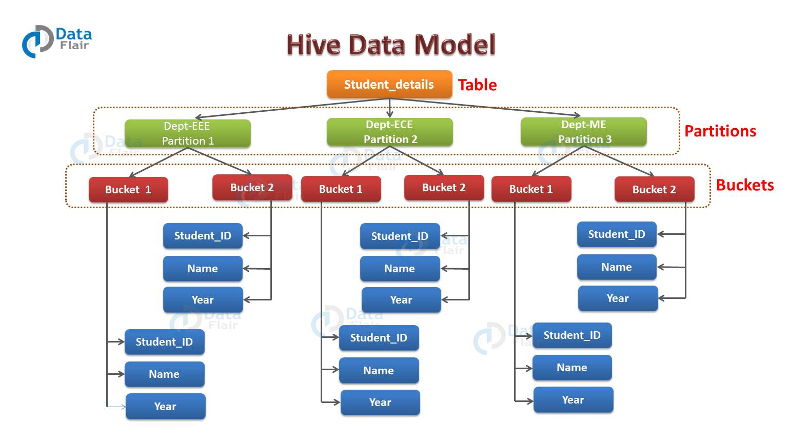
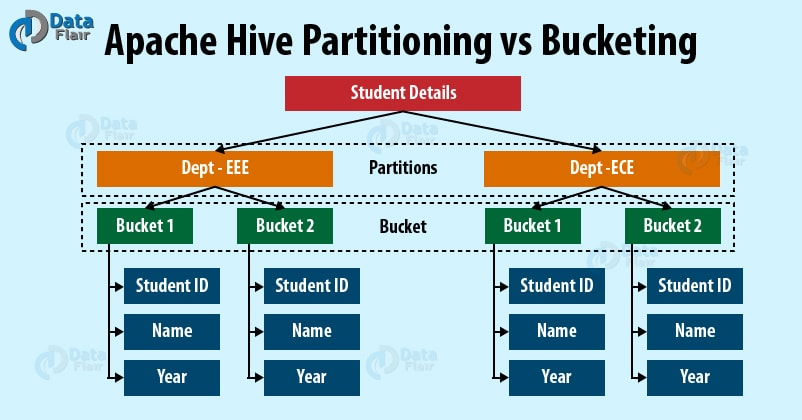

# 第一章 Hive简介

Hive是一个基于Hadoop的数据仓库工具，可以用于对Hadoop文件中的数据集进行整理、查询、分析。Hive提供了类似于SQL的HiveQL，HiveQL可以转化为MapReduce任务进行运行，而不必开发专门的MapReduce应用。

# 第二章 安装Hive

1. 嵌入模式的安装特点：不需要MySQL数据库的支持，使用Hive自带的数据块Derby。但只支持一个数据库连接。
2. 本地模式的安装特点：采用MySQL数据库存储数据。
3. 远程模式的安装特点：如果有其他主机已经启动了Metastore服务（hive --service metastore），参考本地模式的安装步骤并修改配置文件hive-site.xml即可。

# 第三章 Hive的数据类型和存储格式

Hive 的基本数据类型有：TINYINT，SAMLLINT，INT，BIGINT，BOOLEAN，FLOAT，DOUBLE，DECIMAL，STRING，TIMESTAMP(V0.8.0+)和 BINARY(V0.8.0+)。

对 decimal 类型简单解释下：
用法：decimal(11,2) 代表最多有 11 位数字，其中后 2 位是小数，整数部分是 9
位；如果整数部分超过 9 位，则这个字段就会变成 null；如果小数部分不足 2 位，
则后面用 0 补齐两位，如果小数部分超过两位，则超出部分四舍五入
也可直接写 decimal，后面不指定位数，默认是 decimal(10,0) 整数 10 位，没有
小数。

Hive 的集合类型有：STRUCT，MAP 和 ARRAY。

Hive支持的存储数据的格式主要有： TEXTFILE 文本格式文件（行式存储）、 SEQUENCEFILE 二进制序列化文件(行式存储)、ORC（列式存储）、PARQUET（列式存储）、Avro（不是列存储，是一个数据序列化系统）等。

# 第四章 Hive的数据模型

Hive 主要有四种数据模型(即表)：内部表、外部表、分区表和桶表。

表的元数据保存传统的数据库的表中，当前 hive 只支持 Derby 和 MySQL 数据库。

`HiveQL提示: ROW FORMAT DELIMITED FIELDS TERMINATED BY  以结束的行格式分隔字段`

## 4.1 表

Hive 表跟关系数据库里面的表类似。逻辑上，数据是存储在 Hive 表里面的，而表的元数据描述了数据的布局。我们可以对表执行过滤，关联，合并等操作。在 Hadoop 里面，物理数据一般是存储在 HDFS 的，而元数据是存储在关系型数据库的，当前 hive 只支持 Derby 和 MySQL 数据库。Hive 有下面两种表：

- **内部表**
- **外部表**

当我们在 Hive 创建表的时候，Hive 将以默认的方式管理表数据，也就是说，Hive 会默认把数据存储到 `/user/hive/warehouse` 目录里面。除了内部表，我们可以创建外部表，外部表需要指定数据的目录。我们可以看到这两种不同类型的表在使用 LOAD 和 DROP 命令时的差异。

除此之外，Hive还有分区表和桶表。

因此Hive 主要有四种数据模型(即表)：内部表、外部表、分区表和桶表

### 4.2 内部表

当我们把数据 load 到内部表的时候，Hive 会把数据移动并存储在 `/user/hive/warehouse` 目录下。

```sql
CREATE TABLE managed_table (dummy STRING);
LOAD DATA INPATH '/user/tom/data.txt' INTO table managed_table;
```

根据上面的代码，Hive 会把文件 data.txt 文件移动并存储在 managed_table 表的 warehouse 目录下，即 hdfs://user/hive/warehouse/managed_table 目录。

如果我们用 drop 命令把表删除：

```sql
DROP TABLE managed_table
```

这样将会把表以及表里面的数据和表的元数据都一起删除。

### 4.3 外部表

外部表与内部表的行为上有些差别。删除外部表的时候，Hive 只会删除表的元数据，不会删除表数据。数据路径是在创建表的时候指定的：

```sql
CREATE EXTERNAL TABLE external_table (dummy STRING)
LOCATION '/user/tom/external_table';
LOAD DATA INPATH '/user/tom/data.txt' INTO TABLE external_table;
```

利用 `EXTERNAL` 关键字创建外部表，Hive 不会去管理表数据，所以它不会把数据移到 `/user/hive/warehouse` 目录下。甚至在执行创建语句的时候，它不会去检查建表语句中指定的外部数据路径是否存在。这个是比较有用的特性，我们可以在表创建之后，再创建数据。
外部表还有一个比较重要的特性，上面有提到的，就是删除外部表的时候，Hive 只有删除表的元数据，而不会删除表数据。

## 4.4 分区表


为了提高查询数据的效率，Hive 提供了表分区机制。分区表基于分区键把具有相同分区键的数据存储在一个目录下，在查询某一个分区的数据的时候，只需要查询相对应目录下的数据，而不会执行全表扫描，也就是说，Hive 在查询的时候会进行分区剪裁。每个表可以有一个或多个分区键。

创建分区表语法：

```sql
CREATE TABLE table_name (column1 data_type, column2 data_type)
PARTITIONED BY (partition1 data_type, partition2 data_type,….);
```

下面通过一个例子来更好的理解分区概念。

如上图所示，假如你有一个存储学生信息的表，表名为 `student_details`，列分别是 `student_id`，`name`，`department`，`year` 等。现在，如果你想基于 department 列对数据进行分区。那么属于同一个 department 的学生将会被分在同一个分区里面。在物理上，一个分区其实就是表目录下的一个子目录。

假如你在 student_details 表里面有三个 department 的数据，分别为 EEE，ECE 和 ME。那么这个表总共就会有三个分区，也就是图中的绿色方块部分。对于每个 department ，您将拥有与该 department 相关的所有数据，这些数据位于表目录下的单独子目录中。

假如所有 `department = EEE` 的学生数据被存储在 `/user/hive/warehouse/student_details/department=EEE` 目录下。那么查询 `department` 为 `EEE` 的学生信息，只需要查询 `EEE` 目录下的数据即可，不需要全表扫描，这样查询的效率就比较高。而在真实生产环境中，你需要处理的数据可能会有几百 TB，如果不分区，在你只需要表的其中一小部分数据的时候，你不得不走全表扫描，这样的查询将会非常慢而且浪费资源，可能 95% 的数据跟你的查询语句并没有关系。

## 4.5 分桶表



Hive 可以对每一个表或者是分区，进一步组织成桶，也就是说桶是更为细粒度的数据范围划分。Hive 是针对表的某一列进行分桶。Hive 采用对表的列值进行哈希计算，然后除以桶的个数求余的方式决定该条记录存放在哪个桶中。分桶的好处是可以获得更高的查询处理效率。使取样更高效。

分桶表创建命令：

```sql
CREATE TABLE table_name
PARTITIONED BY (partition1 data_type, partition2 data_type,….) 
CLUSTERED BY (column_name1, column_name2, …) 
SORTED BY (column_name [ASC|DESC], …)] 
INTO num_buckets BUCKETS;
```

每个桶只是表目录或者分区目录下的一个文件，如果表不是分区表，那么桶文件会存储在表目录下，如果表是分区表，那么桶文件会存储在分区目录下。所以你可以选择把分区分成 n 个桶，那么每个分区目录下就会有 n 个文件。从上图可以看到，每个分区有 2 个桶。因此每个分区就会有 2 个文件，每个文件将会存储该分区下的数据。

# 参考文献

> 《Hadoop大数据技术与应用》杨治明 许桂秋主编
>
> 《Hive数据模型》https://www.hadoopdoc.com/hive/hive-data-model
>
> 《Hive 分区与分桶》https://data-flair.training/blogs/hive-partitioning-vs-bucketing/
