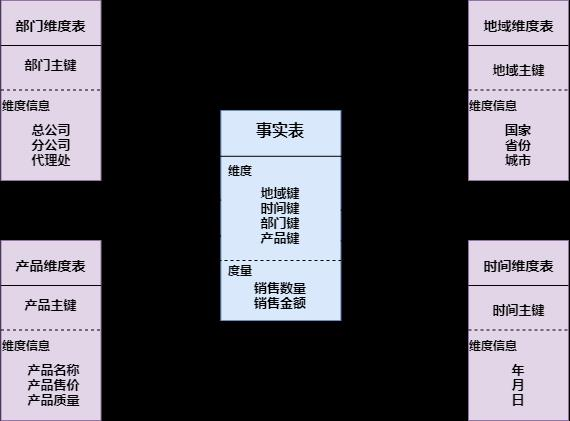
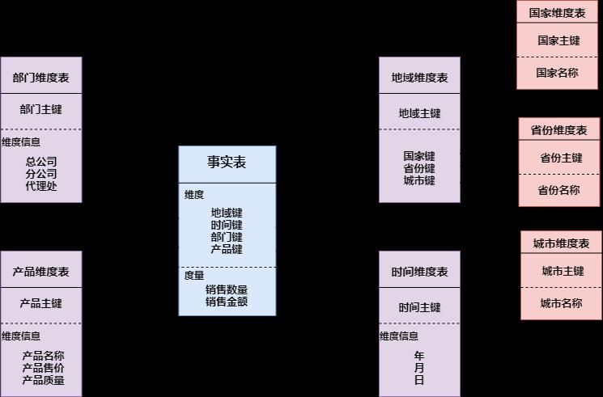
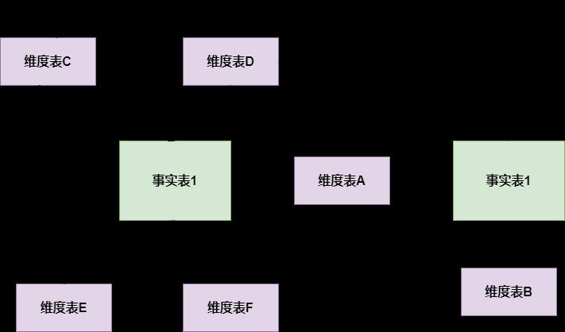

# 1. hive 内部表和外部表的区别

未被 external 修饰的是内部表，被 external 修饰的为外部表。
区别：

1. 内部表数据由 Hive 自身管理，外部表数据由 HDFS 管理；
2. 内部表数据存储的位置是 hive.metastore.warehouse.dir（默认：/user/hive/warehouse），外部表数据的存储位置由自己制定（如果没有LOCATION，Hive 将在 HDFS 上的/user/hive/warehouse 文件夹下以外部表的表名创建一个文件夹，并将属于这个表的数据存放在这里）；
3. 删除内部表会直接删除元数据（metadata）及存储数据；删除外部表仅仅会删除元数据，HDFS 上的文件并不会被删除。

# 2. Hive 有索引吗

Hive 支持索引（3.0 版本之前），但是 Hive 的索引与关系型数据库中的索引并不相同，比如，Hive 不支持主键或者外键。并且 Hive 索引提供的功能很有限，效率也并不高，因此 Hive 索引很少使用。
索引适用的场景：
适用于不更新的静态字段。以免总是重建索引数据。每次建立、更新数据后，都要重建索引以构建索引表。

Hive 索引的机制如下：
hive 在指定列上建立索引，会产生一张索引表（Hive 的一张物理表），里面的字段包括：索引列的值、该值对应的 HDFS 文件路径、该值在文件中的偏移量。Hive 0.8 版本后引入 bitmap 索引处理器，这个处理器适用于去重后，值较少的列（例如，某字段的取值只可能是几个枚举值）。 因为索引是用空间换时间，索引列的取值过多会导致建立 bitmap 索引表过大。
**注意**：Hive 中每次有数据时需要及时更新索引，相当于重建一个新表，否则会影响数据查询的效率和准确性，Hive 官方文档已经明确表示 Hive 的索引不推荐被使用，在新版本的 Hive 中已经被废弃了。
扩展：Hive 是在 0.7 版本之后支持索引的，在 0.8 版本后引入 bitmap 索引处理器，在 3.0 版本开始移除索引的功能，取而代之的是 2.3 版本开始的物化视图，自动重写的物化视图替代了索引的功能。

# 3. 运维如何对 hive 进行调度

1. 将 hive 的 sql 定义在脚本当中；
2. 使用 azkaban 或者 oozie 进行任务的调度；
3. 监控任务调度页面。

# 4. ORC、Parquet 等列式存储的优点

ORC 和 Parquet 都是高性能的存储方式，这两种存储格式总会带来存储和性能上
的提升。
Parquet:

1. Parquet 支持嵌套的数据模型，类似于 Protocol Buffers，每一个数据模型的 schema 包含多个字段，每一个字段有三个属性：重复次数、数据类型和字段名。
重复次数可以是以下三种：required(只出现 1 次)，repeated(出现 0 次
或多次)，optional(出现 0 次或 1 次)。每一个字段的数据类型可以分成两种： group(复杂类型)和 primitive(基本类型)。

2. Parquet 中没有 Map、Array 这样的复杂数据结构，但是可以通过 repeated和 group 组合来实现的。

3. 由于 Parquet 支持的数据模型比较松散，可能一条记录中存在比较深的嵌套关系，如果为每一条记录都维护一个类似的树状结可能会占用较大的存储空间，因此 Dremel 论文中提出了一种高效的对于嵌套数据格式的压缩
算法：Striping/Assembly 算法。通过 Striping/Assembly 算法，parquet可以使用较少的存储空间表示复杂的嵌套格式，并且通常 Repetitionlevel 和 Definition level 都是较小的整数值，可以通过 RLE 算法对其进行压缩，进一步降低存储空间。

4. Parquet 文件是以二进制方式存储的，是不可以直接读取和修改的，Parquet 文件是自解析的，文件中包括该文件的数据和元数据。

ORC:

1. ORC 文件是自描述的，它的元数据使用 Protocol Buffers 序列化，并且文件中的数据尽可能的压缩以降低存储空间的消耗。
2. 和 Parquet 类似，ORC 文件也是以二进制方式存储的，所以是不可以直接读取，ORC 文件也是自解析的，它包含许多的元数据，这些元数据都是同构 ProtoBuffer 进行序列化的。
3. ORC 会尽可能合并多个离散的区间尽可能的减少 I/O 次数。
4. ORC 中使用了更加精确的索引信息，使得在读取数据时可以指定从任意一行开始读取，更细粒度的统计信息使得读取 ORC 文件跳过整个 row group， ORC 默认会对任何一块数据和索引信息使用 ZLIB 压缩，因此 ORC 文件占用的存储空间也更小。

5. 在新版本的 ORC 中也加入了对 Bloom Filter 的支持，它可以进一 步提升谓词下推的效率，在 Hive 1.2.0 版本以后也加入了对此的支 持。

# 5. 数据建模用的哪些模型？

## 5.1 星型模型



星型模式(Star Schema)是最常用的维度建模方式。星型模式是以事实表为中心，所有的维度表直接连接在事实表上，像星星一样。 星形模式的维度建模由一个事实表和一组维表成，且具有以下特点：

1. 维表只和事实表关联，维表之间没有关联。
2.  每个维表主键为单列，且该主键放置在事实表中，作为两边连接的外键。
3. 以事实表为核心，维表围绕核心呈星形分布。

## 5.2 雪花模型



雪花模型(Snowflake Schema)是对星形模型的扩展。雪花模型的维度表可以拥有其他维度表的，虽然这种模型相比星型更规范一些，但是由于这种模型不太容易理解，维护成本比较高，而且性能方面需要关联多层维表，性能比星型模型要低。

## 5.3 星座模型



星座模型是星型模型延伸而来，星型模型是基于一张事实表的，而星座模型是基于多张事实表的，而且共享维度信息。前面介绍的两种维度建模方法都是多维表对应单事实表，但在很多时候维度空间内的事实表不止一个，而一个维表也可能被多个事实表用到。在业务发展后期，绝大部分维度建模都采用的是星座模型。

# 6. 为什么要对数据仓库分层？

-  用空间换时间，通过大量的预处理来提升应用系统的用户体验（效率），因此数据仓库会存在大量冗余的数据。
-  如果不分层的话，如果源业务系统的业务规则发生变化将会影响整个数据清洗过程，工作量巨大。
-  通过数据分层管理可以简化数据清洗的过程，因为把原来一步的工作分到了多个步骤去完成，相当于把一个复杂的工作拆成了多个简单的工作，把一个大的黑盒变成了一个白盒，每一层的处理逻辑都相对简单和容易理解，这样我们比较容易保证每一个步骤的正确性，当数据发生错误的时候，往往我们只需要局部调整某个步骤即可。

# 7. 使用过 Hive 解析 JSON 串吗

Hive 处理 json 数据总体来说有两个方向的路走：
1. 将 json 以字符串的方式整个导入 Hive 表，然后通过使用 UDF 函数解析已经导入到 hive 中的数据，比如使用 LATERAL VIEW json_tuple 的方法，获取所需要的列名。
2. 在导入之前将 json 拆成各个字段，导入 Hive 表的数据是已经解析过的。这将需要使用第三方的 SerDe。

# 8. sort by 和 order by 的区别

order by 会对输入做全局排序，因此只有一个 reducer（多个 reducer 无法保证全局有序）。只有一个 reducer，会导致当输入规模较大时，需要较长的计算时间。

sort by 不是全局排序，其在数据进入 reducer 前完成排序。

因此，如果用 sort by 进行排序，并且设置 mapred.reduce.tasks>1，则 sort by 只保证每个 reducer的输出有序，不保证全局有序。

# 9. 数据倾斜怎么解决

数据倾斜问题主要有以下几种：
1. 空值引发的数据倾斜

2. 不同数据类型引发的数据倾斜

3. 不可拆分大文件引发的数据倾斜

4. 数据膨胀引发的数据倾斜

5. 表连接时引发的数据倾斜

6. 确实无法减少数据量引发的数据倾斜

**注意**：对于 left join 或者 right join 来说，不会对关联的字段自动去除 null 值，对于 inner join 来说，会对关联的字段自动去除 null 值。

# 10. Hive 小文件过多怎么解决

## 10.1 使用 hive 自带的 concatenate 命令，自动合并小文件
使用方法：

  ```sql
  #对于非分区表
  alter table A concatenate;
  #对于分区表
  alter table B partition(day=20201224) concatenate;
  ```

  **注意**：
  1、concatenate 命令只支持 RCFILE 和 ORC 文件类型。
  2、使用 concatenate 命令合并小文件时不能指定合并后的文件数量，但可以多次执行该命令。
  3、当多次使用 concatenate 后文件数量不在变化，这个跟参数mapreduce.input.fileinputformat.split.minsize=256mb 的设置有关，可设定每个文件的最小 size。

## 10.2 调整参数减少 Map 数量
设置 map 输入合并小文件的相关参数（执行 Map 前进行小文件合并）：

1. 在 mapper 中将多个文件合成一个 split 作为输入（CombineHiveInputFormat 底层是 Hadoop 的CombineFileInputFormat 方法）：

      ```sql
      set hive.input.format=org.apache.hadoop.hive.ql.io.CombineHiveInputFormat; -- 默认
      ```

  2. 每个 Map 最大输入大小（这个值决定了合并后文件的数量）：

      ```sql
      set mapred.max.split.size=256000000; -- 256M 
      ```

  3. 一个节点上 split 的至少大小（这个值决定了多个 DataNode 上的文件是否需要合并）：

      ```sql
      set mapred.min.split.size.per.node=100000000; -- 100M 
      ```

  4. 一个交换机下 split 的至少大小(这个值决定了多个交换机上的文件是否需要合并)：

      ```sql
      set mapred.min.split.size.per.rack=100000000; -- 100M
      ```

## 10.3 减少 Reduce 的数量
reduce 的个数决定了输出的文件的个数，所以可以调整 reduce 的个数控制 hive表的文件数量。
  hive 中的分区函数 distribute by 正好是控制 MR 中 partition 分区的，可以通过设置 reduce 的数量，结合分区函数让数据均衡的进入每个 reduce 即可：

1. 设置 reduce 的数量有两种方式，第一种是直接设置 reduce 个数

      ```sql
      set mapreduce.job.reduces=10;
      ```

  2. 第二种是设置每个 reduce 的大小，Hive 会根据数据总大小猜测确定一个 reduce 个数

      ```sql
      set hive.exec.reducers.bytes.per.reducer=5120000000; -- 默认是 1G，设置为 5G
      ```

  3. 执行以下语句，将数据均衡的分配到 reduce 中

      ```sql
      set mapreduce.job.reduces=10;
      insert overwrite table A partition(dt)
      select * from B
      distribute by rand();
      ```

  ​	对于上述语句解释：如设置 reduce 数量为 10，使用 rand()， 随机生成一个数x % 10 ， 这样数据就会随机进入 reduce 中，防止出现有的文件过大或过小。

## 10.4 使用 hadoop 的 archive 将小文件归档
Hadoop Archive 简称 HAR，是一个高效地将小文件放入 HDFS 块中的文件存档工具，它能够将多个小文件打包成一个 HAR 文件，这样在减少 namenode 内存使用的同时，仍然允许对文件进行透明的访问。

1. 用来控制归档是否可用

    ```sql
    set hive.archive.enabled=true;
    ```

2. 通知 Hive 在创建归档时是否可以设置父目录

    ```sql
    set hive.archive.har.parentdir.settable=true;
    ```

3. 控制需要归档文件的大小

    ```sql
    set har.partfile.size=1099511627776;
    ```

  4. 使用以下命令进行归档：

     ```sql
     ALTER TABLE A ARCHIVE PARTITION(dt='2021-05-07', hr='12');
     ```

  5. 对已归档的分区恢复为原文件：

     ```sql
     ALTER TABLE A UNARCHIVE PARTITION(dt='2021-05-07', hr='12');
     ```

# 11. Hive 优化有哪些

1. **数据存储及压缩**：
针对 hive 中表的存储格式通常有 orc 和 parquet，压缩格式一般使用 snappy。
相比与 textfile 格式表，orc 占有更少的存储。因为 hive 底层使用 MR 计算架构，数据流是 hdfs 到磁盘再到 hdfs，而且会有很多次，所以使用 orc 数据格式和 snappy 压缩策略可以降低 IO 读写，还能降低网络传输量，这样在一定程度上可以节省存储，还能提升 hql 任务执行效率；
2. **通过调参优化**：
- 并行执行，调节 parallel 参数；
- 调节 jvm 参数，重用 jvm；
- 设置 map、reduce 的参数；开启 strict mode 模式；
- 关闭推测执行设置。
3. **有效地减小数据集将大表拆分成子表**；**结合使用外部表和分区表。**
4. **SQL 优化**
- 大表对大表：尽量减少数据集，可以通过分区表，避免扫描全表或者全字段；
-  大表对小表：设置自动识别小表，将小表放入内存中去执行。

