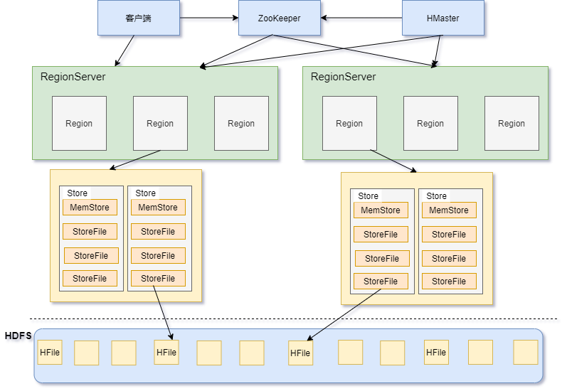
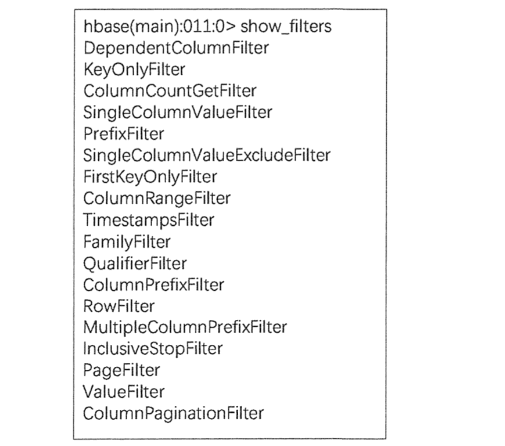
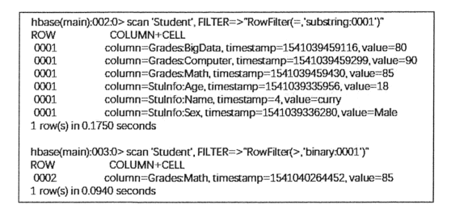
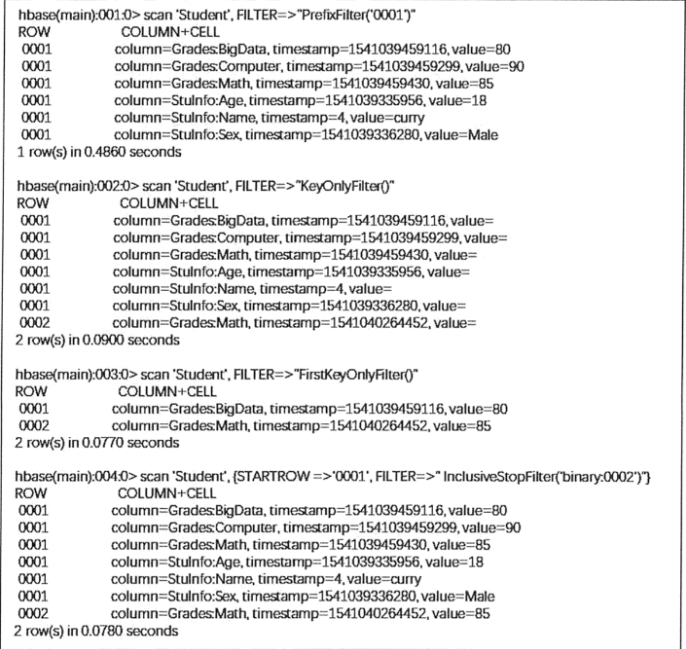
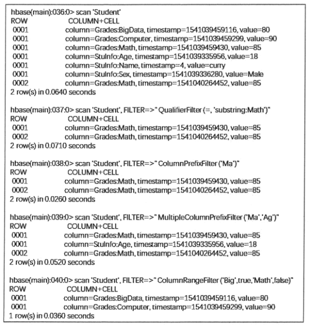
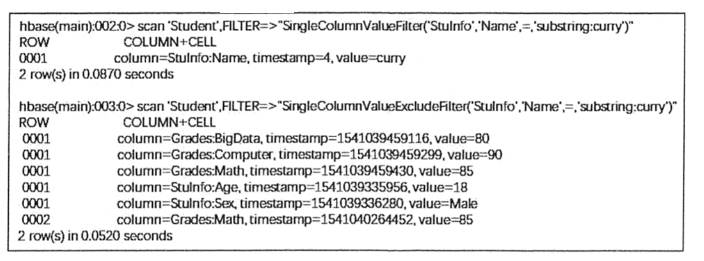

# HBASE

HBase是一个开源的、分布式的、可扩展的、列存储的、版本化的非关系型数据库，利用HDFS提供分布式数据存储。

## Hbase的组件和功能

HBase系统架构图如下：

### 客户端

客户端包含访问 HBase 的接口，是整个 HBase 系统的入口，使用者直接通过客户端操作 HBase。客户端使用 HBase 的 RPC 机制与 HMaster 和 RegionServer 进行通信。

在一般情况下，客户端与 HMaster 进行管理类操作的通信，在获取 RegionServer 的信息后，直接与RegionServer 进行数据读写类操作。而且客户端获取 Region 的位置信息后会缓存下来，用来加速后续数据的访问过程。

### ZooKeeper

ZooKeepeer是一个高性能、集中化、分布式应用程序协调服务，主要解决分布式应用中遇到的数据管理问题，如Master选举、数据发布/订阅、集群管理等。在Hadoop中，ZooKeeper主要用于实现HA，包括HDFS的NameNode和YARN的ResourceManager的HA。

ZooKeeper在HBase负责任务如下：

1. Master选举。HBase集群有多个HMaster并存，通过竞争选举保证同一时刻只有一个HMaster处于活跃状态，一旦这个HMaster挂掉，则备用HMaster替换并继续提供服务，保证集群的高可靠性。

2. 系统容错

   在 HBase 启动时，每个 RegionServer 在加入集群时都需要到 ZooKeeper 中进行注册，创建一个状态节点，ZooKeeper 会实时监控每个 RegionServer 的状态，同时 HMaster 会监听这些注册的 RegionServer。

   当某个 RegionServer 挂断的时候，ZooKeeper 会因为一段时间内接收不到它的心跳信息而删除该RegionServer 对应的状态节点，并且给 HMaster 发送节点删除的通知。这时，HMaster 获知集群中某节点断开，会立即调度其他节点开启容错机制。

3. Region 元数据管理

   在 HBase 集群中，Region 元数据被存储在 Meta 表中。每次客户端发起新的请求时，需要查询 Meta 表来获取 Region 的位置，而 Meta 表是存在 ZooKeeper 中的。

   当 Region 发生变化时，例如，Region 的手工移动、进行负载均衡的移动或 Region 所在的 RegionServer 出现故障等，就能够通过 ZooKeeper 来感知到这一变化，保证客户端能够获得正确的 Region 元数据信息。

4. Region 状态管理

   HBase 集群中 Region 会经常发生变更，其原因可能是系统故障，配置修改，或者是 Region 的分裂和合并。只要 Region 发生变化，就需要让集群的所有节点知晓，否则就会出现某些事务性的异常。

   而对于 HBase 集群，Region 的数量会达到 10 万，甚至更多。如此规模的 Region 状态管理如果直接由 HMaster 来实现，则 HMaster 的负担会很重，因此只有依靠 ZooKeeper 系统来完成。

5. 提供 Meta 表存储位置

   在 HBase 集群中，数据库表信息、列族信息及列族存储位置信息都属于元数据。这些元数据存储在 Meta 表中，而 Meta 表的位置入口由 ZooKeeper 来提供。

### HMaster

HMaster 是 HBase集群中的主服务器，负责监控集群中的所有 RegionServer，并且是所有元数据更改的接口。

在分布式集群中，HMaster 服务器通常运行在 HDFS 的 NameNode上，HMaster 通过 ZooKeeper 来避免单点故障，在集群中可以启动多个 HMaster，但 ZooKeeper 的选举机制能够保证同时只有一个 HMaster 处于 Active 状态，其他的 HMaster 处于Standby状态。

HMaster 主要负责表和 Region 的管理工作。

1. 管理用户对表的增、删、改、查操作。

HMaster 提供了下表中的一些基于元数据方法的接口，便于用户与 HBase 进行交互。

| 相关接口        | 功能                                |
| --------------- | ----------------------------------- |
| HBase 表        | 创建表、删除表、启用/失效表、修改表 |
| HBase 列表      | 添加列、修改列、移除列              |
| HBase 表 Region | 移动 Region、分配和合并 Region      |

2. 管理 RegionServer 的负载均衡，调整 Region 的分布。

3. Region 的分配和移除。

4. 处理 RegionServer 的故障转移。

当某台 RegionServer 出现故障时，总有一部分新写入的数据还没有持久化地存储到磁盘中，因此在迁移该 RegionServer 的服务时，需要从修改记录中恢复这部分还在内存中的数据，HMaster 需要遍历该 RegionServer 的修改记录，并按 Region 拆分成小块移动到新的地址下。

另外，当 HMaster 节点发生故障时，由于客户端是直接与 RegionServer 交互的，且 Meta 表也是存在于 ZooKeeper 当中，整个集群的工作会继续正常运行，所以当 HMaster 发生故障时，集群仍然可以稳定运行。

但是 HMaster 还会执行一些重要的工作，例如，Region 的切片、RegionServer 的故障转移等，如果 HMaster 发生故障而没有及时处理，这些功能都会受到影响，因此 HMaster 还是要尽快恢复工作。 ZooKeeper 组件提供了这种多 HMaster 的机制，提高了 HBase 的可用性和稳健性。

### RegionServer

在 HDFS 中，DataNode 负责存储实际数据。RegionServer 主要负责响应用户的请求，向 HDFS 读写数据。一般在分布式集群中，RegionServer 运行在 DataNode 服务器上，实现数据的本地性。

每个 RegionServer 包含多个 Region，它负责的功能如下：

- 处理分批给它的 Region。
- 处理客户端读写请求。
- 刷新缓存到 HDFS 中。
- 处理 Region 分片。
- 执行压缩。

RegionServer 是 HBase中最核心的模块，其内部管理了一系列 Region 对象，每个 Region 由多个 HStore 组成，每个 HStore 对应表中一个列族的存储。

HBase 是按列进行存储的，将列族作为一个集中的存储单元，并且 HBase 将具备相同 I/O 特性的列存储到一个列族中，这样可以保证读写的高效性。

在HBase架构图中，RegionServer 最终将 Region 数据存储在 HDFS 中，采用 HDFS 作为底层存储。

HBase 自身并不具备数据复制和维护数据副本的功能，而依赖 HDFS 为 HBase 提供可靠和稳定的存储。

## HBase数据模型及使用

一个单元格可以用行键、列族、列、时间戳来确定。

HBase的逻辑数据模型，是有空值的，但真实的物理存储是无空值的。

## Shell

### 添加操作

1. 进入 HBase 客户端命令操作界面
   $ bin/hbase shell
2. 查看帮助命令
   hbase(main):001:0> help
3. 查看当前数据库中有哪些表
   hbase(main):002:0> list
4. 创建一张表
   创建 user 表，包含 info、data 两个列族
   hbase(main):010:0> create 'user', 'info', 'data' 或者
   hbase(main):010:0> create 'user', {NAME => 'info', VERSIONS => '3'}，{NAME => 'data'}
5. 添加数据操作
   向 user 表中插入信息，row key 为 rk0001，列族 info 中添加 name 列标示
   符，值为 zhangsan
   hbase(main):011:0> put 'user', 'rk0001', 'info:name', 'zhangsan' 向 user 表中插入信息，row key 为 rk0001，列族 info 中添加 gender 列标
   示符，值为 female
   hbase(main):012:0> put 'user', 'rk0001', 'info:gender', 'female' 向 user 表中插入信息，row key 为 rk0001，列族 info 中添加 age 列标示符，
   值为 20
   hbase(main):013:0> put 'user', 'rk0001', 'info:age', 20
   向 user 表中插入信息，row key 为 rk0001，列族 data 中添加 pic 列标示符，
   值为 picture
   hbase(main):014:0> put 'user', 'rk0001', 'data:pic', 'picture' 

### 查询操作

1. 通过 rowkey 进行查询
   获取 user 表中 row key 为 rk0001 的所有信息
   hbase(main):015:0> get 'user', 'rk0001' 2. 查看 rowkey 下面的某个列族的信息
   获取 user 表中 row key 为 rk0001，info 列族的所有信息
   hbase(main):016:0> get 'user', 'rk0001', 'info' 3. 查看 rowkey 指定列族指定字段的值
   获取 user 表中 row key 为 rk0001，info 列族的 name、age 列标示符的信息
   hbase(main):017:0> get 'user', 'rk0001', 'info:name', 'info:age' 4. 查看 rowkey 指定多个列族的信息
   获取 user 表中 row key 为 rk0001，info、data 列族的信息
   hbase(main):018:0> get 'user', 'rk0001', 'info', 'data' 或者这样写
   hbase(main):019:0> get 'user', 'rk0001', {COLUMN => ['info', 'data']}
   或者这样写
   hbase(main):020:0> get 'user', 'rk0001', {COLUMN => ['info:name', 'data:pic']}
2. 指定 rowkey 与列值查询
   获取 user 表中 row key 为 rk0001，cell 的值为 zhangsan 的信息
   hbase(main):030:0> get 'user', 'rk0001', {FILTER => "ValueFilter(=, 'binary:zhangsa
   n')"}
3. 指定 rowkey 与列值模糊查询
   获取 user 表中 row key 为 rk0001，列标示符中含有 a 的信息
   hbase(main):031:0> get 'user', 'rk0001', {FILTER => "(QualifierFilter(=,'substring:
   a'))"}
   继续插入一批数据
   hbase(main):032:0> put 'user', 'rk0002', 'info:name', 'fanbingbing'
   hbase(main):033:0> put 'user', 'rk0002', 'info:gender', 'female'
   hbase(main):034:0> put 'user', 'rk0002', 'info:nationality', '中国'
   hbase(main):035:0> get 'user', 'rk0002', {FILTER => "ValueFilter(=, 'binary:中国')"}
4. 查询所有数据
   查询 user 表中的所有信息
   scan 'user' 8. 列族查询
   查询 user 表中列族为 info 的信息
   scan 'user', {COLUMNS => 'info'}
   scan 'user', {COLUMNS => 'info', RAW => true, VERSIONS => 5}
   scan 'user', {COLUMNS => 'info', RAW => true, VERSIONS => 3}
5. 多列族查询
   查询 user 表中列族为 info 和 data 的信息
   scan 'user', {COLUMNS => ['info', 'data']}
   scan 'user', {COLUMNS => ['info:name', 'data:pic']}
   10.指定列族与某个列名查询
   查询 user 表中列族为 info、列标示符为 name 的信息
   scan 'user', {COLUMNS => 'info:name'}
   11.指定列族与列名以及限定版本查询
   查询 user 表中列族为 info、列标示符为 name 的信息,并且版本最新的 5 个
   scan 'user', {COLUMNS => 'info:name', VERSIONS => 5}
   12.指定多个列族与按照数据值模糊查询
   查询 user 表中列族为 info 和 data 且列标示符中含有 a 字符的信息
   scan 'user', {COLUMNS => ['info', 'data'], FILTER => "(QualifierFilter(=,'substring:
   a'))"}
   13.rowkey 的范围值查询
   查询 user 表中列族为 info，rk 范围是(rk0001, rk0003)的数据
   scan 'user', {COLUMNS => 'info', STARTROW => 'rk0001', ENDROW => 'rk0003'}
   14.指定 rowkey 模糊查询
   查询 user 表中 row key 以 rk 字符开头的
   scan 'user',{FILTER=>"PrefixFilter('rk')"}
   15.指定数据范围值查询
   查询 user 表中指定范围的数据
   scan 'user', {TIMERANGE => [1392368783980, 1392380169184]}
   16.统计一张表有多少行数据
   count 'user' 

### 更新操作

1. 更新数据值
   更新操作同插入操作一模一样，只不过有数据就更新，没数据就添加。

2. 更新版本号
   将 user 表的 f1 列族版本号改为 5
   hbase(main):050:0> alter 'user', NAME => 'info', VERSIONS => 5

### 删除操作

1. 指定 rowkey 以及列名进行删除
   删除 user 表 row key 为 rk0001，列标示符为 info:name 的数据
   hbase(main):045:0> delete 'user', 'rk0001', 'info:name' 2. 指定 rowkey，列名以及字段值进行删除
   删除 user 表 row key 为 rk0001，列标示符为 info:name，timestamp 为
   1392383705316 的数据
   delete 'user', 'rk0001', 'info:name', 1392383705316

2. 删除一个列族
   alter 'user', NAME => 'info', METHOD => 'delete' 或者
   alter 'user', NAME => 'info', METHOD => 'delete' 4. 清空表数据
   hbase(main):017:0> truncate 'user' 5. 删除表
   首先需要先让该表为 disable 状态，使用命令：
   hbase(main):049:0> disable 'user
   然后才能 drop 这个表，使用命令：
   hbase(main):050:0> drop 'user' 注意：如果直接 drop 表，会报错：Drop the named table. Table must first be
   disabled

## HBase 的高级 shell 管理命令

1. status
   例如：显示服务器状态
   hbase(main):058:0> status 'node01' 
2. whoami
   显示 HBase 当前用户，例如：
   hbase> whoami
3. list
   显示当前所有的表
   hbase> list
4. count
   统计指定表的记录数，例如：
   hbase> count 'user'
5. describe
   展示表结构信息
   hbase> describe 'user' 
6. exists
   检查表是否存在，适用于表量特别多的情况
   hbase> exists 'user' 
7. is_enabled、is_disabled
   检查表是否启用或禁用
   hbase> is_enabled 'user' 
8. alter
   该命令可以改变表和列族的模式，例如：
   为当前表增加列族：
   hbase> alter 'user', NAME => 'CF2', VERSIONS => 2
   为当前表删除列族：
   hbase(main):002:0> alter 'user', 'delete' => 'CF2' 
9. disable/enable
   禁用一张表/启用一张表
10. drop
    删除一张表，记得在删除表之前必须先禁用
11. truncate
    清空表

### 过滤器

 在 HBase中，get 和 scan 操作都可以使用过滤器来设置输出的范围，类似 SQL 里的 Where 查询条件。

使用 show_filter 命令可以查看当前 HBase 支持的过滤器类型，如下图所示。

使用上述过滤器时，一般需要配合比较运算符或比较器使用，如下面两个表所示。

#### 比较运算符

| 比较运算符 | 描述     |
| ---------- | -------- |
| =          | 等于     |
| >          | 大于     |
| >=         | 大于等于 |
| <          | 小于     |
| <=         | 小于等于 |
| !=         | 不等于   |

#### 比较器

| 比较器                 | 描述             |
| ---------------------- | ---------------- |
| BinaryComparator       | 匹配完整字节数组 |
| BinaryPrefixComparator | 匹配字节数组前缀 |
| BitComparator          | 匹配比特位       |
| NullComparator         | 匹配空值         |
| RegexStringComparator  | 匹配正则表达式   |
| SubstringComparator    | 匹配子字符串     |

使用过滤器的语法格式如下所示：

scan '表名', { Filter => "过滤器(比较运算符, '比较器')“ }

在上述语法中，Filter=> 指明过滤的方法，整体可用大括号引用，也可以不用大括号。过滤的方法用双引号引用，而比较方式用小括号引用。

下面介绍常见的过滤器使用方法。

#### 行键过滤器

RowFilter 可以配合比较器和运算符，实现行键字符串的比较和过滤。例如，匹配行键中大于 0001 的数据，可使用 binary 比较器；匹配以 0001 开头的行键，可使用 substring 比较器，注意 substring 不支持大于或小于运算符。

实现上述匹配条件的过滤命令以及显示结果如下图所示。

 

针对行键进行匹配的过滤器还有 PrefixFilter、KeyOnlyFilter、FirstKeyOnlyFilter 和 InclusiveStopFilter，其具体含义和使用示例如下表所示。

其中，FirstKeyOnlyFilter 过滤器可以用来实现对逻辑行进行计数的功能，并且比其他计数方式效率高。

| 行键过滤器          | 描述                                               | 示例                                                         |
| ------------------- | -------------------------------------------------- | ------------------------------------------------------------ |
| PrefixFilter        | 行键前缀比较器，比较行键前缀                       | scan 'Student', FILTER => "PrefixFilter('0001')"                         同 scan 'Student', FILTER => "RowFilter(=,'substring:0001')" |
| KeyOnlyFilter       | 只对单元格的键进行过滤和显示，不显示值             | scan 'Student', FILTER => "KeyOnlyFilter()"                  |
| FirstKeyOnlyFilter  | 只扫描显示相同键的第一个单元格，其键值对会显示出来 | scan 'Student', FILTER => "FirstKeyOnlyFilter()"             |
| InclusiveStopFilter | 替代 ENDROW 返回终止条件行                         | scan 'Student', { STARTROW => '0001', FIILTER => "InclusiveStopFilter('binary:0002')" }                                              同  scan 'Student', { STARTROW => '0001', ENDROW => '0003' } |

上表中的命令示例操作结果如下图所示。

 

#### 列族与列过滤器

针对列族进行过滤的过滤器为 FamilyFilter，其语法结构与 RowFilter 类似，不同之处在于 FamilyFilter 是对列族名称进行过滤的。

例如，以下命令扫描Student表显示列族为 Grades 的行。

scan 'Student', FILTER=>" FamilyFilter(= , 'substring:Grades')"

针对列的过滤器如下表所示，这些过滤器也需要结合比较运算符和比较器进行列族或列的扫描过滤。

| 列过滤器                   | 描述                               | 示例                                                         |
| -------------------------- | ---------------------------------- | ------------------------------------------------------------ |
| QualifierFilter            | 列标识过滤器，只显示对应列名的数据 | scan 'Student', FILTER => "QualifierFilter(=,'substring:Math')" |
| ColumnPrefixFilter         | 对列名称的前缀进行过滤             | scan 'Student', FILTER => "ColumnPrefixFilter('Ma')"         |
| MultipleColumnPrefixFilter | 可以指定多个前缀对列名称过滤       | scan 'Student', FILTER => "MultipleColumnPrefixFilter('Ma','Ag')" |
| ColumnRangeFilter          | 过滤列名称的范围                   | scan 'Student', FILTER => "ColumnRangeFilter('Big',true,'Math',false')" |

上表中 QualifierFilter 和 ColumnPrefixFilter 过滤效果类似，只是 ColumnPrefixFilter 无须结合运算符和比较器即可完成字符串前缀的过滤。

MultipleColumnPrefixFilter 过滤器是对 ColumnPrefixFilter 的延伸，可以一次过滤多个列前缀。

ColumnRangeFilter过滤器则可以扫描出符合过滤条件的列范围，起始和终止列名用单引号引用，true 和 false 参数可指明结果中包含的起始或终止列。

上表中的过滤器示例在 HBase Shell 中扫描结果如下图所示。
 

#### 值过滤器

在 HBase 的过滤器中也有针对单元格进行扫描的过滤器，即值过滤器，如下表所示。

| 值过滤器                       | 描述                                 | 示例                                                         |
| ------------------------------ | ------------------------------------ | ------------------------------------------------------------ |
| ValueFilter                    | 值过滤器，找到符合值条件的键值对     | scan 'Student', FILTER => "ValueFilter(=,'substring:curry')"                                  同  get 'Student', '0001', FILTER => "ValueFilter(=,'substring:curry')" |
| SingleColumnValueFilter        | 在指定的列族和列中进行比较的值过滤器 | scan 'Student', Filter => "SingleColumnValueFilter('StuInfo', 'Name', =, 'binary:curry')" |
| SingleColumnValueExcludeFilter | 排除匹配成功的值                     | scan 'Student', Filter => "SingleColumnValueExcludeFilter('StuInfo', 'Name', =, 'binary:curry')" |

ValueFilter 过滤器可以利用 get 和 scan 方法对单元格进行过滤，但是使用 get 方法时，需要指定行键。

SingleColumnValueFilter 和 SingleColumnValueExcludeFilter 过滤器扫描的结果是相反的， 都需要在过滤条件中指定列族和列的名称。

上表中的值过滤器示例在 HBase Shell 中扫描结果如下图所示。

 

#### 其他过滤器

还有一些其他的过滤器，其过滤方式和示例如下表所示。

| 值过滤器               | 描述                                                        | 示例                                                         |
| ---------------------- | ----------------------------------------------------------- | ------------------------------------------------------------ |
| ColumnCountGetFilter   | 限制每个逻辑行返回键值对的个数，在 get 方法中使用           | get 'Student', '0001', FILTER => "ColumnCountGetFilter(3)"   |
| TimestampsFilter       | 时间戳过滤，支持等值，可以设置多个时间戳                    | scan 'Student', Filter => "TimestampsFilter(1,4)"            |
| InclusiveStopFilter    | 设置停止行                                                  | scan 'Student', { STARTROW => '0001', ENDROW => '0005', FILTER => "InclusiveStopFilter('0003')" } |
| PageFilter             | 对显示结果按行进行分页显示                                  | scan 'Student', { STARTROW => '0001', ENDROW => '0005', FILTER => "PageFilter(3)" } |
| ColumnPaginationFilter | 对一行的所有列分页，只返回 [offset,offset+limit] 范围内的列 | scan 'Student', { STARTROW => '0001', ENDROW => '0005', FILTER => "ColumnPaginationFilter(2,1)" } |

ColumnCountGetFilter 过滤器限制每个逻辑行返回多少列，一般不用在 scan 方法中，Timestamps Filter 匹配相同时间戳的数据。

InclusiveStopFilter过滤器设置停止行，且包含停止的行，上表中示例最终展示数据为行键 0001〜0003 范围内的数据。PageFilter 设置每页最多显示多少逻辑行, 示例中显示三个逻辑行。

ColumnPaginationFilter过滤器对一个逻辑行的所有列进行分页显示。

## HBase原理

## 参考文献

> 《HBase过滤器入门教程》http://c.biancheng.net/view/6522.html