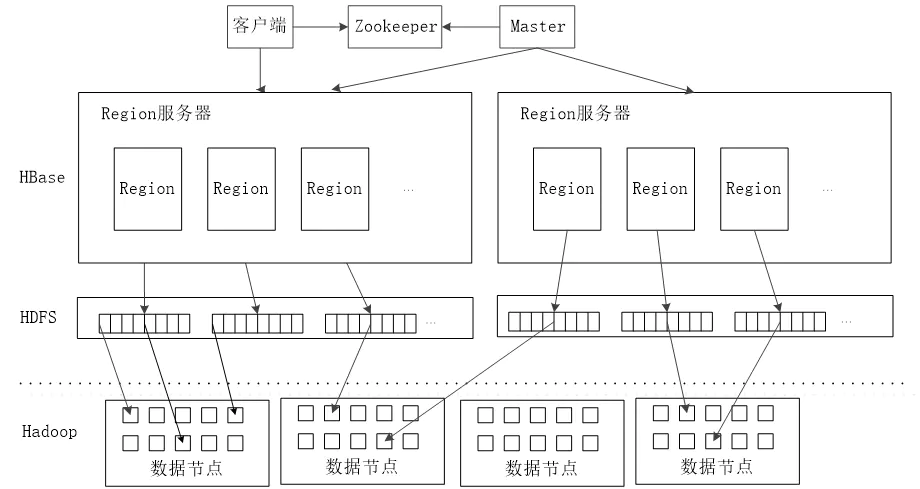

# 第一章 Hbase介绍

HBase是一个开源的、分布式的、可扩展的、列存储的、版本化的非关系型数据库，利用HDFS提供分布式数据存储。

# 第二章 Hbase的组件和功能

HBase系统架构图如下：

## 2.1 客户端

客户端包含访问 HBase 的接口，是整个 HBase 系统的入口，使用者直接通过客户端操作 HBase。客户端使用 HBase 的 RPC 机制与 HMaster 和 RegionServer 进行通信。

在一般情况下，客户端与 HMaster 进行管理类操作的通信，在获取 RegionServer 的信息后，直接与RegionServer 进行数据读写类操作。而且客户端获取 Region 的位置信息后会缓存下来，用来加速后续数据的访问过程。

## 2.2 ZooKeeper

ZooKeepeer是一个高性能、集中化、分布式应用程序协调服务，主要解决分布式应用中遇到的数据管理问题，如Master选举、数据发布/订阅、集群管理等。在Hadoop中，ZooKeeper主要用于实现HA，包括HDFS的NameNode和YARN的ResourceManager的HA。

ZooKeeper在HBase负责任务如下：

1. Master选举。HBase集群有多个HMaster并存，通过竞争选举保证同一时刻只有一个HMaster处于活跃状态，一旦这个HMaster挂掉，则备用HMaster替换并继续提供服务，保证集群的高可靠性。

2. 系统容错

   在 HBase 启动时，每个 RegionServer 在加入集群时都需要到 ZooKeeper 中进行注册，创建一个状态节点，ZooKeeper 会实时监控每个 RegionServer 的状态，同时 HMaster 会监听这些注册的 RegionServer。

   当某个 RegionServer 挂断的时候，ZooKeeper 会因为一段时间内接收不到它的心跳信息而删除该RegionServer 对应的状态节点，并且给 HMaster 发送节点删除的通知。这时，HMaster 获知集群中某节点断开，会立即调度其他节点开启容错机制。

3. Region 元数据管理

   在 HBase 集群中，Region 元数据被存储在 Meta 表中。每次客户端发起新的请求时，需要查询 Meta 表来获取 Region 的位置，而 Meta 表是存在 ZooKeeper 中的。

   当 Region 发生变化时，例如，Region 的手工移动、进行负载均衡的移动或 Region 所在的 RegionServer 出现故障等，就能够通过 ZooKeeper 来感知到这一变化，保证客户端能够获得正确的 Region 元数据信息。

4. Region 状态管理

   HBase 集群中 Region 会经常发生变更，其原因可能是系统故障，配置修改，或者是 Region 的分裂和合并。只要 Region 发生变化，就需要让集群的所有节点知晓，否则就会出现某些事务性的异常。

   而对于 HBase 集群，Region 的数量会达到 10 万，甚至更多。如此规模的 Region 状态管理如果直接由 HMaster 来实现，则 HMaster 的负担会很重，因此只有依靠 ZooKeeper 系统来完成。

5. 提供 Meta 表存储位置

   在 HBase 集群中，数据库表信息、列族信息及列族存储位置信息都属于元数据。这些元数据存储在 Meta 表中，而 Meta 表的位置入口由 ZooKeeper 来提供。

## 2.3 HMaster

HMaster 是 HBase集群中的主服务器，负责监控集群中的所有 RegionServer，并且是所有元数据更改的接口。

在分布式集群中，HMaster 服务器通常运行在 HDFS 的 NameNode上，HMaster 通过 ZooKeeper 来避免单点故障，在集群中可以启动多个 HMaster，但 ZooKeeper 的选举机制能够保证同时只有一个 HMaster 处于 Active 状态，其他的 HMaster 处于Standby状态。

HMaster 主要负责表和 Region 的管理工作。

1. 管理用户对表的增、删、改、查操作。

HMaster 提供了下表中的一些基于元数据方法的接口，便于用户与 HBase 进行交互。

| 相关接口        | 功能                                |
| --------------- | ----------------------------------- |
| HBase 表        | 创建表、删除表、启用/失效表、修改表 |
| HBase 列表      | 添加列、修改列、移除列              |
| HBase 表 Region | 移动 Region、分配和合并 Region      |

2. 管理 RegionServer 的负载均衡，调整 Region 的分布。

3. Region 的分配和移除。

4. 处理 RegionServer 的故障转移。

当某台 RegionServer 出现故障时，总有一部分新写入的数据还没有持久化地存储到磁盘中，因此在迁移该 RegionServer 的服务时，需要从修改记录中恢复这部分还在内存中的数据，HMaster 需要遍历该 RegionServer 的修改记录，并按 Region 拆分成小块移动到新的地址下。

另外，当 HMaster 节点发生故障时，由于客户端是直接与 RegionServer 交互的，且 Meta 表也是存在于 ZooKeeper 当中，整个集群的工作会继续正常运行，所以当 HMaster 发生故障时，集群仍然可以稳定运行。

但是 HMaster 还会执行一些重要的工作，例如，Region 的切片、RegionServer 的故障转移等，如果 HMaster 发生故障而没有及时处理，这些功能都会受到影响，因此 HMaster 还是要尽快恢复工作。 ZooKeeper 组件提供了这种多 HMaster 的机制，提高了 HBase 的可用性和稳健性。

## 2.4 RegionServer

在 HDFS 中，DataNode 负责存储实际数据。RegionServer 主要负责响应用户的请求，向 HDFS 读写数据。一般在分布式集群中，RegionServer 运行在 DataNode 服务器上，实现数据的本地性。

每个 RegionServer 包含多个 Region，它负责的功能如下：

- 处理分批给它的 Region。
- 处理客户端读写请求。
- 刷新缓存到 HDFS 中。
- 处理 Region 分片。
- 执行压缩。

RegionServer 是 HBase中最核心的模块，其内部管理了一系列 Region 对象，每个 Region 由多个 HStore 组成，每个 HStore 对应表中一个列族的存储。

HBase 是按列进行存储的，将列族作为一个集中的存储单元，并且 HBase 将具备相同 I/O 特性的列存储到一个列族中，这样可以保证读写的高效性。

在HBase架构图中，RegionServer 最终将 Region 数据存储在 HDFS 中，采用 HDFS 作为底层存储。

HBase 自身并不具备数据复制和维护数据副本的功能，而依赖 HDFS 为 HBase 提供可靠和稳定的存储。

# 第三章 Shell操作

## 3.1 添加操作

1. 进入 HBase 客户端命令操作界面
   $ bin/hbase shell
2. 查看帮助命令
   hbase(main):001:0> help
3. 查看当前数据库中有哪些表
   hbase(main):002:0> list
4. 创建一张表
   创建 user 表，包含 info、data 两个列族
   hbase(main):010:0> create 'user', 'info', 'data' 或者
   hbase(main):010:0> create 'user', {NAME => 'info', VERSIONS => '3'}，{NAME => 'data'}
5. 添加数据操作
   向 user 表中插入信息，row key 为 rk0001，列族 info 中添加 name 列标示
   符，值为 zhangsan
   hbase(main):011:0> put 'user', 'rk0001', 'info:name', 'zhangsan' 向 user 表中插入信息，row key 为 rk0001，列族 info 中添加 gender 列标
   示符，值为 female
   hbase(main):012:0> put 'user', 'rk0001', 'info:gender', 'female' 向 user 表中插入信息，row key 为 rk0001，列族 info 中添加 age 列标示符，
   值为 20
   hbase(main):013:0> put 'user', 'rk0001', 'info:age', 20
   向 user 表中插入信息，row key 为 rk0001，列族 data 中添加 pic 列标示符，
   值为 picture
   hbase(main):014:0> put 'user', 'rk0001', 'data:pic', 'picture' 

## 3.2 查询操作

1. 通过 rowkey 进行查询
   获取 user 表中 row key 为 rk0001 的所有信息
   hbase(main):015:0> get 'user', 'rk0001' 2. 查看 rowkey 下面的某个列族的信息
   获取 user 表中 row key 为 rk0001，info 列族的所有信息
   hbase(main):016:0> get 'user', 'rk0001', 'info' 3. 查看 rowkey 指定列族指定字段的值
   获取 user 表中 row key 为 rk0001，info 列族的 name、age 列标示符的信息
   hbase(main):017:0> get 'user', 'rk0001', 'info:name', 'info:age' 4. 查看 rowkey 指定多个列族的信息
   获取 user 表中 row key 为 rk0001，info、data 列族的信息
   hbase(main):018:0> get 'user', 'rk0001', 'info', 'data' 或者这样写
   hbase(main):019:0> get 'user', 'rk0001', {COLUMN => ['info', 'data']}
   或者这样写
   hbase(main):020:0> get 'user', 'rk0001', {COLUMN => ['info:name', 'data:pic']}
2. 指定 rowkey 与列值查询
   获取 user 表中 row key 为 rk0001，cell 的值为 zhangsan 的信息
   hbase(main):030:0> get 'user', 'rk0001', {FILTER => "ValueFilter(=, 'binary:zhangsa
   n')"}
3. 指定 rowkey 与列值模糊查询
   获取 user 表中 row key 为 rk0001，列标示符中含有 a 的信息
   hbase(main):031:0> get 'user', 'rk0001', {FILTER => "(QualifierFilter(=,'substring:
   a'))"}
   继续插入一批数据
   hbase(main):032:0> put 'user', 'rk0002', 'info:name', 'fanbingbing'
   hbase(main):033:0> put 'user', 'rk0002', 'info:gender', 'female'
   hbase(main):034:0> put 'user', 'rk0002', 'info:nationality', '中国'
   hbase(main):035:0> get 'user', 'rk0002', {FILTER => "ValueFilter(=, 'binary:中国')"}
4. 查询所有数据
   查询 user 表中的所有信息
   scan 'user' 8. 列族查询
   查询 user 表中列族为 info 的信息
   scan 'user', {COLUMNS => 'info'}
   scan 'user', {COLUMNS => 'info', RAW => true, VERSIONS => 5}
   scan 'user', {COLUMNS => 'info', RAW => true, VERSIONS => 3}
5. 多列族查询
   查询 user 表中列族为 info 和 data 的信息
   scan 'user', {COLUMNS => ['info', 'data']}
   scan 'user', {COLUMNS => ['info:name', 'data:pic']}
   10.指定列族与某个列名查询
   查询 user 表中列族为 info、列标示符为 name 的信息
   scan 'user', {COLUMNS => 'info:name'}
   11.指定列族与列名以及限定版本查询
   查询 user 表中列族为 info、列标示符为 name 的信息,并且版本最新的 5 个
   scan 'user', {COLUMNS => 'info:name', VERSIONS => 5}
   12.指定多个列族与按照数据值模糊查询
   查询 user 表中列族为 info 和 data 且列标示符中含有 a 字符的信息
   scan 'user', {COLUMNS => ['info', 'data'], FILTER => "(QualifierFilter(=,'substring:
   a'))"}
   13.rowkey 的范围值查询
   查询 user 表中列族为 info，rk 范围是(rk0001, rk0003)的数据
   scan 'user', {COLUMNS => 'info', STARTROW => 'rk0001', ENDROW => 'rk0003'}
   14.指定 rowkey 模糊查询
   查询 user 表中 row key 以 rk 字符开头的
   scan 'user',{FILTER=>"PrefixFilter('rk')"}
   15.指定数据范围值查询
   查询 user 表中指定范围的数据
   scan 'user', {TIMERANGE => [1392368783980, 1392380169184]}
   16.统计一张表有多少行数据
   count 'user' 

## 3.3 更新操作

1. 更新数据值
   更新操作同插入操作一模一样，只不过有数据就更新，没数据就添加。

2. 更新版本号
   将 user 表的 f1 列族版本号改为 5
   hbase(main):050:0> alter 'user', NAME => 'info', VERSIONS => 5

## 3.4 删除操作

1. 指定 rowkey 以及列名进行删除
   删除 user 表 row key 为 rk0001，列标示符为 info:name 的数据
   hbase(main):045:0> delete 'user', 'rk0001', 'info:name' 2. 指定 rowkey，列名以及字段值进行删除
   删除 user 表 row key 为 rk0001，列标示符为 info:name，timestamp 为
   1392383705316 的数据
   delete 'user', 'rk0001', 'info:name', 1392383705316
2. 删除一个列族
   alter 'user', NAME => 'info', METHOD => 'delete' 或者
   alter 'user', NAME => 'info', METHOD => 'delete' 4. 清空表数据
   hbase(main):017:0> truncate 'user' 5. 删除表
   首先需要先让该表为 disable 状态，使用命令：
   hbase(main):049:0> disable 'user
   然后才能 drop 这个表，使用命令：
   hbase(main):050:0> drop 'user' 注意：如果直接 drop 表，会报错：Drop the named table. Table must first be
   disabled

## 3.5 其他操作

1. status
   例如：显示服务器状态
   hbase(main):058:0> status 'node01' 
2. whoami
   显示 HBase 当前用户，例如：
   hbase> whoami
3. list
   显示当前所有的表
   hbase> list
4. count
   统计指定表的记录数，例如：
   hbase> count 'user'
5. describe
   展示表结构信息
   hbase> describe 'user' 
6. exists
   检查表是否存在，适用于表量特别多的情况
   hbase> exists 'user' 
7. is_enabled、is_disabled
   检查表是否启用或禁用
   hbase> is_enabled 'user' 
8. alter
   该命令可以改变表和列族的模式，例如：
   为当前表增加列族：
   hbase> alter 'user', NAME => 'CF2', VERSIONS => 2
   为当前表删除列族：
   hbase(main):002:0> alter 'user', 'delete' => 'CF2' 
9. disable/enable
   禁用一张表/启用一张表
10. drop
    删除一张表，记得在删除表之前必须先禁用
11. truncate
    清空表

## 3.6 过滤器

在 HBase中，get 和 scan 操作都可以使用过滤器来设置输出的范围，类似 SQL 里的 Where 查询条件。

使用 show_filter 命令可以查看当前 HBase 支持的过滤器类型，如下图所示。

使用上述过滤器时，一般需要配合比较运算符或比较器使用，如下面两个表所示。

### 3.6.1 比较运算符

| 比较运算符 | 描述     |
| ---------- | -------- |
| =          | 等于     |
| >          | 大于     |
| >=         | 大于等于 |
| <          | 小于     |
| <=         | 小于等于 |
| !=         | 不等于   |

### 3.6.2 比较器

| 比较器                 | 描述             |
| ---------------------- | ---------------- |
| BinaryComparator       | 匹配完整字节数组 |
| BinaryPrefixComparator | 匹配字节数组前缀 |
| BitComparator          | 匹配比特位       |
| NullComparator         | 匹配空值         |
| RegexStringComparator  | 匹配正则表达式   |
| SubstringComparator    | 匹配子字符串     |

使用过滤器的语法格式如下所示：

scan '表名', { Filter => "过滤器(比较运算符, '比较器')“ }

在上述语法中，Filter=> 指明过滤的方法，整体可用大括号引用，也可以不用大括号。过滤的方法用双引号引用，而比较方式用小括号引用。

下面介绍常见的过滤器使用方法。

### 3.6.3 行键过滤器

RowFilter 可以配合比较器和运算符，实现行键字符串的比较和过滤。例如，匹配行键中大于 0001 的数据，可使用 binary 比较器；匹配以 0001 开头的行键，可使用 substring 比较器，注意 substring 不支持大于或小于运算符。

实现上述匹配条件的过滤命令以及显示结果如下图所示。

 

针对行键进行匹配的过滤器还有 PrefixFilter、KeyOnlyFilter、FirstKeyOnlyFilter 和 InclusiveStopFilter，其具体含义和使用示例如下表所示。

其中，FirstKeyOnlyFilter 过滤器可以用来实现对逻辑行进行计数的功能，并且比其他计数方式效率高。

| 行键过滤器          | 描述                                               | 示例                                                         |
| ------------------- | -------------------------------------------------- | ------------------------------------------------------------ |
| PrefixFilter        | 行键前缀比较器，比较行键前缀                       | scan 'Student', FILTER => "PrefixFilter('0001')"                         同 scan 'Student', FILTER => "RowFilter(=,'substring:0001')" |
| KeyOnlyFilter       | 只对单元格的键进行过滤和显示，不显示值             | scan 'Student', FILTER => "KeyOnlyFilter()"                  |
| FirstKeyOnlyFilter  | 只扫描显示相同键的第一个单元格，其键值对会显示出来 | scan 'Student', FILTER => "FirstKeyOnlyFilter()"             |
| InclusiveStopFilter | 替代 ENDROW 返回终止条件行                         | scan 'Student', { STARTROW => '0001', FIILTER => "InclusiveStopFilter('binary:0002')" }                                              同  scan 'Student', { STARTROW => '0001', ENDROW => '0003' } |

上表中的命令示例操作结果如下图所示。

 

### 3.6.4 列族与列过滤器

针对列族进行过滤的过滤器为 FamilyFilter，其语法结构与 RowFilter 类似，不同之处在于 FamilyFilter 是对列族名称进行过滤的。

例如，以下命令扫描Student表显示列族为 Grades 的行。

scan 'Student', FILTER=>" FamilyFilter(= , 'substring:Grades')"

针对列的过滤器如下表所示，这些过滤器也需要结合比较运算符和比较器进行列族或列的扫描过滤。

| 列过滤器                   | 描述                               | 示例                                                         |
| -------------------------- | ---------------------------------- | ------------------------------------------------------------ |
| QualifierFilter            | 列标识过滤器，只显示对应列名的数据 | scan 'Student', FILTER => "QualifierFilter(=,'substring:Math')" |
| ColumnPrefixFilter         | 对列名称的前缀进行过滤             | scan 'Student', FILTER => "ColumnPrefixFilter('Ma')"         |
| MultipleColumnPrefixFilter | 可以指定多个前缀对列名称过滤       | scan 'Student', FILTER => "MultipleColumnPrefixFilter('Ma','Ag')" |
| ColumnRangeFilter          | 过滤列名称的范围                   | scan 'Student', FILTER => "ColumnRangeFilter('Big',true,'Math',false')" |

上表中 QualifierFilter 和 ColumnPrefixFilter 过滤效果类似，只是 ColumnPrefixFilter 无须结合运算符和比较器即可完成字符串前缀的过滤。

MultipleColumnPrefixFilter 过滤器是对 ColumnPrefixFilter 的延伸，可以一次过滤多个列前缀。

ColumnRangeFilter过滤器则可以扫描出符合过滤条件的列范围，起始和终止列名用单引号引用，true 和 false 参数可指明结果中包含的起始或终止列。

上表中的过滤器示例在 HBase Shell 中扫描结果如下图所示。
 

### 3.6.5 值过滤器

在 HBase 的过滤器中也有针对单元格进行扫描的过滤器，即值过滤器，如下表所示。

| 值过滤器                       | 描述                                 | 示例                                                         |
| ------------------------------ | ------------------------------------ | ------------------------------------------------------------ |
| ValueFilter                    | 值过滤器，找到符合值条件的键值对     | scan 'Student', FILTER => "ValueFilter(=,'substring:curry')"                                  同  get 'Student', '0001', FILTER => "ValueFilter(=,'substring:curry')" |
| SingleColumnValueFilter        | 在指定的列族和列中进行比较的值过滤器 | scan 'Student', Filter => "SingleColumnValueFilter('StuInfo', 'Name', =, 'binary:curry')" |
| SingleColumnValueExcludeFilter | 排除匹配成功的值                     | scan 'Student', Filter => "SingleColumnValueExcludeFilter('StuInfo', 'Name', =, 'binary:curry')" |

ValueFilter 过滤器可以利用 get 和 scan 方法对单元格进行过滤，但是使用 get 方法时，需要指定行键。

SingleColumnValueFilter 和 SingleColumnValueExcludeFilter 过滤器扫描的结果是相反的， 都需要在过滤条件中指定列族和列的名称。

上表中的值过滤器示例在 HBase Shell 中扫描结果如下图所示。

 

### 3.6.6 其他过滤器

还有一些其他的过滤器，其过滤方式和示例如下表所示。

| 值过滤器               | 描述                                                        | 示例                                                         |
| ---------------------- | ----------------------------------------------------------- | ------------------------------------------------------------ |
| ColumnCountGetFilter   | 限制每个逻辑行返回键值对的个数，在 get 方法中使用           | get 'Student', '0001', FILTER => "ColumnCountGetFilter(3)"   |
| TimestampsFilter       | 时间戳过滤，支持等值，可以设置多个时间戳                    | scan 'Student', Filter => "TimestampsFilter(1,4)"            |
| InclusiveStopFilter    | 设置停止行                                                  | scan 'Student', { STARTROW => '0001', ENDROW => '0005', FILTER => "InclusiveStopFilter('0003')" } |
| PageFilter             | 对显示结果按行进行分页显示                                  | scan 'Student', { STARTROW => '0001', ENDROW => '0005', FILTER => "PageFilter(3)" } |
| ColumnPaginationFilter | 对一行的所有列分页，只返回 [offset,offset+limit] 范围内的列 | scan 'Student', { STARTROW => '0001', ENDROW => '0005', FILTER => "ColumnPaginationFilter(2,1)" } |

ColumnCountGetFilter 过滤器限制每个逻辑行返回多少列，一般不用在 scan 方法中，Timestamps Filter 匹配相同时间戳的数据。

InclusiveStopFilter过滤器设置停止行，且包含停止的行，上表中示例最终展示数据为行键 0001〜0003 范围内的数据。PageFilter 设置每页最多显示多少逻辑行, 示例中显示三个逻辑行。

ColumnPaginationFilter过滤器对一个逻辑行的所有列进行分页显示。

# 第四章 HBase数据模型及使用

一个单元格可以用行键、列族、列、时间戳来确定。

HBase的逻辑数据模型，是有空值的，但真实的物理存储是无空值的。

# 第五章 HBase原理

## 5.1 Region定位

### 5.1.1 Region

在HBase中，表的所有行都是按照 RowKey 的字典序排列的，表在行的方向上分割为多个分区（Region），如下图所示。

每张表一开始只有一个 Region，但是随着数据的插入，HBase 会根据一定的规则将表进行水平拆分，形成两个 Region。当表中的行越来越多时，就会产生越来越多的 Region，而这些 Region 无法存储到一台机器上时，则可将其分布存储到多台机器上。

Master 主服务器把不同的 Region 分配到不同的 Region 服务器上，同一个行键的 Region 不会被拆分到多个 Region 服务器上。每个 Region 服务器负责管理一个 Region，通常在每个 Region 服务器上会放置 10 ~ 1000 个 Region，HBase中Region 的物理存储如下图所示。

**客户端在插入、删除、查询数据时需要知道哪个 Region 服务器上存储所需的数据，这个查找 Region 的过程称为 Region 定位。**

HBase 中的每个 Region 由三个要素组成，包括 Region 所属的表、第一行和最后一行。其中，第一个 Region 没有首行，最后一个 Region 没有末行。每个 Region 都有一个 RegionlD 来标识它的唯一性，Region 标识符就可以表示成“表名+开始行键+RegionID”。

### 5.1.2 Meta表

有了 Region 标识符，就可以唯一标识每个 Region。为了定位每个 Region 所在的位置，可以构建一张映射表。

映射表的每个条目包含两项内容，一项是 Region 标识符，另一项是 Region 服务器标识。这个条目就表示 Region 和 Region 服务器之间的对应关系，从而就可以使用户知道某个 Region 存储在哪个 Region 服务器中。这个映射表包含了关于 Region 的元数据，因此也被称为“元数据表”，又名“Meta表”。

使用 scan 命令可查看 Meta 表的结构，如图所示。

Meta 表中的每一行记录了一个 Region 的信息。RowKey 包含表名、起始行键和时间戳信息，中间用逗号隔开，第一个 Region 的起始行键为空。时间戳之后用`.`隔开的为分区名称的编码字符串，该信息是由前面的表名、起始行键和时间戳进行字符串编码后形成的。

Meta 表里有一个列族 info。info 包含了三个列，分别为 RegioninfoServer 和 Serverstartcode。Regionlnfo中记录了 Region 的详细信息，包括行键范围 StartKey 和 EndKey、列族列表和属性。

Server 记录了管理该 Region 的 Region 服务器的地址，如 localhost:16201。Serverstartcode 记录了 Region 服务器开始托管该 Region 的时间。

当用户表特别大时，用户表的 Region 也会非常多。Meta 表存储了这些 Region 信息，也变得非常大。Meta 表也需要划分成多个 Region，每个 Meta 分区记录一部分用户表和分区管理的情况。

### 5.1.3 Region定位

**定位流程：**客户端通过 ZooKeeper 获取 分区Meta 表位置，查询分区Meta表信息得到所需的表和行键所在的Region位置，然后从Meta表（映射表，映射region和regionServer的对应关系）找出Region所在的Region服务器，从 Region 服务器上找到所需的数据。一般客户端获取 Region 信息后会进行缓存，用户下次再查询不必从 ZooKeeper 开始寻址。

## 5.2 数据存储与读取

**HBase的核心模块是 Region 服务器**。Region 服务器由多个 Region 块构成，Region 块中存储一系列连续的数据集。Region 服务器主要构成部分是 HLog 和 Region 块。HLog 记录该 Region 的操作日志。

Region 对象由多个 Store 组成，每个 Store 对应当前分区中的一个列族，每个 Store 管理一块内存，即 MemStore。 当 MemStore 中的数据达到一定条件时会写入 StoreFile 文件中，因此每个 Store 包含若干个 StoreFile 文件。StoreFile 文件对应 HDFS 中的 HFile 文件。

HBase 群集数据的构成如图所示。

### 5.2.1 MemStore

当 Region 服务器收到写请求的时候，Region 服务器会将请求转至相应的 Region。数据先被写入 MemStore，当到达一定的阈值时，MemStore 中的数据会被刷新到 HFile 中进行持久化存储。

HBase 将最近接收到的数据缓存在 MemStore 中，在持久化到 HDFS 之前完成排序，再顺序写入 HDFS，为后续数据的检索进行优化。因为 MemStore 缓存的是最近增加的数据，所以也提高了对近期数据的操作速度。

在持久化写入之前，在内存中对行键或单元格进行优化。例如，当数据的 version 被设为 1 时，对某些列族中的一些数据，MemStore 缓存单元格的最新数据，在写入 HFile 时，仅需要保存一个最新的版本。

### 5.2.2 Store

**Store 是 Region 服务器的核心，存储的是同一个列族下的数据**，每个 Store 包含一块 MemStore 和 StoreFile（ 0 个或多个）。**StoreFile 是 HBase 中最小的数据存储单元。**

数据写入 MemStore 缓存，当 MemStore 缓存满时，内存中的数据会持久化到磁盘中一个 StoreFile 文件中，随着 StoreFile 文件数量的不断增加，数量达到一个阈值后，就会促使文件合并成一个大的 StoreFile 文件。

由于 StoreFile 文件的不断合并，造成 StoreFile 文件的大小超过一定的阈值，因此，会促使文件进行分裂操作。同时，当前的一个父 Region 会被分成两个子 Region, 父 Region 会下线，新分裂出的两个子 Region 会被 Master 分配到相应的 Region服务器上。

Store 的合并和分裂过程如下图所示。

### 5.2.3 HFile

将 MemStore 内存中的数据写入 StoreFile 文件中，StoreFile 底层是以 HFile 格式保存的。

HFile 的存储格式如下图所示。

HFile 文件是不定长的，长度固定的只有其中的两块：Trailer 和 File Info。Trailer 中有指针指向其他数据块的起始点，File Info 记录了文件的一些 Meta 信息。每个 Data 块的大小可以在创建一个 Table 的时候通过参数指定（默认块大小为 64KB）。每个 Data 块除了开头的 Magic 以外就是由一个键值对拼接而成的，Magic 内容是一些随机数字，用于防止数据损坏。

HFile 里面的每个键值对就是一个简单的 Byte 数组。但是这个 Byte 数组里面包含了很多项， 并且有固定的结构，其具体结构如图所示。

键值对结构以两个固定长度的数值开始，分别表示 Key 的长度和 Value 的长度。紧接着是 Key，Key 以 RowLength 开始，是固定长度的数值，表示 RowKey 的长度；接着是 Row，然后是固定长度的数值 ColumnFamilyLength，表示 Family 的长度；之后是 Family 列族，接着是 Qualifier 列标识符，Key 最后以两个固定长度的数值 Time Stamp 和 Key Type(Put/Delete) 结束。Value部分没有这么复杂的结构，就是纯粹的二进制数据。

### 5.2.4 HBase 数据写入流程

1) 客户端访问 ZooKeeper，从 Meta 表得到写入数据对应的 Region 信息和相应 的Region 服务器。

2) 客户端访问相应的 Region 服务器，把数据分别写入 HLog 和 MemStore。MemStore 数据容量有限，当达到一个阈值后，则把数据写入磁盘文件 StoreFile 中，在 HLog 文件中写入一个标记，表示 MemStore 缓存中的数据已被写入 StoreFile 中。如果 MemStore 中的数据丢失，则可以从 HLog 上恢复。

3) 当多个 StoreFile 文件达到阈值后，会触发 Store.compact() 将多个 StoreFile 文件合并为一个 大文件。

### 5.2.5 HBase 数据读取流程

1) 客户端先访问 ZooKeeper，从 Meta 表读取 Region 信息对应的服务器。

2) 客户端向对应 Region 服务器发送读取数据的请求，Region 接收请求后，先从 MemStore 查找数据；如果没有，再到 StoreFile 上读取，然后将数据返回给客户端。

### 5.2.6 WAL机制

在分布式环境下，用户必须要考虑系统出错的情形，例如，Region服务器发生故障时， MemStore 缓存中还没有被写入文件的数据会全部丢失。因此，**HBase 采用 HLog 来保证系统发生故障时能够恢复到正常的状态**。

如上图所示，每个 Region 服务器都有一个 HLog 文件，同一个 Region 服务器的 Region 对象共用一个 HLog，**HLog 是一种预写日志（Write Ahead Log）文件。**

也就是说，用户更新数据必须先被记入日志后才能写入 MemStore 缓存，当缓存内容对应的日志已经被写入磁盘后，即日志写成功后，缓存的内容才会被写入磁盘。

ZooKeeper 会实时监测每个 Region 服务器的状态，当某个 Region 服务器发生故障时，ZooKeeper 会通知 Master，Master 首先会处理该故障 Region 服务器上遗留的 HLog 文件。

由于一个 Region 服务器上可能会维护着多个 Region 对象，这些 Region 对象共用一个 HLog 文件，因此这个遗留的 HLog 文件中包含了来自多个 Region 对象的日志记录。

系统会根据每条日志记录所属的 Region 对象对 HLog 数据进行拆分，并分别存放到相应 Region 对象的目录下。再将失效的 Region 重新分配到可用的 Region 服务器中，并在可用的 Region 服务器中重新进行日志记录中的各种操作， 把日志记录中的数据写入 MemStore 然后刷新到磁盘的 StoreFile 文件中，完成数据恢复。

在 HBase 系统中每个 Region 服务器只需要一个 HLog 文件，所有 Region 对象共用一个 HLog，而不是每个 Region 使用一个 HLog。在这种 Region 对象共用一个 HLog 的方式中，多个 Region 对象在进行更新操作需要修改日志时，只需要不断地把日志记录追加到单个日志文件中，而不需要同时打开、写入多个日志文件中，因此可以减少磁盘寻址次数，提高对表的写操作性能。

## 5.3 HBase Region管理

### 5.3.1 HFile 合并

每个 RegionServer 包含多个 Region，而每个 Region 又对应多个 Store，每一个 Store 对应表中一个列族的存储，且每个 Store 由一个 MemStore 和多个 StoreFile 文件组成。

StoreFile 在底层文件系统中由 HFile 实现，也可以把 Store 看作由一个 MemStore 和多个 HFile 文件组成。MemStore 充当内存写缓存，默认大小 64MB，当 MemStore 超过阈值时，MemStore 中的数据会刷新到一个新的 HFile 文件中来持久化存储。

久而久之，每个 Store 中的 HFile 文件会越来越多，I/O 操作的速度也随之变慢，读写也会延时，导致慢操作。因此，需要对 HFile 文件进行合并，让文件更紧凑，让系统更有效率。

HFile 的合并分为两种类型，分别是 Minor 合并和 Major 合并。这两种合并都发生在 Store 内部，不是 Region 的合并，如下图所示。

#### 5.3.1.1 Minor 合并

Minor 合并是把多个小 HFile 合并生成一个大的 HFile。

执行合并时，HBase 读出已有的多个 HFile 的内容，把记录写入一个新文件中。然后把新文件设置为激活状态，并标记旧文件为删除。

在 Minor 合并中，这些标记为删除的旧文件是没有被移除的，仍然会出现在 HFile 中，只有在进行 Major 合并时才会移除这些旧文件。对需要进行 Minor 合并的文件的选择是触发式的，当达到触发条件才会进行 Minor 合并，而触发条件有很多，例如， 在将 MemStore 的数据刷新到 HFile 时会申请对 Store下符合条件的 HFile 进行合并，或者定期对 Store 内的 HFile 进行合并。

另外对选择合并的 HFile 也是有条件的，如下表所示。

| 参数名           | 配置项                           | 默认值            | 备注                                           |
| ---------------- | -------------------------------- | ----------------- | ---------------------------------------------- |
| minFileToCompact | hbase.hstore.compaction.min      | 3                 | 至少需要三个满足条件的 HFile 才启动合并        |
| minFileToCompact | hbase.hstore.compaction.max      | 10                | 一次合并最多选择 10 个                         |
| maxCompactSize   | hbase.hstore.compaction.max.size | Long.MAX_VALUE    | HFile 大于此值时被排除合并，避免对大文件的合并 |
| minCompactSize   | hbase.hstore.compaction.min.size | MemStoreFlushSize | HFile 小于 MemStore 的默认值时被加入合并队列   |

在执行 Minor 合并时，系统会根据上述配置参数选择合适的 HFile 进行合并。Minor 合并对 HBase 的性能是有轻微影响的，因此，合并的 HFile 数量是有限的，默认最多为 10 个。

#### 5.3.1.2 Major 合并

Major 合并针对的是给定 Region 的一个列族的所有 HFile。它将 Store 中的所有 HFile 合并成一个大文件，有时也会对整个表的同一列族的 HFile 进行合并，这是一个耗时和耗费资源的操作，会影响集群性能。

一般情况下都是做 Minor 合并，不少集群是禁止 Major 合并的，只有在集群负载较小时进行手动 Major 合并操作，或者配置 Major 合并周期，默认为 7 天。另外，Major 合并时会清理 Minor 合并中被标记为删除的 HFile。

### 5.3.2 Region 拆分

Region 拆分是 HBase 能够拥有良好扩展性的最重要因素。一旦 Region 的负载过大或者超过阈值时，它就会被分裂成两个新的 Region，如下图所示。

这个过程是由 RegionServer 完成的，其拆分流程如下。

1. 将需要拆分的 Region下线，阻止所有对该 Region 的客户端请求，Master 会检测到 Region 的状态为 SPLITTING（splitting)。
2. 将一个 Region 拆分成两个子 Region，先在父 Region下建立两个引用文件，分别指向 Region 的首行和末行，这时两个引用文件并不会从父 Region 中复制数据。
3. 之后在 HDFS 上建立两个子 Region 的目录，分别复制上一步建立的引用文件，每个子 Region 分别占父 Region 的一半数据。复制登录完成后删除两个引用文件。
4. 完成子 Region 创建后，向 Meta 表发送新产生的 Region 的元数据信息。
5. 将 Region 的拆分信息更新到 HMaster，并且每个 Region 进入可用状态。

以上是 Region 的拆分过程，那么，Region 在什么时候才会触发拆分呢？常用的拆分策略如下表所示

| 策略                                     | 原理                                                         | 描述                                                         |
| ---------------------------------------- | ------------------------------------------------------------ | ------------------------------------------------------------ |
| ConstantSizeRegionSplitPolicy            | Region 中最大 Store 的大小大于设置阈值（hbase.hregion.max.filesize）之后才会触发拆分。 拆分策略原理相同，只是阈值的设置不同 | 拆分策略对于大表和小表没有明显的区分。阈值设置较大时小表可能不会触发分裂。如果阈值设置较小，大表就会在整个集群产生大量的 Region，影响整个集群的性能 |
| IncreasingToUpper BoundRegionSplitPolicy | 阈值在一定条件下不断调整，调整规则与 Region 所属表在当前 Region 服务器上的 Region 个数有关系 | 很多小表会在大集群中产生大量小 Region，分散在整个集群中      |
| SteppingSplitPolicy                      | 阈值可变。如果 Region 个数等于 1，则拆分阈值为 flushsize × 2；否则为 MaxRegionFileSize | 小表不会再产生大量的小 Region，而是适可而止                  |
| DisabledRegionSplitPolicy                | 关闭策略，手动拆分                                           | 可控制拆分时间，选择集群空闲时间                             |

上表中列举的拆分策略中，拆分点的定义是一致的，即当 Region 中最大 Store 的大小大于设置阈值之后才会触发拆分。而在不同策略中，阈值的定义是不同的，且对集群中 Region 的分布有很大的影响。

### 5.3.3 Region 合并

从 Region 的拆分过程中可以看到，随着表的增大，Region 的数量也越来越大。如果有很多 Region，它们中 MemStore 也过多，会频繁出现数据从内存被刷新到 HFile 的操作，从而会对用户请求产生较大的影响，可能阻塞该 Region 服务器上的更新操作。过多的 Region 会增加 ZooKeeper 的负担。

因此，当 Region 服务器中的 Region 数量到达阈值时，Region 服务器就会发起 Region 合并，其合并过程如下：

1. 客户端发起 Region 合并处理，并发送 Region 合并请求给 Master。
2. Master 在 Region 服务器上把 Region 移到一起，并发起一个 Region 合并操作的请求。
3. Region 服务器将准备合并的 Region下线，然后进行合并。
4. 从 Meta 表删除被合并的 Region 元数据，新的合并了的 Region 的元数据被更新写入 Meta 表中。
5. 合并的 Region 被设置为上线状态并接受访问，同时更新 Region 信息到 Master。

# 参考文献

> 《HBase过滤器入门教程》http://c.biancheng.net/view/6522.html
>
> 《NoSQL数据库原理与应用》王爱国 许桂秋主编